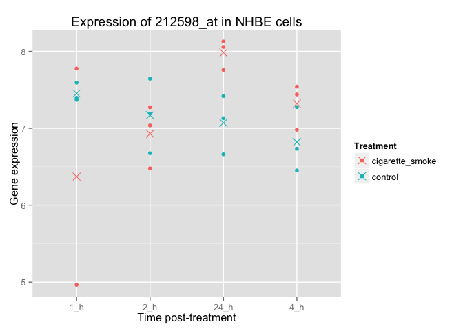

# hw1
Eva Y  
February 14, 2015  

##### Q0 (0 pts) Intake

```r
suppressPackageStartupMessages(library(dplyr))
library(ggplot2)
library(car)

metadata <- read.delim("design.txt", header = TRUE)
nhbe_data <- read.delim("data.txt", header = TRUE)

# smell test
str(metadata)
```

```
## 'data.frame':	23 obs. of  3 variables:
##  $ ExternalID: Factor w/ 23 levels "GSM270872","GSM270873",..: 11 3 2 1 9 8 7 14 13 16 ...
##  $ Treatment : Factor w/ 2 levels "cigarette_smoke",..: 2 2 2 2 2 2 2 1 1 1 ...
##  $ time      : Factor w/ 4 levels "1_h","2_h","24_h",..: 3 1 1 1 4 4 4 1 1 2 ...
```

```r
str(nhbe_data)
```

```
## 'data.frame':	22737 obs. of  23 variables:
##  $ GSE10718_Biomat_1 : num  7.9 6.13 6.82 6.63 6.95 ...
##  $ GSE10718_Biomat_10: num  7.62 5.85 7.62 5.7 7.51 ...
##  $ GSE10718_Biomat_11: num  8.22 6.3 7.22 6.22 7.29 ...
##  $ GSE10718_Biomat_12: num  8.01 5.91 6.17 6.06 7.95 ...
##  $ GSE10718_Biomat_13: num  7.61 6.62 7.2 6.89 7.87 ...
##  $ GSE10718_Biomat_14: num  7.45 6.82 7.4 7.02 7.55 ...
##  $ GSE10718_Biomat_15: num  7.41 6.88 6.78 6.59 7.27 ...
##  $ GSE10718_Biomat_16: num  7.67 6.83 6.99 6.45 7.56 ...
##  $ GSE10718_Biomat_17: num  7.89 6.45 5.85 6.18 7.24 ...
##  $ GSE10718_Biomat_19: num  7.8 6.66 6.83 6.19 6.96 ...
##  $ GSE10718_Biomat_2 : num  7.72 6.57 6.67 6.74 7.05 ...
##  $ GSE10718_Biomat_20: num  7.55 5.81 6.28 5.57 8.04 ...
##  $ GSE10718_Biomat_21: num  6.34 7.06 7.23 5.77 7.62 ...
##  $ GSE10718_Biomat_22: num  7.8 6.49 6.75 5.59 7.32 ...
##  $ GSE10718_Biomat_23: num  7.95 7.08 7.11 7.14 7.83 ...
##  $ GSE10718_Biomat_24: num  7.88 6.24 6.97 6.34 7.03 ...
##  $ GSE10718_Biomat_3 : num  7.51 6.38 6.98 6.73 7.06 ...
##  $ GSE10718_Biomat_4 : num  7.31 6.89 7.62 6.48 8.46 ...
##  $ GSE10718_Biomat_5 : num  8 7.1 7.29 5.72 7.73 ...
##  $ GSE10718_Biomat_6 : num  7.5 6.42 7.68 6.28 7.54 ...
##  $ GSE10718_Biomat_7 : num  7.5 6.27 7.12 6.63 8.17 ...
##  $ GSE10718_Biomat_8 : num  7.51 6.53 6.61 6.52 7.67 ...
##  $ GSE10718_Biomat_9 : num  7.74 6.89 6.71 7.06 7.42 ...
```

##### Q1 (1 points) What are the basic characteristics of the data and meta-data?

```r
# Q1a: How many probes? How many samples (Bioassay)?
nrow(nhbe_data) # number of probes
```

```
## [1] 22737
```

```r
ncol(nhbe_data) # number of samples
```

```
## [1] 23
```

```r
# Q1b: What is the breakdown of samples (Bioassay) for agent, time?
addmargins(with(metadata, table(Treatment, time)))
```

```
##                  time
## Treatment         1_h 2_h 24_h 4_h Sum
##   cigarette_smoke   2   3    3   3  11
##   control           3   3    3   3  12
##   Sum               5   6    6   6  23
```

```r
# Q1c: Create a quantitative (numeric) variable that represents the time at which cells were measured.
metadata$time_num <- recode(metadata$time,
       "'1_h' = 1; '2_h' = 2; '24_h' = 24; '4_h' = 4",
       as.factor.result = FALSE) 

str(metadata$time_num) # check if the level is numeric
```

```
##  num [1:23] 24 1 1 1 4 4 4 1 1 2 ...
```

```r
# Q1d: Create a plot showing the gene expression data for one probe and the averages for all possible combinations of agent and time.

# pick random gene
set.seed(1)
(random_gene <- sample(1:nrow(nhbe_data), size = 1))
```

```
## [1] 6037
```

```r
random_gene <- nhbe_data[random_gene, ]
gene_exp <- t(random_gene)
random_gene_df <- cbind(gene_exp, metadata)

# create data frame
random_gene_df <- with(random_gene_df, data.frame(ExternalID, Treatment, time, time_num, gene = factor(rep(c(colnames(random_gene_df[1])), each = nrow(random_gene_df))), gene_exp = c(gene_exp)))

# plot data
ggplot(random_gene_df, aes(x = time, y = gene_exp,  color = Treatment)) + geom_point() + stat_summary(fun.y = mean, geom = "point", shape = 4, size = 4) + xlab("Time post-treatment") + ylab("Gene expression") + ggtitle("Expression of 212598_at in NHBE cells")
```

 

##### Q2 (2 points) Assessing data quality

```r
# Q2a: Examine the sample-to-sample correlations in a heatmap.
```

