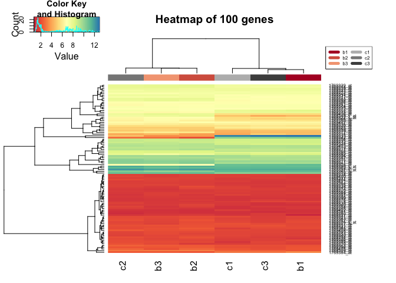
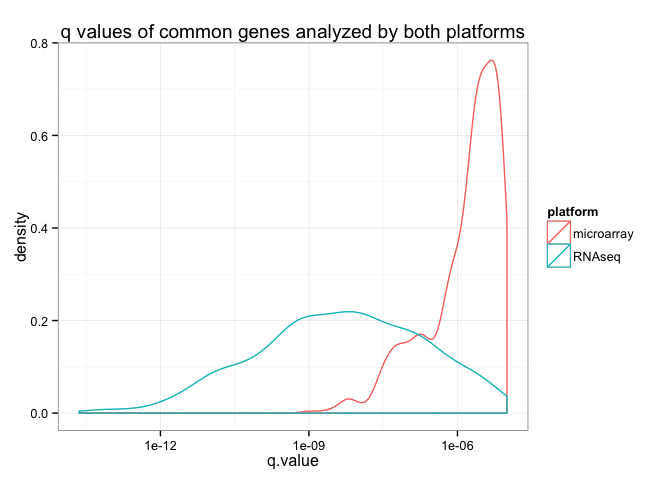
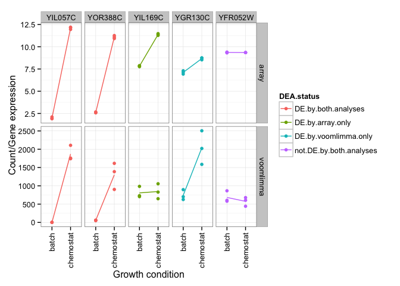

# hw02
Eva Y  
March 21, 2015  

## Attach packages

```r
library(car)
library(edgeR)
library(gplots)
library(ggplot2)
library(GGally)
library(lattice)
library(limma)
library(RColorBrewer)
library(reshape2)
library(VennDiagram)
library(yeast2.db)
```

## Useful functions
After going through this hw02, I realized there were many occasions that required repetition of the same analysis on different datasets. For this purpose, it is a good idea to functionalize some commonly used scripts. 

```r
# TBA
```

## Q1 Microarray analysis

### Q1a) (0 points) Load Microarray Data

> Load the normalized data.


```r
# load normalized microarray data
mdat <- read.table("../../data/GSE37599-data.tsv", header=TRUE, row.names=1)

# what is the flavour of the dataset? 
str(mdat)
```

```
## 'data.frame':	10928 obs. of  6 variables:
##  $ b1: num  11.15 2.16 1.49 9.01 6.95 ...
##  $ b2: num  6.8 3.18 1.43 9.46 6.9 ...
##  $ b3: num  6.71 3.13 1.82 9.23 6.96 ...
##  $ c1: num  10.95 2.5 1.46 8.97 6.85 ...
##  $ c2: num  6.7 3.05 2.08 9.28 6.9 ...
##  $ c3: num  11.07 2.44 1.62 9 6.89 ...
```

> What are dimensions of the dataset?


```r
dim(mdat)
```

```
## [1] 10928     6
```

> In addition to reporting number of rows and columns, make it clear what rows and columns represent and how you're interpreting column names.**


```r
# what are the column names?
colnames(mdat)
```

```
## [1] "b1" "b2" "b3" "c1" "c2" "c3"
```

```r
# what are the row names?
head(row.names(mdat))
```

```
## [1] "1769308_at" "1769309_at" "1769310_at" "1769311_at" "1769312_at"
## [6] "1769313_at"
```

Based on this exploratory analysis, this dataset consists of 10928 rows and 6 columns. The rows represent the probes measured by the microarray platform whereas the columns represent yeast samples in the experiment. Three samples are labelled with "b" followed by 1-3. These are yeast samples grown in batch medium and the number following the letter represents the sample replicates. There are also three samples labelled with "c" followed by 1-3. These are yeast samples grown in the chemostat setup and the number following the letter represents the sample replicates. There are three replicates for each growth condition(total samples = 6).

### Q1b) (1 point) Identify Sample Swap

> The labels on two of the samples have been swapped, that is one of the batch samples has been labelled as chemostat and vice-versa. Produce the plots described below and explain how they allow you to identify the swapped samples.

> i. (High volume) scatter plot matrix.


```r
ggpairs(mdat)
```

 

From the far-left column of the scatter plot matrix, we can be observed that b1 is more highly correlated with c1 and c3 compared to b2 and b3. From the second last row, we can be observed that c2 is more highly correlated to b2 and b3 compared to c1. From the correlation plot between c2 and c3 (last row, second from the right), we can also be observed that c2 is less correlated to c3. 

> ii. A heatmap of the first 100 genes (you can try more but it gets slow).


```r
# create data frame for heatmap.2
mdat_100 <- as.matrix(mdat[1:100, ])

# extract sample names
sample_name <- data.frame(sample=colnames(mdat_100))

# color palette 
jSpectral <- colorRampPalette(brewer.pal(n=9, "Spectral"))
palette_size <- 256
spec_palette <- jSpectral(palette_size)

# specify color labels for different samples
sample_cols <- brewer.pal(11, "RdGy")[c(2,3,4,8,9,10)]

# plot heatmap
heatmap.2(mdat_100, col=spec_palette, 
          trace="none", 
          ColSideColors=sample_cols[unclass(sample_name$sample)],
          main="Heatmap of 100 genes",
          margin=c(4,10))

# add legend
legend("topright", legend = levels(sample_name$sample),
       col=sample_cols, ncol=2, lty=1, lwd=5, cex=0.5)
```

 

From the heatmap, we can be observed that c2 clusters with b2 and b3 whereas b1 clusters with c1 and c3. 

> iii. Compute the Pearson correlation of the samples and plot the results using a heatmap.


```r
# functionalize this step because it is required in the future
pcorr <- function(data){
  # compute Pearson's correlation between samples
  pcorr_dat <- cor(data)
  diag(pcorr_dat) <- NA
  
  # plot heatmap
  heatmap.2(pcorr_dat, col=spec_palette,
          trace="none",
          ColSideColors=sample_cols[unclass(sample_name$sample)], 
          RowSideColors=sample_cols[unclass(sample_name$sample)],
          margin=c(4,10))
  
  # add legend
  legend("topright", legend=levels(sample_name$sample),
       col=sample_cols, ncol=2, border=FALSE,
       lty=1, lwd=5, cex=0.5)
}

# compute for dataset with swapped samples
pcorr(mdat)
```

 

The heatmap showing Pearson's correlation between samples also demonstrated that c2 clusters with b2 and b3 while b1 clusters with c1 and c3. 

> iv. Scatterplot the six data samples with respect to the first two principal components and label the samples.


```r
# perform pca
pca <- prcomp(mdat)

# extract PC1 and PC2
pca_df <- data.frame(pca$rotation)[ ,1:2]

# make data frame for plotting
pca_df <- data.frame(condition=rep(c("batch", "chemostat"), each=3), pca_df)

# plot pca with respect to the first two principal components
ggplot(pca_df, aes(x=PC1, y=PC2, color=condition, label=rownames(pca_df))) +
  geom_text()
```

 

Lastly, the scatterplot of the first two principal components showed that b1 clusters with c1 and c3 whereas c2 clusters with b2 and b3. 

In conclusion, all four plots showed that there is a sample swap between b1 and c2.

### Q1c) (2 points) Microarray Differential Expression

>  Fix the label swap identified in question 1b. We want to swap b1 <--> c2. Revisit one or more elements of question 1b to sanity check before proceeding.

Now to fix the label swap and some sanity check before proceeding.

```r
# fix label swap
mdat_fix <- with(mdat, data.frame(row.names=row.names(mdat), 
                                  b1=mdat$c2, b2=mdat$b2, 
                                  b3=mdat$b3, c1=mdat$c1, 
                                  c2=mdat$b1, c3=mdat$c3))
```

Time to revisit one or more elements of question 1b to sanity check before proceeding...I pick the heatmap showing Pearson's correlation between samples. 

```r
pcorr(mdat_fix)
```

 

The samples are clustered in the correct groups. Unlike the previous heatmap depicting Pearson's correlation between samples, we can see that the grey labels (chemostat growth condition) are clustered together while red labels (batch medium) are clustered together.

Everything checked out. Good to go!

> Now use this data to do a differential expression analysis with `limma`.

First, we need to generate a design matrix before fitting the linear model. 

```r
# create metadata
metadata <- data.frame(sample=colnames(mdat), condition=rep(c("batch", "chemostat"), each=3))

# create design matrix
design <- model.matrix(~condition, metadata)
str(design)
```

```
##  num [1:6, 1:2] 1 1 1 1 1 1 0 0 0 1 ...
##  - attr(*, "dimnames")=List of 2
##   ..$ : chr [1:6] "1" "2" "3" "4" ...
##   ..$ : chr [1:2] "(Intercept)" "conditionchemostat"
##  - attr(*, "assign")= int [1:2] 0 1
##  - attr(*, "contrasts")=List of 1
##   ..$ condition: chr "contr.treatment"
```

```r
# fit the linear model
fit <- lmFit(mdat_fix, design)

# apply eBayes() to moderate the estimated error variances
ebfit <- eBayes(fit)
```

> Package these results in a data frame with six columns:
  - probe.id - The array probe id.
  - gene.id - The id of the gene which the probe overlaps (see below).
  - p.value - The raw p-value for the probe.
  - q.value - The BH corrected p-value, aka the q-value.
  - log.fc - The log fold change which is the column called "logFC" in the limma results table.
  - test.stat - The test statistics which for limma is the moderated t statistic. This is the column called "t" in the limma results table.

Now to extract output of the linear model using `topTable()`.

```r
top <- topTable(ebfit, number=Inf)
```

We can retrive the gene IDs from the `yeast2ORF` object from the `yeast2.db` package and construct the data frame described above.

```r
# retrive gene IDs from yeast2ORF
probe_id <- row.names(top)
gene_id <- unlist(mget(probe_id, yeast2ORF))

# make data frame
top <- data.frame(probe.id=probe_id, gene.id=gene_id,
                     p.value=top$P.Value, q.value=top$adj.P.Val,
                     log.fc=top$logFC, test.stat=top$t)

# check dimensions of the dataframe
str(top, max.level=0)
```

```
## 'data.frame':	10928 obs. of  6 variables:
```

> Remove any rows with probes which don't map to genes. You'll be able to find these because they will have NA as their gene id. Work with this data.frame to answer the questions below.

Based on the description above, let's filter out rows with NA as their gene IDs.

```r
# filter out NA values
top_filter <- subset(top, top$gene.id != "NA")

# check dimensions of the filtered dataset
str(top_filter, max.level=0)
```

```
## 'data.frame':	5705 obs. of  6 variables:
```

> i. How many probes did we start with and how many remain after removing probes without gene ids?


```r
# pre-filtered datasets 
nrow(top)
```

```
## [1] 10928
```

```r
# dataset without NA values as gene IDs
nrow(top_filter)
```

```
## [1] 5705
```

We started with 10928 probes and we are left with 5705 after filtering out gene IDs with NA values. 

> ii. Illustrate the differential expression between the batch and the chemostat samples for the top hit (i.e., probe with the lowest p- or q-value).


```r
# top hit with lowest q-value
top_hit <- top_filter$probe.id[1]

# select gene expression for the probe for all samples from mdat
top_hit <- mdat_fix[top_hit, ]

# make data frame tall and skinny
top_hit <- melt(top_hit)
top_hit <- cbind(gene=rep(top_filter$probe.id[1], 
                          each=nrow(top_hit)), 
                 condition=metadata$condition, top_hit)

# plot 
ggplot(top_hit, aes(x=condition, y=value)) + 
  geom_point() +
  facet_wrap(~gene) +
  stat_summary(aes(group=1), fun.y=mean, geom="line") +
  ylab("Gene expression") +
  xlab("Growth condition") 
```

 

> iii. How many probes are identified as differentially expressed at a false discovery rate (FDR) of 1e-05 (note: this is a FDR cutoff used in the original paper)?


```r
# number of probes with FDR < 1e-05
nrow(subset(top_filter, q.value < 1e-05))
```

```
## [1] 725
```

At FDR < 1e-05, there are 725 differentially expressed genes between yeast samples grown under batch medium and chemostat setup. 

> iv. Save your results for later with write.table().


```r
# save differentially expressed genes with FDR < 1e-05
dea_fdr <- subset(top_filter, q.value < 1e-05)
write.table(dea_fdr, "micro.limma.results.tsv", row.names=TRUE, col.names=NA)
```


## Q2 RNA-Seq Analysis

### Q2a) (1 point) Load RNA Count Data and Sanity Check

> Load the count data. 


```r
# load count data
cdat <- read.table("../../data/stampy.deep.counts.tsv", header=TRUE, row.names=1)

# what is the flavour of the dataset? 
str(cdat)
```

```
## 'data.frame':	6542 obs. of  6 variables:
##  $ b1: int  11 40 31 63 112 17 0 4 5 0 ...
##  $ b2: int  3 26 52 87 106 21 0 2 8 1 ...
##  $ b3: int  5 10 40 53 60 15 0 2 1 0 ...
##  $ c1: int  13 71 12 51 139 7 0 11 5 1 ...
##  $ c2: int  5 41 18 78 142 6 0 0 5 0 ...
##  $ c3: int  17 48 32 100 127 2 2 3 2 1 ...
```

> i) What are dimensions of the dataset? In addition to reporting number of rows and columns, make it clear what rows and columns represent. What is the difference between the rows of this dataset versus rows of the array data in question 1a?


```r
# dimensions of the dataset
dim(cdat)
```

```
## [1] 6542    6
```

```r
# what do the columns represent? 
colnames(cdat)
```

```
## [1] "b1" "b2" "b3" "c1" "c2" "c3"
```

```r
# what do the rows represent?
head(row.names(cdat))
```

```
## [1] "15S_rRNA" "21S_rRNA" "HRA1"     "ICR1"     "LSR1"     "NME1"
```

The count dataset has 6542 rows and 6 columns. The columns represent the 6 yeast samples grown under batch medium (b group) and chemostat setup (c group). Unlike the rows in the microarray data which represent probe IDs, the rows in the count data represent sequence annotations on the yeast reference genome. While the numeric values in the microarray data are gene expression, the numeric values in the count data are number of reads. 

> ii) Do a sanity check to make sure there is no sample swap by plotting a heatmap of the sample correlations.


```r
# use pcorr() function to do this
pcorr(cdat)
```

 

Grey labels (c group) are clustered together whereas red labels (b group) are clustered together. No sample swap is identified, we can move on.

### Q2b) (2 points) voom Differential Expression Analysis

> Use voom+limma to identify differentially expressed genes between the batch medium vs. chemostat conditions.

> i) voom normalizes the counts before it converts counts to log2-cpm. Use calcNormFactors to normalize counts.


```r
# normalize counts
norm_factor <- calcNormFactors(cdat)
```

> ii) Use voom to convert count data into logged CPM data and then use limma to identify differentially expressed genes between conditions.


```r
# convert count data to logged CPM using voom()
cdat_norm <- voom(cdat, design, plot=TRUE,
                  lib.size=colSums(cdat)*norm_factor)
```

 

Now, we can use `limma` to get differentially expressed genes between conditions. 

```r
# fit the linear model
fit <- lmFit(cdat_norm, design)

# apply eBayes() to moderate the estimated error variances
ebfit <- eBayes(fit)
```

> Package these results in a data.frame called 'voom.limma.deep.results' with five columns:
  - gene.id - The id of the gene which reads were aligned to.
  - p.value - The raw p-value for the gene.
  - q.value - The BH corrected p-value, aka the q-value.
  - log.fc - The log fold change which is the column called "logFC" in the edgeR results table.
  - test.stat - The test statistic, which is the column called "t".

Time to package the data as described in the instructions above.

```r
# use topTable to extract output of the linear model
top <- topTable(ebfit, number=Inf)

# create data frame
voom.limma.deep.results <- data.frame(gene.id=row.names(top),
                                      p.value=top$P.Value, 
                                      q.value=top$adj.P.Val,
                                      log.fc=top$logFC,
                                      test.stat=top$t)
```

> iii) How many genes are differentially expressed between conditions at a false discovery rate (FDR) of 1e-05?


```r
# number of genes with FDR < 1e-05
nrow(subset(voom.limma.deep.results, q.value < 1e-05))
```

```
## [1] 1794
```

There are 1794 genes that are differentially expressed between conditions at FDR < 1e-05. 

> iv) Save your results for later with write.table() in file called stampy.deep.limma.results.tsv.


```r
# save differentially expressed genes with FDR < 1e-05
dea_fdr <- subset(voom.limma.deep.results, q.value < 1e-05)
write.table(dea_fdr, "stampy.deep.limma.results.tsv", row.names=TRUE, col.names=NA)
```


## Q3) Compare DEA results between RNA-Seq and array

### Q3a) (1 point) Comparing volumes of DE genes

> In this question, you will examine the difference between the q-values from both analyses (i.e., array and voom+limma) by overlaying density plots of the q-values from each analysis.

Load both data sets.

```r
# microarray
array <- read.table("micro.limma.results.tsv", header=T, row.names=1)
  
# RNA seq
voomlimma <- read.table("stampy.deep.limma.results.tsv", header=T, row.names=1)
```

Generate density plot that represents q.values of common genes analyzed by both platforms.

```r
# what are the genes analyzed by both platforms?
common <- intersect(array$gene.id, voomlimma$gene.id)

# extract the common genes
array_common <- subset(array$q.value, array$gene.id %in% common)
voomlimma_common <- subset(voomlimma$q.value, voomlimma$gene.id %in% common)

# make data frame for plotting
common_df <- data.frame(microarray=array_common, 
                        RNAseq=voomlimma_common)
common_df <- melt(common_df,
                  variable.name="platform", 
                  value.name="q.value")
```

```
## No id variables; using all as measure variables
```

```r
# plot
ggplot(common_df, aes(q.value, color=platform)) +
  geom_density() +
  scale_x_log10() +
  theme_bw() +
  ggtitle("q values of common genes analyzed by both platforms")
```

 

Generate density plot that represents q.values of all genes analyzed by both platforms.

```r
# data frame of q-values for all genes 
array_all <- data.frame(platform=rep("microarray", each=nrow(array)),
                        q.value=array$q.value)
voomlimma_all <- data.frame(platform=rep("RNAseq", each=nrow(voomlimma)), 
                       q.value=voomlimma$q.value)
all_df <- rbind(array_all, voomlimma_all)

# plot
ggplot(all_df, aes(q.value, color=platform)) +
  geom_density() +
  scale_x_log10() +
  theme_bw() +
  ggtitle("q values of all genes analyzed by both platforms")
```

 

> Make some observations about the strengths of these two platforms.

blah blah blah

### Q3b) (2 points) Plots

> Plot the gene expression (i.e., from array data) and the logged counts (i.e., from RNA-Seq data) of: two interesting genes identified as DE by both analyses; one DE gene identified as DE only in the array analysis; one DE gene only in the voom+limma analysis; one boring gene in both analyses (i.e., 5 genes total measured with 2 platforms)

Let's start by extracting data for two interesting genes identified as DE by both analyses.

```r
# pick two DE/interesting genes common in both platforms
(int_common_genes <- common[1:2])
```

```
## [1] "YIL057C" "YOR388C"
```

```r
# what probe IDs correspond to these genes?
(int_common_probes <- subset(array$probe.id, array$gene.id %in% int_common_genes))
```

```
## [1] 1772391_at 1774122_at
## 725 Levels: 1769308_at 1769313_at 1769325_at 1769333_at ... 1780248_at
```

```r
# extract gene expression from microarray dataset
int_common <- subset(mdat_fix, row.names(mdat_fix) %in% int_common_probes)

# make data frame for plotting 
int_common <- t(int_common)
int_common <- melt(int_common)
colnames(int_common) <- c("sample", "probe.id", "gene.exp")

# add read counts data
int_common_reads <- melt(t(subset(cdat, row.names(cdat) %in% int_common_genes)))
int_common <- cbind(condition=rep(c("batch", "chemostat", "batch", "chemostat"), each=3),
                    int_common, 
                    int_common_reads[ ,2:3])

# rename the last two columns
colnames(int_common)[5:6] <- c("gene.id", "count")
```

The DE genes I picked are YIL057C and YOR388C which correspond to probe IDs 1772391_at and 1774122_at respectively. 

From the generated data frame, we can plot gene expression vs. growth conditions.

```r
ggplot(int_common, aes(x=condition, y=gene.exp)) +
  geom_point() +
  facet_wrap(~probe.id) +
  stat_summary(aes(group=1), fun.y=mean, geom="line") +
  ylab("Gene expression")
```

 

Now, let's plot logged counts vs. growth conditions. 

```r
ggplot(int_common, aes(x=condition, y=count)) +
  geom_point() +
  facet_wrap(~gene.id) +
  stat_summary(aes(group=1), fun.y=mean, geom="line") +
  ylab("Logged counts")
```

 

Moving on...

Pick one DE gene identified as DE only in the array analysis.

```r
# extract DE genes identified only in array analysis
array_only <- setdiff(array$gene.id, voomlimma$gene.id)

# pick one gene
(int_array_gene <- array_only[2])
```

```
## [1] "YBL029W"
```

```r
# what probe ID corresponds to this gene?
(int_array_probe <- subset(array$probe.id, array$gene.id %in% int_array_gene))
```

```
## [1] 1777284_at
## 725 Levels: 1769308_at 1769313_at 1769325_at 1769333_at ... 1780248_at
```

```r
# extract gene expression from microarray dataset
int_array <- subset(mdat_fix, row.names(mdat_fix) %in% int_array_probe)

# make data frame for plotting 
int_array <- t(int_array)
int_array <- melt(int_array)
colnames(int_array) <- c("sample", "probe.id", "gene.exp")
int_array <- cbind(condition=rep(c("batch", "chemostat"), each=3),
                    int_array)

# plot
ggplot(int_array, aes(x=condition, y=gene.exp)) +
  geom_point() +
  facet_wrap(~probe.id) +
  stat_summary(aes(group=1), fun.y=mean, geom="line") +
  ylab("Gene expression")
```

 

Pick one DE gene only in the voom+limma analysis.

```r
# extract DE genes identified only in voom+limma analysis
voomlimma_only <- setdiff(voomlimma$gene.id, array$gene.id)

# pick one gene
(int_voomlimma_gene <- voomlimma_only[2])
```

```
## [1] "YPR160W"
```

```r
# extract logged counts from RNA-seq dataset
int_voomlimma <- subset(cdat, row.names(cdat) %in% int_voomlimma_gene)

# make data frame for plotting 
int_voomlimma <- t(int_voomlimma)
int_voomlimma <- melt(int_voomlimma)
colnames(int_voomlimma) <- c("sample", "gene.id", "logged.counts")
int_voomlimma <- cbind(condition=rep(c("batch", "chemostat"), each=3),
                    int_voomlimma)

# plot
ggplot(int_voomlimma, aes(x=condition, y=logged.counts)) +
  geom_point() +
  facet_wrap(~gene.id) +
  stat_summary(aes(group=1), fun.y=mean, geom="line") +
  ylab("Logged counts")
```

 

Pick one boring gene in both analyses. 

```r
# pick 100 boring genes from array analysis
bor_array <- tail(top_filter, 100)

# pick 100 boring genes from RNA-seq analysis
bor_voomlimma <- tail(voom.limma.deep.results, 100)

# what are the common boring genes? 
(common <- intersect(bor_array$gene.id, bor_voomlimma$gene.id))
```

```
## [1] "YFR052W" "YJL095W" "YHR077C" "YEL032W" "YER133W" "YGR170W"
```

```r
# pick one boring gene from the list
(common_bor <- common[1])
```

```
## [1] "YFR052W"
```

Plot gene expression vs. growth conditions for the probe which corresponds to the YFR052W gene. 

```r
# what probe ID corresponds to this gene?
(bor_array_probe <- subset(top_filter$probe.id, top_filter$gene.id %in% common_bor))
```

```
## [1] 1777244_at
## 10928 Levels: 1769308_at 1769309_at 1769310_at 1769311_at ... RPTR-Sc-X58791-2_s_at
```

```r
# extract gene expression from microarray dataset
bor_array <- subset(mdat_fix, row.names(mdat_fix) %in% bor_array_probe)

# make data frame for plotting 
bor_array <- t(bor_array)
bor_array <- melt(bor_array)
colnames(bor_array) <- c("sample", "probe.id", "gene.exp")
bor_array <- cbind(condition=rep(c("batch", "chemostat"), each=3),
                    bor_array)

# plot
ggplot(bor_array, aes(x=condition, y=gene.exp)) +
  geom_point() +
  facet_wrap(~probe.id) +
  stat_summary(aes(group=1), fun.y=mean, geom="line") +
  ylab("Gene expression")
```

 

Plot logged counts vs. growth conditions for the YFR052W gene. 

```r
# extract logged counts from RNA-seq dataset
bor_voomlimma <- subset(cdat, row.names(cdat) %in% common_bor)

# make data frame for plotting 
bor_voomlimma <- t(bor_voomlimma)
bor_voomlimma <- melt(bor_voomlimma)
colnames(bor_voomlimma) <- c("sample", "gene.id", "logged.counts")
bor_voomlimma <- cbind(condition=rep(c("batch", "chemostat"), each=3),
                    bor_voomlimma)

# plot
ggplot(bor_voomlimma, aes(x=condition, y=logged.counts)) +
  geom_point() +
  facet_wrap(~gene.id) +
  stat_summary(aes(group=1), fun.y=mean, geom="line") +
  ylab("Logged counts")
```

 

## Q4: Deep vs low sequencing

### Q4a) (1 point) voom+limma DEA of low sequencing data

> In Q2b you analyzed deep count data using voom+limma. You will now repeat the analysis on the low sequencing data.

> i) Load the low depth count data using read.table; you will need to pass the arguments header=TRUE and row.names=1. The data file is available as stampy.low.counts.tsv.


```r
# load low count data
low_cdat <- read.table("../../data/stampy.low.counts.tsv", header=TRUE, row.names=1)

# smell test
str(low_cdat)
```

```
## 'data.frame':	7126 obs. of  6 variables:
##  $ b1: int  0 4 3 21 1 33 6 3 14 1 ...
##  $ b2: int  0 10 13 36 1 31 2 11 28 0 ...
##  $ b3: int  0 5 7 16 1 24 4 5 24 0 ...
##  $ c1: int  0 9 6 11 0 26 6 5 8 0 ...
##  $ c2: int  0 5 5 3 2 23 8 6 9 0 ...
##  $ c3: int  0 16 10 6 0 37 11 7 17 0 ...
```

The low counts dataset has 7126 rows and 6 columns. 

> ii) Repeat Q2b-i and Q2b-ii for this new data.

Repeat Q2b(i).

```r
# normalize counts
norm_factor <- calcNormFactors(low_cdat)
```

Repeat Q2b(ii).

```r
# convert count data to logged CPM using voom()
low_cdat_norm <- voom(low_cdat, design, plot=TRUE,
                  lib.size=colSums(low_cdat)*norm_factor)
```

 

```r
# fit the linear model
fit <- lmFit(low_cdat_norm, design)

# apply eBayes() to moderate the estimated error variances
ebfit <- eBayes(fit)
```

> Package these results in a data.frame called 'voom.limma.low.results' with five columns as you did in Q2b.


```r
# use topTable to extract output of the linear model
top <- topTable(ebfit, number=Inf)

# create data frame
voom.limma.low.results <- data.frame(gene.id=row.names(top),
                                      p.value=top$P.Value, 
                                      q.value=top$adj.P.Val,
                                      log.fc=top$logFC,
                                      test.stat=top$t)
```

### Q4b) (2 points) edgeR DEA of deep sequencing data

> Now you will use edgeR to identify differentially expressed genes between the batch medium vs. chemostat conditions in the deep count datasets loaded in Q2a.

> i) Recall that edgeR needs to estimate the dispersion parameter in the negative binomial model using an empirical Bayes method. Estimate the dispersion parameters using `estimateGLMCommonDisp`, `estimateGLMTrendedDisp` and `estimateGLMTagwiseDisp`.


```r
# produce an object of type DGEList 
dge_glm <- DGEList(counts=cdat, group=metadata$condition)

# estimate dispersion parameters
com_disp <- estimateGLMCommonDisp(dge_glm, design, verbose=TRUE)
```

```
## Disp = 0.00551 , BCV = 0.0742
```

```r
trend_disp <- estimateGLMTrendedDisp(com_disp, design)
tag_disp <- estimateGLMTagwiseDisp(trend_disp, design)
```

> ii) Use the glm functionality of edgeR, i.e. use the glmFit function, to identify differentially expressed genes between conditions.


```r
# fit the model
fit <- glmFit(tag_disp, design)

# what are the coefficients?
colnames(coef(fit))
```

```
## [1] "(Intercept)"        "conditionchemostat"
```

```r
lrt <- glmLRT(fit, coef=2)
tt_glm <- topTags(lrt, n=Inf)
```

> iii) How many genes are differentially expressed between conditions at a false discovery rate (FDR) of 1e-05? Compare the results with those obtained in Q2b-iii.


```r
# get number of DE genes at FDR < 1e-05
nrow(tt_glm$table[tt_glm$table$FDR < 1e-05,])
```

```
## [1] 2669
```

There are 2669 DE genes identified using `edgeR` analysis compared to 1794 DE genes identified using `voom+limma`.

> Package these results in a data.frame called 'edger.deep.results' with five columns:
  - gene.id - The id of the gene which reads were aligned to.
  - p.value - The raw p-value for the gene.
  - q.value - The BH corrected p-value, aka the q-value.
  - log.fc - The log fold change which is the column called "logFC" in the edgeR results table.
  - test.stat - The test statistic, which for edgeR is a likelihood ratio. This is the column called "LR" in the edgeR results table.


```r
# package results to the specified data frame
edger.deep.results <- data.frame(gene.id=row.names(tt_glm),
                                      p.value=tt_glm$table$PValue, 
                                      q.value=tt_glm$table$FDR,
                                      log.fc=tt_glm$table$logFC,
                                      test.stat=tt_glm$table$LR)
```

### Q4c) (1 point) edgeR DEA of low sequencing data

> Repeat Q4b-i and Q4b-ii for the low count data. 


```r
# produce an object of type DGEList 
dge_glm <- DGEList(counts=low_cdat, group=metadata$condition)

# estimate dispersion parameters
com_disp <- estimateGLMCommonDisp(dge_glm, design, verbose=TRUE)
```

```
## Disp = 0.0042 , BCV = 0.0648
```

```r
trend_disp <- estimateGLMTrendedDisp(com_disp, design)
tag_disp <- estimateGLMTagwiseDisp(trend_disp, design)

# fit the model
fit <- glmFit(tag_disp, design)
lrt <- glmLRT(fit, coef=2)
tt_glm <- topTags(lrt, n=Inf)

# get number of DE genes at FDR < 1e-05
nrow(tt_glm$table[tt_glm$table$FDR < 1e-05,])
```

```
## [1] 486
```

For the low count data, there are 486 DE genes identified using `edgeR` analysis compared to 0 DE genes identified using `voom+limma`.

> Package these results in a data.frame called 'edger.low.results' with five columns as before.


```r
# package results to the specified data frame
edger.low.results <- data.frame(gene.id=row.names(tt_glm),
                                      p.value=tt_glm$table$PValue, 
                                      q.value=tt_glm$table$FDR,
                                      log.fc=tt_glm$table$logFC,
                                      test.stat=tt_glm$table$LR)
```

### Q4d) (2 point) Comparison of DEA

> Now that we have the results of the differential expression analysis performed by voom+limma and edgeR methods on both low and deep count data, we are going to compare and illustrate the results.

> Create a Venn diagram showing all genes identified as differentially expressed (at FDR of 1e-5) in the four previous RNA-Seq analyses. If the comparison of 4 sets gets very confusing, you can also create different pairs of Venn diagrams of interest.

> i) How many genes were identified by voom+limma in both low and deep count data?

> ii) How many genes were identified by edgeR in both low and deep count data?

> iii) How many genes were identified in all the analyses?

> iv) Comment on the effect of sequencing depth on the DEA results. Is one of the methods more robust to this effect than the other. Make any additional observations about your results that you find interesting.

