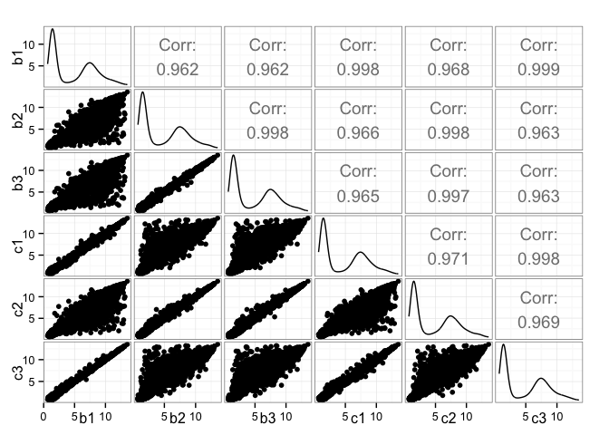
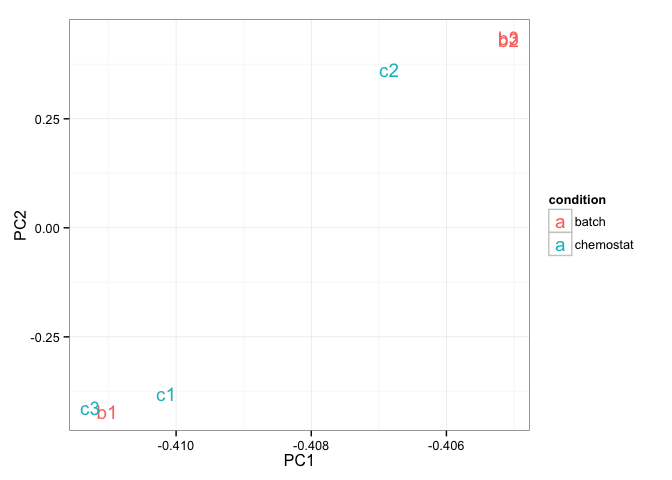

# hw02
Eva Y  
March 21, 2015  

## Attach packages

```r
library(car)
library(gplots)
library(ggplot2)
library(GGally)
library(lattice)
library(limma)
library(RColorBrewer)
library(reshape2)
library(yeast2.db)
```

## Q1 Microarray analysis

### Q1a) (0 points) Load Microarray Data

> Load the normalized data.


```r
# load normalized microarray data
mdat <- read.table("../../data/GSE37599-data.tsv", header=TRUE, row.names=1)

# what is the flavour of the dataset? 
str(mdat)
```

```
## 'data.frame':	10928 obs. of  6 variables:
##  $ b1: num  11.15 2.16 1.49 9.01 6.95 ...
##  $ b2: num  6.8 3.18 1.43 9.46 6.9 ...
##  $ b3: num  6.71 3.13 1.82 9.23 6.96 ...
##  $ c1: num  10.95 2.5 1.46 8.97 6.85 ...
##  $ c2: num  6.7 3.05 2.08 9.28 6.9 ...
##  $ c3: num  11.07 2.44 1.62 9 6.89 ...
```

> What are dimensions of the dataset?


```r
dim(mdat)
```

```
## [1] 10928     6
```

> In addition to reporting number of rows and columns, make it clear what rows and columns represent and how you're interpreting column names.**


```r
# what are the column names?
colnames(mdat)
```

```
## [1] "b1" "b2" "b3" "c1" "c2" "c3"
```

```r
# what are the row names?
head(row.names(mdat))
```

```
## [1] "1769308_at" "1769309_at" "1769310_at" "1769311_at" "1769312_at"
## [6] "1769313_at"
```

Based on this exploratory analysis, this dataset consists of 10928 rows and 6 columns. The rows represent the probes measured by the microarray platform whereas the columns represent yeast samples in the experiment. Three samples are labelled with "b" followed by 1-3. These are yeast samples grown in batch medium and the number following the letter represents the sample replicates. There are also three samples labelled with "c" followed by 1-3. These are yeast samples grown in the chemostat setup and the number following the letter represents the sample replicates. There are three replicates for each growth condition(total samples = 6).

### Q1b) (1 point) Identify Sample Swap
> The labels on two of the samples have been swapped, that is one of the batch samples has been labelled as chemostat and vice-versa. Produce the plots described below and explain how they allow you to identify the swapped samples.

> i. (High volume) scatter plot matrix.


```r
ggpairs(mdat)
```

 

From the far-left column of the scatter plot matrix, we can be observed that b1 is more highly correlated with c1 and c3 compared to b2 and b3. From the second last row, we can be observed that c2 is more highly correlated to b2 and b3 compared to c1. From the correlation plot between c2 and c3 (last row, second from the right), we can also be observed that c2 is less correlated to c3. 

> ii. A heatmap of the first 100 genes (you can try more but it gets slow).


```r
# create data frame for heatmap.2
mdat_100 <- as.matrix(mdat[1:100, ])

# extract sample names
sample_name <- data.frame(sample=colnames(mdat_100))

# color palette 
jSpectral <- colorRampPalette(brewer.pal(n = 9, "Spectral"))
palette_size <- 256
spec_palette <- jSpectral(palette_size)

# specify color labels for different samples
sample_cols <- brewer.pal(11, "RdGy")[c(2,3,4,8,9,10)]

# plot heatmap
heatmap.2(mdat_100, col=spec_palette, 
          trace="none", 
          ColSideColors=sample_cols[unclass(sample_name$sample)],
          main="Heatmap of 100 genes",
          margin=c(4,10))

# add legend
legend("topright", legend = levels(sample_name$sample),
       col=sample_cols, ncol=2, lty = 1, lwd = 5, cex = 0.5)
```

 

From the heatmap, we can be observed that c2 clusters with b2 and b3 whereas b1 clusters with c1 and c3. 

> iii. Compute the Pearson correlation of the samples and plot the results using a heatmap.


```r
# compute Pearson's correlation between samples
corr_mdat <- cor(mdat)
diag(corr_mdat) <- NA

# plot heatmap
heatmap.2(corr_mdat, col=spec_palette,
          trace="none",
          ColSideColors=sample_cols[unclass(sample_name$sample)], 
          RowSideColors=sample_cols[unclass(sample_name$sample)], 
          main="Pearson's correlation of samples",
          margin=c(4,10))

# add legend
legend("topright", legend = levels(sample_name$sample),
       col = sample_cols, ncol=2, border=FALSE,
       lty = 1, lwd = 5, cex = 0.5)
```

 

The heatmap showing Pearson's correlation between samples also demonstrated that c2 clusters with b2 and b3 while b1 clusters with c1 and c3. 

> iv. Scatterplot the six data samples with respect to the first two principal components and label the samples.


```r
# perform pca
pca <- prcomp(mdat)

# extract PC1 and PC2
pca_df <- data.frame(pca$rotation)[ ,1:2]

# make data frame for plotting
pca_df <- data.frame(condition=rep(c("batch", "chemostat"), each=3), pca_df)

# plot pca with respect to the first two principal components
ggplot(pca_df, aes(x=PC1, y=PC2, color=condition, label=rownames(pca_df))) +
  geom_text()
```

 

Lastly, the scatterplot of the first two principal components showed that b1 clusters with c1 and c3 whereas c2 clusters with b2 and b3. 

In conclusion, all four plots showed that there is a sample swap between b1 and c2.

### Q1c) (2 points) Microarray Differential Expression

>  Fix the label swap identified in question 1b. We want to swap b1 <--> c2. Revisit one or more elements of question 1b to sanity check before proceeding.

Now to fix the label swap and some sanity check before proceeding.

```r
# fix label swap
mdat_fix <- with(mdat, data.frame(row.names=row.names(mdat), 
                                  b1=mdat$c2, b2=mdat$b2, 
                                  b3=mdat$b3, c1=mdat$c1, 
                                  c2=mdat$b1, c3=mdat$c3))
```

Time to revisit one or more elements of question 1b to sanity check before proceeding...I pick the heatmap showing Pearson's correlation between samples. 

```r
# compute Pearson's correlation between samples
corr_mdat_fix <- cor(mdat_fix)
diag(corr_mdat_fix) <- NA

# plot heatmap
heatmap.2(corr_mdat_fix, col=spec_palette,
          trace="none",
          ColSideColors=sample_cols[unclass(sample_name$sample)], 
          RowSideColors=sample_cols[unclass(sample_name$sample)], 
          main="Pearson's correlation of samples",
          margin=c(4,10))

# add legend
legend("topright", legend = levels(sample_name$sample),
       col = sample_cols, ncol=2, border=FALSE,
       lty = 1, lwd = 5, cex = 0.5)
```

 

The samples are clustered in the correct groups. Unlike the previous heatmap depicting Pearson's correlation between samples, we can see that the grey labels (chemostat growth condition) are clustered together while red labels (batch medium) are clustered together.

Everything checked out. Good to go!

> Now use this data to do a differential expression analysis with `limma`.

First, we need to generate a design matrix before fitting the linear model. 

```r
# create metadata
metadata <- data.frame(sample=colnames(mdat), condition=rep(c("batch", "chemostat"), each=3))

# create design matrix
design <- model.matrix(~condition, metadata)
str(design)
```

```
##  num [1:6, 1:2] 1 1 1 1 1 1 0 0 0 1 ...
##  - attr(*, "dimnames")=List of 2
##   ..$ : chr [1:6] "1" "2" "3" "4" ...
##   ..$ : chr [1:2] "(Intercept)" "conditionchemostat"
##  - attr(*, "assign")= int [1:2] 0 1
##  - attr(*, "contrasts")=List of 1
##   ..$ condition: chr "contr.treatment"
```

```r
# fit the linear model
fit <- lmFit(mdat_fix, design)

# apply eBayes() to moderate the estimated error variances
ebfit <- eBayes(fit)
```

> Package these results in a data frame with six columns:

> - probe.id - The array probe id.
  - gene.id - The id of the gene which the probe overlaps (see below).
  - p.value - The raw p-value for the probe.
  - q.value - The BH corrected p-value, aka the q-value.
  - log.fc - The log fold change which is the column called "logFC" in the limma results table.
  - test.stat - The test statistics which for limma is the moderated t statistic. This is the column called "t" in the limma results table.

Now to extract output of the linear model using `topTable()`.

```r
top <- topTable(ebfit, number=Inf)
```

We can now retrive the gene IDs from the `yeast2ORF` object from the `yeast2.db` package and construct the data frame described above.

```r
# retrive gene IDs from yeast2ORF
probe_id <- row.names(top)
gene_id <- unlist(mget(probe_id, yeast2ORF))

# make data frame
top <- data.frame(probe.id=probe_id, gene.id=gene_id,
                     p.value=top$P.Value, q.value=top$adj.P.Val,
                     log.fc=top$logFC, test.stat=top$t)

# check dimensions of the dataframe
str(top, max.level=0)
```

```
## 'data.frame':	10928 obs. of  6 variables:
```

> Remove any rows with probes which don't map to genes. You'll be able to find these because they will have NA as their gene id. Work with this data.frame to answer the questions below.

Based on the description above, let's filter out rows with NA as their gene IDs.

```r
# filter out NA values
top_filter <- subset(top, top$gene.id != "NA")

# check dimensions of the filtered dataset
str(top_filter, max.level=0)
```

```
## 'data.frame':	5705 obs. of  6 variables:
```

> i. How many probes did we start with and how many remain after removing probes without gene ids?


```r
# pre-filtered datasets 
nrow(top)
```

```
## [1] 10928
```

```r
# dataset without NA values as gene IDs
nrow(top_filter)
```

```
## [1] 5705
```

We started with 10928 probes and we are left with 5705 after filtering out gene IDs with NA values. 

> ii. Illustrate the differential expression between the batch and the chemostat samples for the top hit (i.e., probe with the lowest p- or q-value).


```r
# top hit with lowest q-value
top_hit <- top_filter$probe.id[1]

# select gene expression for the probe for all samples from mdat
top_hit <- mdat_fix[top_hit, ]

# make data frame tall and skinny
top_hit <- melt(top_hit)
top_hit <- cbind(gene=rep(top_filter$probe.id[1], 
                          each=nrow(top_hit)), 
                 condition=metadata$condition, top_hit)

# plot 
ggplot(top_hit, aes(x=condition, y=value)) + 
  geom_point() +
  facet_wrap(~gene) +
  stat_summary(aes(group=1), fun.y=mean, geom="line") +
  ylab("Gene expression") +
  xlab("Growth condition") 
```

 

> iii. How many probes are identified as differentially expressed at a false discovery rate (FDR) of 1e-5 (note: this is a FDR cutoff used in the original paper)?


```r
# number of probes with FDR < 1e-05
nrow(subset(top_filter, q.value < 1e-05))
```

```
## [1] 725
```

At FDR < 1e-05, there are 725 differentially expressed genes between yeast samples grown under batch medium and chemostat setup. 

> iv. Save your results for later with write.table().


```r
# save differentially expressed genes with FDR < 1e-05
diff_exp <- subset(top_filter, q.value < 1e-05)
write.table(diff_exp, "diff_exp", row.names = TRUE, col.names = NA)
```

## Q2 


```r
# jGraysFun <- colorRampPalette(brewer.pal(n = 9, "Greys"))
# palette_size <- 256
# grays_palette <- jGraysFun(palette_size)
```

