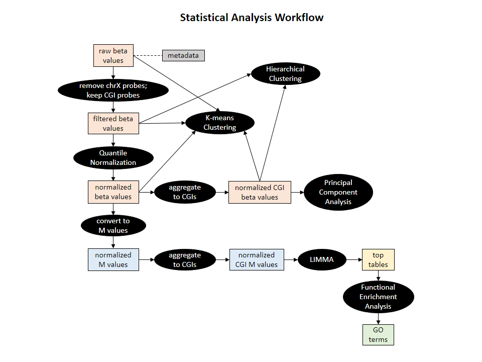
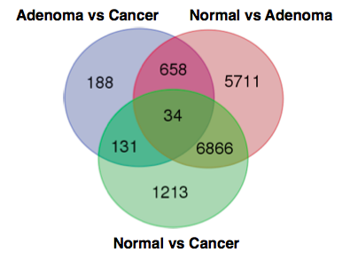

### Concise summary of main role/contribution of each group member
Most parts of this project were worked on by one or more group members. We worked together and helped each other out in multiple roles when we hit dead ends. All group members worked together in the preparation of the initial and final proposals. In summary, team work was the main reason this project was successfully completed. 

#### Beryl
- Data cleaning and processing (downloading and saving data and metadata from Gene Expression Omnibus (GEO))
- Exploratory analysis using principal component analysis (PCA)
- Differential methylation analysis (DMA) using `limma`
- Functional enrichment analysis (FEA) using topGO tool
- Poster preparation
- Organization of repository

#### Ka Ming
- Data cleaning and processing (data filtering - keeping probes corresponding to CpG islands (CGIs) and removing chr X)
- Data normalization using quantile normalization
- Preparing input for differential methylation analysis - converting beta values to M values (logit transformed beta values)
- DMA using `limma`
- Poster preparation - majority of the poster preparation work was done by Ka Ming
- Organization of repository

#### Santina
- Exploratory analysis using unsupervised hierarchical clustering
- DMA using `limma`
- Poster preparation
- Organization of repository

#### Rashedul
- Genomics regions enrichment analysis using GREAT tool
- Organization of repository

### My specific role/contribution
The research question for this project was my idea given my interest in cancer epigenomics and this was further developed and made possible through discussion with my group members. I also wrote the background for the final group project proposal.

As for data analysis, I worked on K-means clustering as an exploratory analysis in addition to PCA and hierarchical clustering and interpretation of the results. I performed K-means cluster analysis on pre-normalized, filtered pre-normalized, and filtered post-normalized beta values. I also performed the analysis on filtered post-normalized beta values that are aggregated to CGIs. 

In addition, I worked on DMA using `limma` with input data generated by Ka Ming and Beryl. Heatmaps and stripplots of the DM CGIs were generated by me. I also performed literature review to associate enriched functions identified by Beryl's FEA to cancer progression and included these interpretation in the poster. I worked with other group members in preparing the poster and organizing our repository.

### Scientific reflections. E.g., what worked well/poorly? what seems worth following up vs. a dead end? what was most difficult or most rewarding?
Overall, I'm quite pleased with my group members and the outcome of our project. We managed to develop a work flow to analyze DNA methylation array data **(Figure 1)**. From our analysis, we identified 34 common differentially methylated (DM) CGIs between the three pairwise comparisons of sample groups (normal vs. adenoma, normal vs. cancer, and adenoma vs. cancer). Based on literature review, I managed to find associations of the enriched functions identified by Beryl's FEA with progression of various cancer types including CRC. More importantly, given that these common DM CGIs are identified in adenomas compared to normal mucosa in addition to the other two pairwise comparisons (normal vs. cancer and adenoma vs. cancer), these aberrant methylation patterns could be markers for assessing the risk of cancer progression from the adenoma stage. 

It is quite an interesting experience given that I'm the only group member with a biochemistry background while all my group members are from the bioinformatics program. I definitely learned a lot in terms of R programming and writing concise codes. We struggled the most with the DMA as our results have extremely low false discovery rates (lowest is ~e-30). Given more time, we could experiment with other models such as a mixed effect model. For our interpretation, we focused on common DM CGIs between the three pairwise comparisons of sample groups. It would also be interesting to explore other common DM CGIs (e.g. the 131 common DM CGIs between pairwise comparisons of normal vs. cancer and adenoma vs. cancer) and their biological relevance as well as implications to CRC progression **(Figure 2)**. Lastly, we went for a plain-vanilla linear model in our project and it would be interesting to include model parameters such as site of biopsy as CRC tumours from different regions of the colon demonstrate different properties in terms of genetics and epigenetic alterations **(1)**.

##### Figure 1: Flow chart representing statistical analyses work flow.

##### Figure 2: Venn diagram of differentially methylated CGIs at FDR < 1e-04.

#### References
1.  [Cancer Genome Atlas Network. "Comprehensive molecular characterization of human colon and rectal cancer." Nature. 2012 Jul 18;487(7407):330-7.](http://www.ncbi.nlm.nih.gov/pubmed/22810696)
