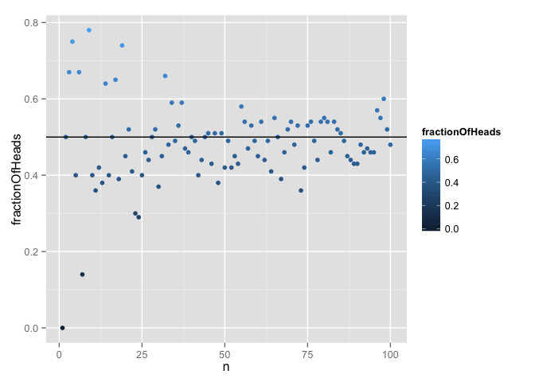
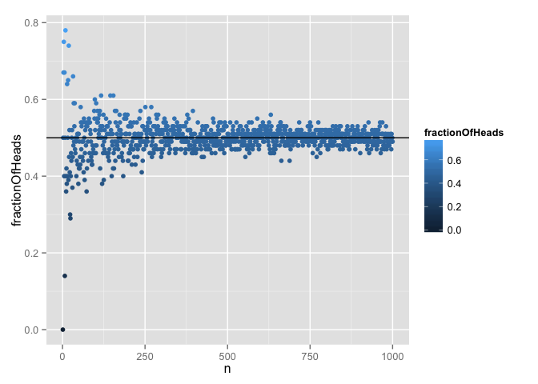
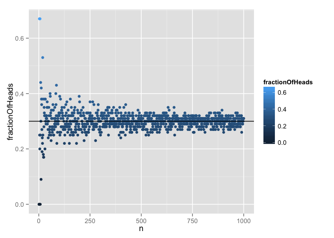
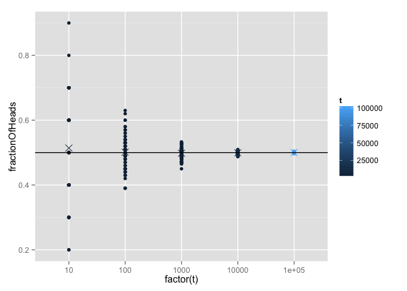

# sm02b
Eva Y  
January 22, 2015  
**Take-home problem: The goal will be to simulate flipping a coin n times, where the coin comes up heads with probability p. As the value of n gets large the relative frequency of flips which are heads (that is, the fraction of tosses which are heads) should tend to p.Pick the probability p. Pick a sample size n. Simulate the n coin flips experiment and count the number of heads. Convert that to a proportion. Now do the same for many values of n. Plot those proportions against n. Add the true p for reference if you can. What do you see? Is it what you expected?**

**ggplot2 package is used to plot the coin toss simulation.**

```r
library(ggplot2)
```

**First step involves ensuring that the coin-toss experiment is repeatably random.**

```r
set.seed(1)
```

**Now pick a sample size/number of coin toss (n) and probability of getting heads (p).**

```r
n <- 10
t <- 1
p <- 0.5
```

**Simulate coin-toss experiment using rbinom() and calculate relative frequency of getting heads.**
*heads = 1*

```r
(round(mean(rbinom(n = n, size = t, prob = p)), digits = 2))
```

```
## [1] 0.6
```

**We notice that relative frequency of getting heads is 0.6 when the coin is tossed 10 times. What should we expect if the coin is tossed >10 times?**

**Let's simulate the coin-toss experiment for various n values and visualize the data on a scatterplot.**

```r
set.seed(1)

n <- seq(1, 100)
t <- 1
p <- 0.5

# Set up empty vector
fractionOfHeads <- NULL

# Use for loop to iterate through various n values
for (i in n){
  fractionOfHeads[i] <- round(mean(rbinom(n = i, size = t, prob = p)), digits = 2)
}

# Prepare data frame for plotting with ggplot2
fractionOfHeadsDat <- data.frame(n, fractionOfHeads)

# Scatterplot!
(p <- ggplot(fractionOfHeadsDat, aes(n, fractionOfHeads, color = fractionOfHeads)) + geom_point() + geom_hline(yintercept=0.5))
```

 

**According to the Weak Law of Large Numbers (WLLN), the proportion of getting heads should converge to p as n gets larger.**

**Hence, relative frequency of getting heads should converge to p when n is increased.**


```r
# This time we set the upper limit to 1000 coin tosses!
n <- seq(1, 1000)

set.seed(1)
t <- 1
p <- 0.5
fractionOfHeads <- NULL

for (i in n){
  fractionOfHeads[i] <- round(mean(rbinom(n = i, size = t, prob = p)), digits = 2)
}

fractionOfHeadsDat <- data.frame(n, fractionOfHeads)
(p <- ggplot(fractionOfHeadsDat, aes(n, fractionOfHeads, color = fractionOfHeads)) + geom_point() + geom_hline(yintercept=0.5))
```

 

**Based on the scatterplot, it is observed that the relative frequency of heads converges to p as n increases. In this simulation, WLLN holds water.**


**Let's try a different p value.**

```r
n <- seq(1, 1000)

set.seed(1)
t <- 1
p <- 0.3
fractionOfHeads <- NULL

for (i in n){
  fractionOfHeads[i] <- round(mean(rbinom(n = i, size = t, prob = p)), digits = 2)
}

fractionOfHeadsDat <- data.frame(n, fractionOfHeads)
(p <- ggplot(fractionOfHeadsDat, aes(n, fractionOfHeads, color = fractionOfHeads)) + geom_point() + geom_hline(yintercept=0.3))
```

 

**Here is another way to simulate the coin toss experiment to explore WLLN.**
**In this example, we can fix the number of tosses to be 100 and for each toss we would flip the coin t times.**


```r
set.seed(1)

t <- 10^seq(1:5)
n <- 100
p <- 0.5
tValDF <- data.frame(t=rep(t, each = n)) # make data frame with number of tosses to aggregate with simulation results after
fractionOfHeadsDF <- NULL

# for loop which creates multiple data frames
for (i in t){
  fractionOfHeadsDF[[i]] <- data.frame(fractionOfHeads = rbinom(n, size = i, prob = p)/i)
}

completeDF <- do.call("rbind", fractionOfHeadsDF) # bind all data frames
completeDF <- cbind(tValDF, completeDF) # bind coin toss simulation results with t values

# stripplot!
(p <- ggplot(completeDF, aes(factor(t), fractionOfHeads, color = t)) + geom_point() + stat_summary(fun.y = mean, geom = "point", shape = 4, size = 4) + geom_hline(yintercept=0.5))
```

 

**We can observe that at higher t values, probablity of getting heads converges to p.**
