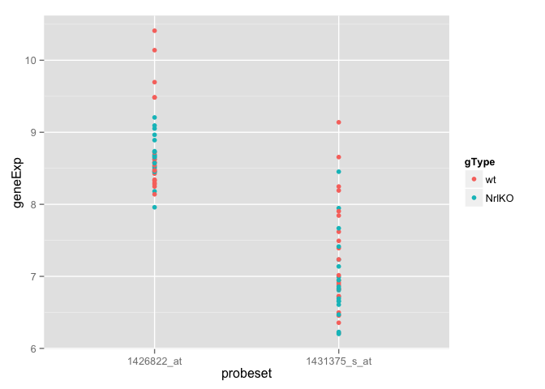

# sm03b
Eva Y  
January 26, 2015  

**Take-home problem: The full photoRec dataset has 39 samples and 29,949 probesets. Choose 2 … or 20 … or 200 random probesets/genes and look for gene expression differences between the two genotypes, wild type versus knockout. Make use of the graphing techniques discussed this week such as scatter plots, box plot, etc.**

**First, we have to set up our data frame. I chose to select 2 random probesets.**


```r
library(ggplot2)
library(RColorBrewer)

# Load datasets
prDat <- read.table("GSE4051_data.tsv")
prDes <- readRDS("GSE4051_design.rds")

# Transpose data frame
transposeDataFrame <- t(prDat)

# set.seed() is used to ensure sampling is repeatably random
set.seed(1)
size <- 2
(randomProbeset <- sample(1:ncol(transposeDataFrame), size = size))
```

```
## [1]  7952 11145
```

```r
# Aggregate the randomly selected probeset with other variables such as devStage and gType.
rpDat <- cbind(genes <- transposeDataFrame[ ,randomProbeset], prDes)

# Organize data frame to prepare for plotting graphs
orgRPDat <- with(rpDat, data.frame(sidChar, sidNum, devStage, gType, probeset = factor(rep(c(colnames(rpDat[1:size])), each = nrow(rpDat))), geneExp = c(genes)))
```

**Now we're ready to plot some graphs to visualize our data!**

**As suggested by the instructions of sm03, we would like to visualize gene expression differences between two genotypes, wild type versus knockout.**


```r
# Using stripplots
(p <- ggplot(orgRPDat, aes(probeset, geneExp, color = gType)) + geom_point())
```

 

```r
# Switch axis and add jitter
(p <- ggplot(orgRPDat, aes(geneExp, probeset, color = gType)) + geom_point(position = position_jitter(height = 0.1)))
```

 

```r
# Add information on other variables and descriptive statistics (i.e. mean)
(p <- ggplot(orgRPDat, aes(devStage, geneExp, color = gType)) + geom_point() + facet_wrap(~ probeset) + stat_summary(fun.y = mean, geom = "point", shape = 4, size = 4))
```

 

```r
# Using density plots
(p <- ggplot(orgRPDat, aes(geneExp, color = gType)) + facet_wrap(~ probeset) + stat_density(geom = "line", position = "identity") + geom_point(aes(y = 0.05), position = position_jitter(height = 0.005)))
```

 

```r
# Using box plots
(p <- ggplot(orgRPDat, aes(devStage, geneExp, color = gType)) + facet_wrap(~ probeset) + geom_boxplot())
```

 

```r
# Using violin plots
(p <- ggplot(orgRPDat, aes(devStage, geneExp, color = gType)) + facet_wrap(~ probeset) + geom_violin())
```

 

**Personally, I prefer presenting this set of biological data using stripplots because it looks more comprehensible to a reader/reviewer. What do you think?**

**This set of data can also be presented using a heatmap.**


```r
# Plot heatmap for data visualization
hmapDat <- t(genes)
colnames(hmapDat) <- with(prDes, paste(devStage, gType, sidChar, sep = "_"))

# transform the data to tall format
hmapDatTall <- data.frame(sample = rep(colnames(hmapDat), each = nrow(hmapDat)), probe = rownames(hmapDat), expression = c(hmapDat))

# create a blue -> purple palette
jBuPuFun <- colorRampPalette(brewer.pal(n = 9, "BuPu"))
paletteSize <- 256
jBuPuPalette <- jBuPuFun(paletteSize)

# heatmap!
ggplot(hmapDatTall, aes(x = probe, y = sample, fill = expression)) + theme(axis.text.x = element_text(angle = 90, hjust = 1, vjust = 0.5)) + geom_tile() + scale_fill_gradient2(low = jBuPuPalette[1], mid = jBuPuPalette[paletteSize/2], high = jBuPuPalette[paletteSize], midpoint = (max(hmapDatTall$expression) + min(hmapDatTall$expression)) / 2, name = "Expression")
```

 

**Just for kicks, I plotted stripplots and a heatmap for 20 randomly selected probes.**


```r
set.seed(1)
size <- 20
(randomProbeset <- sample(1:ncol(transposeDataFrame), size = size))
```

```
##  [1]  7952 11145 17156 27198  6040 26902 28287 19786 18837  1850  6167
## [12]  5286 20568 11499 23046 14899 21481 29690 11375 23269
```

```r
rpDat <- cbind(genes <- transposeDataFrame[ ,randomProbeset], prDes)
orgRPDat <- with(rpDat, data.frame(sidChar, sidNum, devStage, gType, probeset = factor(rep(c(colnames(rpDat[1:size])), each = nrow(rpDat))), geneExp = c(genes)))

# Plotting stripplots
(p <- ggplot(orgRPDat, aes(probeset, geneExp, color = gType)) + geom_point() + theme(axis.text.x = element_text(angle = 90, hjust = 1, vjust = 0.5)))
```

 

```r
(p <- ggplot(orgRPDat, aes(devStage, geneExp, color = gType)) + geom_point() + theme(axis.text.x = element_text(angle = 90, hjust = 1, vjust = 0.5)) + facet_wrap(~ probeset) + stat_summary(fun.y = mean, geom = "point", shape = 4, size = 4))
```

 

```r
# Plot heatmap for data visualization
hmapDat <- t(genes)
colnames(hmapDat) <- with(prDes, paste(devStage, gType, sidChar, sep = "_"))
hmapDatTall <- data.frame(sample = rep(colnames(hmapDat), each = nrow(hmapDat)), probe = rownames(hmapDat), expression = c(hmapDat))

# create a blue -> purple palette
jBuPuFun <- colorRampPalette(brewer.pal(n = 9, "BuPu"))
paletteSize <- 256
jBuPuPalette <- jBuPuFun(paletteSize)

# heatmap!
ggplot(hmapDatTall, aes(x = probe, y = sample, fill = expression)) + theme(axis.text.x = element_text(angle = 90, hjust = 1, vjust = 0.5)) + geom_tile() + scale_fill_gradient2(low = jBuPuPalette[1], mid = jBuPuPalette[paletteSize/2], high = jBuPuPalette[paletteSize], midpoint = (max(hmapDatTall$expression) + min(hmapDatTall$expression)) / 2, name = "Expression")
```

 

