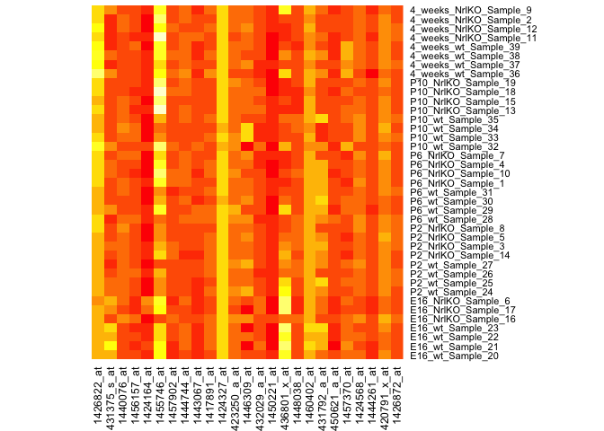
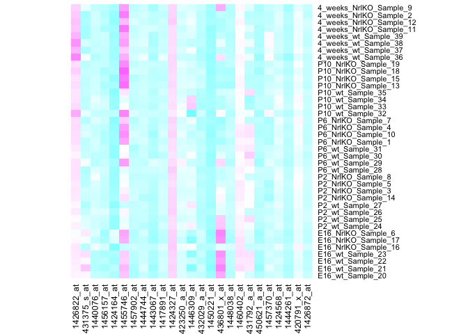

# sm03c
Eva Y  
January 27, 2015  

**Take-home problem: The full photoRec dataset has 39 samples and 29949 probesets. Using Lattice, choose 2 … or 20 … or 200 random probesets/genes and look for gene expression differences between the two genotypes, wild type versus knockout. Make use of the graphing techniques discussed this week such as scatter plots, data heatmaps, correlation heatmaps, etc.**

**In this seminar, we use lattice instead of ggplot2.**

**First, we have to prepare data frame for plotting.**


```r
# Load library 
library(lattice)
library(RColorBrewer)
library(gplots)
```

```
## 
## Attaching package: 'gplots'
## 
## The following object is masked from 'package:stats':
## 
##     lowess
```

```r
# Load datasets
prDat <- read.table("GSE4051_data.tsv")
prDes <- readRDS("GSE4051_design.rds")

# Choose 25 random probeset/genes and look for gene expression differences between the two genotypes, wild type versus knockout.
transposeDataFrame <- t(prDat)
set.seed(1)
size <- 2
(randomProbeset <- sample(1:ncol(transposeDataFrame), size = size))
```

```
## [1]  7952 11145
```

```r
# Create new data frame
rpDat <- cbind(genes <- transposeDataFrame[ ,randomProbeset], prDes)
orgRPDat <- with(rpDat, data.frame(sidChar, sidNum, devStage, gType, probeset = factor(rep(c(colnames(rpDat[1:size])), each = nrow(rpDat))), geneExp = c(genes)))
```

*Done!*

**Now we can visualize gene expression differences between two genotypes, wild type versus knockout using lattice.**


```r
# Using stripplots
stripplot(probeset ~ geneExp, orgRPDat)
```

 

```r
# Switch axis and add jitter
stripplot(probeset ~ geneExp, orgRPDat, jitter.data = TRUE)
```

 

```r
# Add information on gType and devStage as well as including some descriptive statistics. 
stripplot(geneExp ~ devStage | probeset, orgRPDat, layout = c(nlevels(orgRPDat$probeset), 1), groups = gType, auto.key = TRUE, grid = TRUE, type = c('p', 'a'))
```

 

```r
# Using density plots to explore gType and devStage versus geneExp for the randomly selected genes.
jBw <- 0.2
jn <- 400
densityplot(~ geneExp | probeset, orgRPDat, groups = gType, auto.key = TRUE, bw = jBw, n = jn, main = paste("bw =", jBw, ", n =", jn))
```

 

```r
densityplot(~ geneExp | probeset, orgRPDat, groups = devStage, auto.key = TRUE, bw = jBw, n = jn, main = paste("bw =", jBw, ", n =", jn))
```

 

```r
# Using boxplots
bwplot(geneExp ~ gType | probeset, orgRPDat)
```

 

```r
bwplot(geneExp ~ devStage | probeset, orgRPDat)
```

 

```r
# Using violin plots
bwplot(geneExp ~ gType, orgRPDat, panel = panel.violin)
```

 

**We can also plot heatmaps for data visualization.**


```r
# Increase number of randomly selected genes so that the heatmap looks better.
set.seed(1)
size <- 25
(randomProbeset <- sample(1:ncol(transposeDataFrame), size = size))
```

```
##  [1]  7952 11145 17156 27198  6040 26902 28287 19786 18837  1850  6167
## [12]  5286 20568 11499 23046 14899 21481 29690 11375 23269 27975  6350
## [23] 19503  3758  7997
```

```r
# Create new data frame
rpDat <- cbind(genes <- transposeDataFrame[ ,randomProbeset], prDes)
orgRPDat <- with(rpDat, data.frame(sidChar, sidNum, devStage, gType, probeset = factor(rep(c(colnames(rpDat[1:size])), each = nrow(rpDat))), geneExp = c(genes)))

# Plot heatmap for data visualization
hmapDat <- as.matrix(genes)
rownames(hmapDat) <- with(prDes, paste(devStage, gType, sidChar, sep = "_"))

# create the ketchup-mustard color heatmap
heatmap(hmapDat, Rowv = NA, Colv = NA, scale= "none", margins = c(5, 8))
```

 

```r
# change the color scheme
jBuPuFun <- colorRampPalette(brewer.pal(n = 9, "BuPu"))
heatmap(hmapDat, Rowv = NA, Colv = NA, col = cm.colors(256), scale="none", margins = c(5, 8))
```

 

```r
# inclusion of row and column dendrograms and the normalization of the data
heatmap(hmapDat, margins = c(5, 8), col = jBuPuFun(256))
```

 

```r
# try out heatmap.2()
heatmap.2(hmapDat, col = jBuPuFun, trace = "none")
```

 
