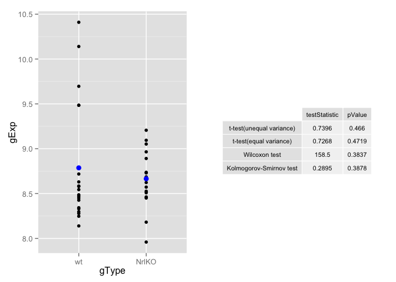
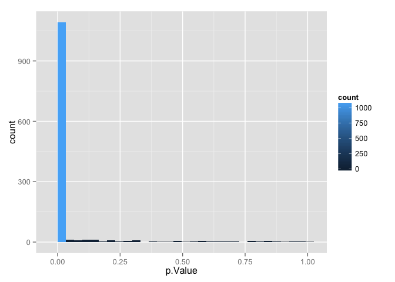
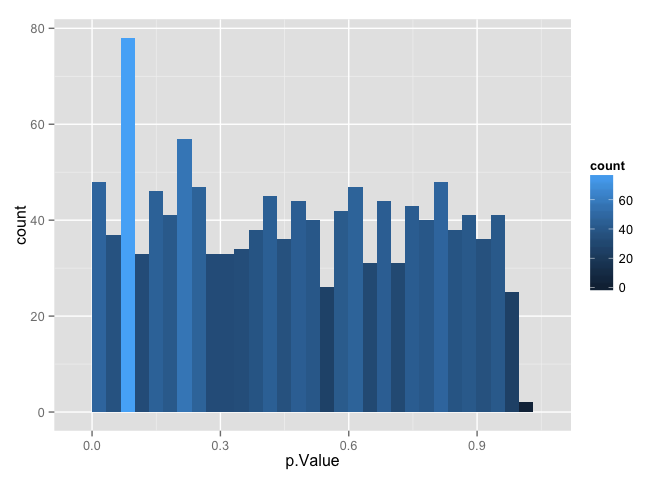

# sm04a
Eva Y  
January 28, 2015  

**Draw a different gene at random or pick one for biological interest and look up the Affy probe ID. Use the t test, with and without the common variance assumption, the Wilcoxon, and/or the Kolmogorov-Smirnov test to assess differential expression. Can you pull test statistics and/or p-values from the different approaches into an common object, like a readable table? Are you getting the same message from the various approaches? Hint: wilcox.test(), ks.test().**


```r
# attach libraries
library(lattice)
library(ggplot2)
library(plyr)
library(gridExtra)
```

```
## Loading required package: grid
```

```r
prDat <- read.table("~/Documents/stat540_seminar_git/seminar/sm03/GSE4051_data.tsv")
str(prDat, max.level = 0)
```

```
## 'data.frame':	29949 obs. of  39 variables:
```

```r
prDes <- readRDS("~/Documents/stat540_seminar_git/seminar/sm03/GSE4051_design.rds")
str(prDes)
```

```
## 'data.frame':	39 obs. of  4 variables:
##  $ sidChar : chr  "Sample_20" "Sample_21" "Sample_22" "Sample_23" ...
##  $ sidNum  : num  20 21 22 23 16 17 6 24 25 26 ...
##  $ devStage: Factor w/ 5 levels "E16","P2","P6",..: 1 1 1 1 1 1 1 2 2 2 ...
##  $ gType   : Factor w/ 2 levels "wt","NrlKO": 1 1 1 1 2 2 2 1 1 1 ...
```

```r
set.seed(1)
(theGene <- sample(1:nrow(prDat), 1))
```

```
## [1] 7952
```

```r
row.names(prDat[theGene, ])
```

```
## [1] "1426822_at"
```

**According to [Affy ID](http://www.augenlichtlab.com/data/Platform_and_annotation.txt), 1419655_at corresponds to the *Rhot2* gene, a member of the Rho family of GTPases. The protein encoded by this gene is localized to the outer mitochondrial membrane and is involved in mitochondrial trafficking and fusion-fission dynamics.**

**Now, we perform various statistical testing to access differential expression of the *Rhot2* gene between wildtype and KO mice.**


```r
pDat <- data.frame(prDes, gExp = unlist(prDat[theGene, ]))
str(pDat)
```

```
## 'data.frame':	39 obs. of  5 variables:
##  $ sidChar : chr  "Sample_20" "Sample_21" "Sample_22" "Sample_23" ...
##  $ sidNum  : num  20 21 22 23 16 17 6 24 25 26 ...
##  $ devStage: Factor w/ 5 levels "E16","P2","P6",..: 1 1 1 1 1 1 1 2 2 2 ...
##  $ gType   : Factor w/ 2 levels "wt","NrlKO": 1 1 1 1 2 2 2 1 1 1 ...
##  $ gExp    : num  8.3 8.33 8.43 8.49 8.51 ...
```

```r
ttRes <- t.test(gExp ~ gType, pDat) # default t-test on R applies Welch's modification (adjust df) to assume unequal variance

ttResEV <- t.test(gExp ~ gType, pDat, var.equal = TRUE) # var.equal = TRUE, specifies equal variances and a pooled variance estimate

wtRes <- suppressWarnings(wilcox.test(gExp ~ gType, pDat)) # wilcoxon test

wt <- subset(pDat, gType == "wt", select = gExp)
ko <- subset(pDat, gType != "wt", select = gExp)
kstRes <- suppressWarnings(ks.test(wt$gExp, ko$gExp)) # Kolmogorov-Smirnov test

# plot graph with test statistics and p-values
testStatistic <- signif(c(ttRes$statist, ttResEV$statist, wtRes$statist, kstRes$statist), digits = 4)
pValue <- signif(c(ttRes$p.value, ttResEV$p.value, wtRes$p.value, kstRes$p.value), digits = 4)
test <- c("t-test(unequal variance)", "t-test(equal variance)", "Wilcoxon test", "Kolmogorov-Smirnov test")
tableValue <- data.frame(testStatistic, pValue)
row.names(tableValue) <- test
tableValue <- tableGrob(tableValue, gpar.coltext = gpar(fontsize=8), gpar.coretext = gpar(fontsize=8), gpar.rowtext = gpar(fontsize=8))

p <- ggplot(pDat, aes(x = gType, y = gExp)) + geom_point() + stat_summary(fun.y = mean, geom = "point", size = 3, color = "blue")
grid.arrange(p, arrangeGrob(tableValue), ncol = 2)
```

 


#### Homework
**Select 50 random rows from the prDat data set. Then generate a matrix of random numbers using:** 
rDat = matrix(rnorm(50*50), nrow=50, ncol=50).

**Your task is to make 2 histograms of p-values. Using your choice of data aggregation techniques, run a t.test() on every pair of the 50 rows from prDat (do not test any single row against itself). You can plot the histogram using hist() or something nicer. Do the same thing again on rDat.You can get the p-value from the t.test using:**
t.test( row1 , row2 )$p.value


```r
set.seed(1)
fiftyRDat <- prDat[sample(1:nrow(prDat), 50), ] # pick 50 random genes
combnFifty <- combn(50, 2) # all possible combinations of two genes without repeats for the 50 randomly selected genes

# function to perform t-test for all possible combinations
pValue <- function(x) {
  t.test(fiftyRDat[x[1], ], fiftyRDat[x[2], ])$p.value
} 
allpValue <- apply(combnFifty, 2, pValue)

# plot histogram
allpValueDF <- data.frame(p.Value = allpValue)
qplot(p.Value, data = allpValueDF, geom="histogram") + geom_histogram(aes(fill = ..count..))
```

```
## stat_bin: binwidth defaulted to range/30. Use 'binwidth = x' to adjust this.
## stat_bin: binwidth defaulted to range/30. Use 'binwidth = x' to adjust this.
```

 

**Now, let's do the same for the matrix of randomly selected numbers.**

```r
rDat <- matrix(rnorm(50*50) ,nrow = 50 ,ncol = 50)
pValueRD <- function(x) {
  t.test(rDat[x[1], ], rDat[x[2], ])$p.value
}
allpValueRD <- apply(combnFifty, 2, pValueRD)

# plot histogram
allpValueDF.RD <- data.frame(p.Value = allpValueRD)
qplot(p.Value, data = allpValueDF.RD, geom="histogram") + geom_histogram(aes(fill = ..count..))
```

```
## stat_bin: binwidth defaulted to range/30. Use 'binwidth = x' to adjust this.
## stat_bin: binwidth defaulted to range/30. Use 'binwidth = x' to adjust this.
```

 

**Explain the difference between the histograms. Why are they different?**
Within the 50 randomly selected genes, the expression between two genes are more likely to be significantly different (high counts of p-values ~ 0). This is observed because these genes could encode for proteins involved in different mechanisms. Moreover, samples in the dataset varies in genotype and developmental stage which contributes to differential gene expressions. The second dataset is a matrix of randomly selected numbers from a normal distribution. Therefore, it can be observed that the p-values are not skewed (unlike the former) because it is less likely for two sets of numbers randomly selected from a normal distribution to be significantly different.
