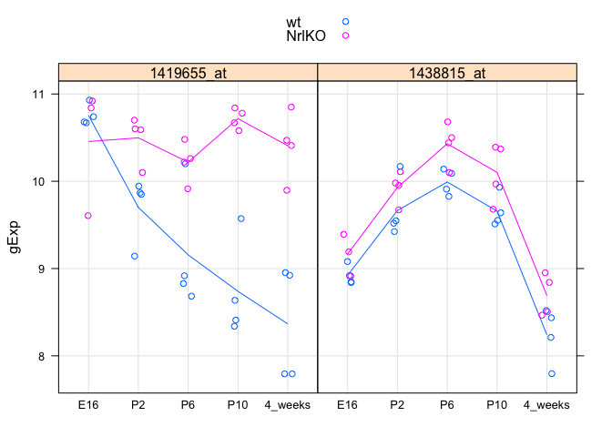
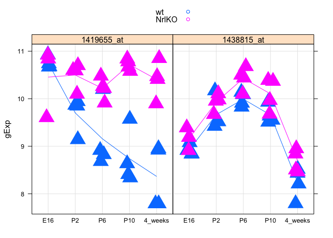
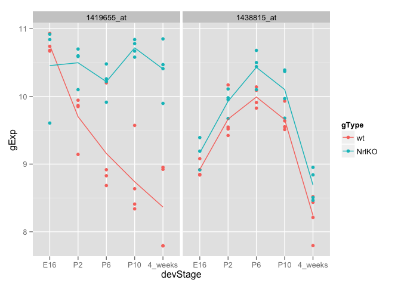
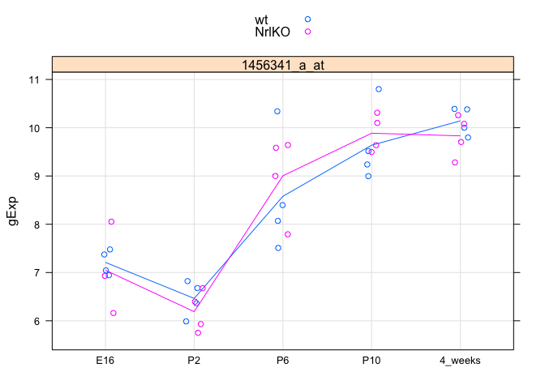
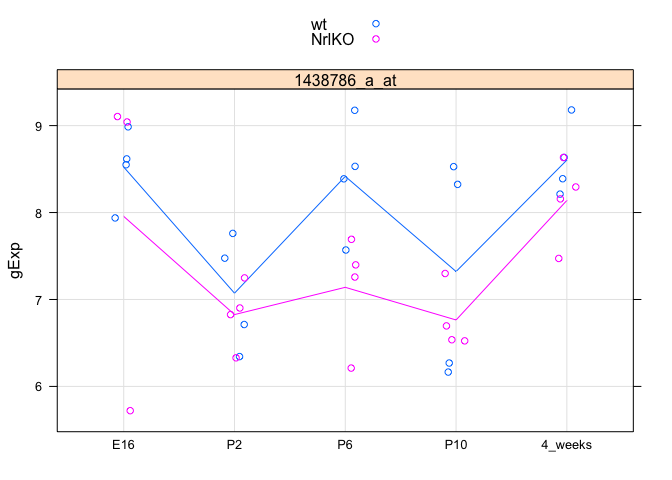
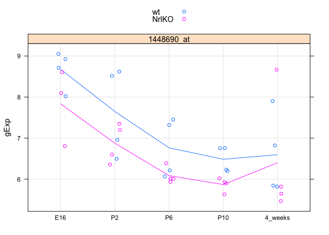
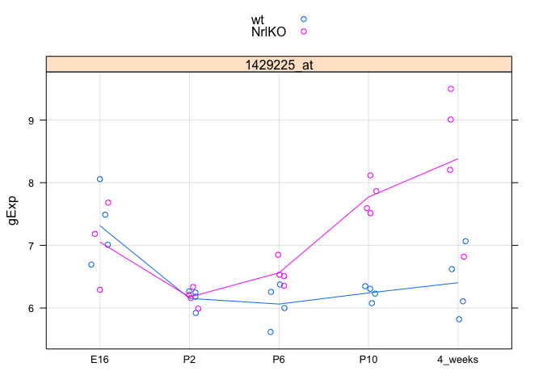

# sm05
Eva Y  
February 9, 2015  

**Write function to create data frame.**

```r
library(lattice)
library(ggplot2) 
library(reshape2)

prDat <- read.table("~/Documents/stat540_seminar_git/seminar/sm03/GSE4051_data.tsv")
str(prDat, max.level = 0)
```

```
## 'data.frame':	29949 obs. of  39 variables:
```

```r
prDes <- readRDS("~/Documents/stat540_seminar_git/seminar/sm03/GSE4051_design.rds")
str(prDes)
```

```
## 'data.frame':	39 obs. of  4 variables:
##  $ sidChar : chr  "Sample_20" "Sample_21" "Sample_22" "Sample_23" ...
##  $ sidNum  : num  20 21 22 23 16 17 6 24 25 26 ...
##  $ devStage: Factor w/ 5 levels "E16","P2","P6",..: 1 1 1 1 1 1 1 2 2 2 ...
##  $ gType   : Factor w/ 2 levels "wt","NrlKO": 1 1 1 1 2 2 2 1 1 1 ...
```

```r
(luckyGenes <- c("1419655_at","1438815_at"))
```

```
## [1] "1419655_at" "1438815_at"
```

```r
# function that takes as input the Affymetrix probeset ID(s) and gives as output a data.frame
prepareData <- function(x){
  selected_genes <- t(prDat[x, ])
  pDat <- cbind(selected_genes, prDes)
  pDat <- with(pDat, data.frame(sidChar, sidNum, devStage, gType, gene = factor(rep(c(colnames(pDat[x])), each = nrow(pDat))), gExp = c(selected_genes)))
}

jDat <- prepareData(luckyGenes)
str(jDat)
```

```
## 'data.frame':	78 obs. of  6 variables:
##  $ sidChar : Factor w/ 39 levels "Sample_1","Sample_10",..: 13 14 15 16 8 9 36 17 18 19 ...
##  $ sidNum  : num  20 21 22 23 16 17 6 24 25 26 ...
##  $ devStage: Factor w/ 5 levels "E16","P2","P6",..: 1 1 1 1 1 1 1 2 2 2 ...
##  $ gType   : Factor w/ 2 levels "wt","NrlKO": 1 1 1 1 2 2 2 1 1 1 ...
##  $ gene    : Factor w/ 2 levels "1419655_at","1438815_at": 1 1 1 1 1 1 1 1 1 1 ...
##  $ gExp    : num  10.93 10.74 10.67 10.68 9.61 ...
```

**Write a function to plot stripplot using lattice.**

```r
# function to plot stripplot using lattice
makeStripplot <- function (x, ...) {
  stripplot(gExp ~ devStage | gene, x,
          group = gType, jitter.data = TRUE,
          auto.key = TRUE, type = c('p', 'a'), grid = TRUE, ...)
  }

makeStripplot(jDat)
```

 

```r
makeStripplot(jDat, pch = 17, cex = 3) # I've got control!
```

 

**Now, try it with ggplot2.**

```r
# function to plot stripplot using ggplot2
makeStripplotGg <- function (x) {
  ggplot(x, aes(x = devStage, y = gExp, color = gType, group = gType)) +
  geom_point() + stat_smooth(se = F) + facet_wrap(~ gene)
  }

makeStripplotGg(jDat)
```

```
## geom_smooth: method="auto" and size of largest group is <1000, so using loess. Use 'method = x' to change the smoothing method.
## geom_smooth: method="auto" and size of largest group is <1000, so using loess. Use 'method = x' to change the smoothing method.
```

 

**Do a two-sample t-test to determine a difference in expected gene expression for probeset "1456341_a_at" at developmental stage P2 vs. 4 weeks post-natal (ignoring genotype, i.e. lump the wild types and knockouts together). Let’s assume a common variance in the two groups.**


```r
# make data frame using function for probeset 1456341_a_at and plot a stripplot
makeStripplot(newDat <- prepareData("1456341_a_at"))
```

 

```r
# use subset to select for devStage P2 and 4_weeks
newDat_p2_4weeks <- subset(newDat, devStage == "P2" | devStage == "4_weeks", 
                    select = c(sidChar:gExp))

# perform two sample t-test
(tt_newDat <- t.test(gExp ~ devStage, newDat_p2_4weeks, var.equal = TRUE))
```

```
## 
## 	Two Sample t-test
## 
## data:  gExp by devStage
## t = -18.8415, df = 14, p-value = 2.411e-11
## alternative hypothesis: true difference in means is not equal to 0
## 95 percent confidence interval:
##  -4.077604 -3.244146
## sample estimates:
##      mean in group P2 mean in group 4_weeks 
##              6.325750              9.986625
```

**Let's focus on probeset "1438786_a_at" and fit a linear model with a categorical covariate.**

```r
# make data frame using function for probeset 1438786_a_at and plot a stripplot
makeStripplot(mDat <- prepareData("1438786_a_at"))
```

 

```r
# fit linear model
mFit <- lm(formula = gExp ~ devStage, data = mDat, subset = gType == "wt")
summary(mFit)
```

```
## 
## Call:
## lm(formula = gExp ~ devStage, data = mDat, subset = gType == 
##     "wt")
## 
## Residuals:
##      Min       1Q   Median       3Q      Max 
## -1.15650 -0.44000  0.02875  0.49150  1.20650 
## 
## Coefficients:
##                 Estimate Std. Error t value Pr(>|t|)    
## (Intercept)       8.5228     0.3788  22.498  5.7e-13 ***
## devStageP2       -1.4503     0.5357  -2.707   0.0162 *  
## devStageP6       -0.1067     0.5357  -0.199   0.8447    
## devStageP10      -1.2012     0.5357  -2.242   0.0405 *  
## devStage4_weeks   0.0810     0.5357   0.151   0.8818    
## ---
## Signif. codes:  0 '***' 0.001 '**' 0.01 '*' 0.05 '.' 0.1 ' ' 1
## 
## Residual standard error: 0.7576 on 15 degrees of freedom
## Multiple R-squared:  0.4974,	Adjusted R-squared:  0.3634 
## F-statistic: 3.712 on 4 and 15 DF,  p-value: 0.02716
```

**As the "W" shape of the expression profile for “1438786_a_at” means that the expression values for developmental stages P2 and P10 are quite similar, let's test whether the P2 and P10 effects are equal or, equivalently, whether their difference is equal to zero.**

```r
# extract parameter estimates for the fitted linear model
coef(mFit)
```

```
##     (Intercept)      devStageP2      devStageP6     devStageP10 
##         8.52275        -1.45025        -0.10675        -1.20125 
## devStage4_weeks 
##         0.08100
```

```r
# construct contrast matrix - one row
contMat <- matrix(c(0, 1, 0, -1, 0), 1)
(obsDiff <- contMat %*% coef(mFit))
```

```
##        [,1]
## [1,] -0.249
```

```r
# check to see if this really is the observed difference in sample mean for wt mice, P2 vs. P10
(sampMeans <- aggregate(gExp ~ devStage, mDat, FUN = mean,
                        subset = gType == "wt"))
```

```
##   devStage    gExp
## 1      E16 8.52275
## 2       P2 7.07250
## 3       P6 8.41600
## 4      P10 7.32150
## 5  4_weeks 8.60375
```

```r
with(sampMeans, gExp[devStage == "P2"] - gExp[devStage == "P10"]) # yes!
```

```
## [1] -0.249
```

**Let's try obtain the estimated standard error for our contrast.**

```r
# use vcov() to obtain variance-covariance matrix of the parameters estimated in the original model
vcov(mFit)
```

```
##                 (Intercept) devStageP2 devStageP6 devStageP10
## (Intercept)       0.1435072 -0.1435072 -0.1435072  -0.1435072
## devStageP2       -0.1435072  0.2870144  0.1435072   0.1435072
## devStageP6       -0.1435072  0.1435072  0.2870144   0.1435072
## devStageP10      -0.1435072  0.1435072  0.1435072   0.2870144
## devStage4_weeks  -0.1435072  0.1435072  0.1435072   0.1435072
##                 devStage4_weeks
## (Intercept)          -0.1435072
## devStageP2            0.1435072
## devStageP6            0.1435072
## devStageP10           0.1435072
## devStage4_weeks       0.2870144
```

```r
# take diagnonal elements and sqrt them, should exactly equal to standard errors reported for the original model
sqrt(diag(vcov(mFit)))
```

```
##     (Intercept)      devStageP2      devStageP6     devStageP10 
##       0.3788234       0.5357372       0.5357372       0.5357372 
## devStage4_weeks 
##       0.5357372
```

```r
summary(mFit)$coefficients[ , "Std. Error"] # yes!
```

```
##     (Intercept)      devStageP2      devStageP6     devStageP10 
##       0.3788234       0.5357372       0.5357372       0.5357372 
## devStage4_weeks 
##       0.5357372
```

**We can form a test statistics by dividing observed effect (difference in estimated coefficient between P2 and P10) and estimated standard error.**

```r
(estSe <- contMat %*% vcov(mFit) %*% t(contMat)) # variance-covariance matrix of a contrast
```

```
##           [,1]
## [1,] 0.2870144
```

```r
# test statistics 
(testStat <- obsDiff/estSe)
```

```
##            [,1]
## [1,] -0.8675523
```

```r
# compute two-sided p value 
2 * pt(abs(testStat), df = df.residual(mFit), lower.tail = FALSE)
```

```
##           [,1]
## [1,] 0.3993062
```

** As p-value is rather larger, we cannot conclude a significant difference in gene expression of 1438786_a_at in wt mice between devStage P2 and P10.**

##### Let's try fit a linear model with two categorical covariates.

```r
# let’s focus on probeset “1448690_at”
makeStripplot(oDat <- prepareData("1448690_at"))
```

 

```r
str(oDat)
```

```
## 'data.frame':	39 obs. of  6 variables:
##  $ sidChar : Factor w/ 39 levels "Sample_1","Sample_10",..: 13 14 15 16 8 9 36 17 18 19 ...
##  $ sidNum  : num  20 21 22 23 16 17 6 24 25 26 ...
##  $ devStage: Factor w/ 5 levels "E16","P2","P6",..: 1 1 1 1 1 1 1 2 2 2 ...
##  $ gType   : Factor w/ 2 levels "wt","NrlKO": 1 1 1 1 2 2 2 1 1 1 ...
##  $ gene    : Factor w/ 1 level "1448690_at": 1 1 1 1 1 1 1 1 1 1 ...
##  $ gExp    : num  8.02 9.05 8.71 8.92 6.8 ...
```

```r
# fit a linear model with covariates gType and devStage and include their interactions. 
oFitBig <- lm(formula = gExp ~ devStage*gType, data = oDat)
summary(oFitBig)$coef
```

```
##                               Estimate Std. Error     t value     Pr(>|t|)
## (Intercept)                 8.67800000  0.3986668 21.76754966 1.634011e-19
## devStageP2                 -1.02900000  0.5638000 -1.82511517 7.830030e-02
## devStageP6                 -1.91450000  0.5638000 -3.39570748 2.002778e-03
## devStageP10                -2.19325000  0.5638000 -3.89012036 5.387044e-04
## devStage4_weeks            -2.08200000  0.5638000 -3.69279862 9.148816e-04
## gTypeNrlKO                 -0.84233333  0.6089736 -1.38320163 1.771604e-01
## devStageP2:gTypeNrlKO       0.06983333  0.8298912  0.08414758 9.335173e-01
## devStageP6:gTypeNrlKO       0.16533333  0.8298912  0.19922291 8.434787e-01
## devStageP10:gTypeNrlKO      0.22583333  0.8298912  0.27212403 7.874548e-01
## devStage4_weeks:gTypeNrlKO  0.64608333  0.8298912  0.77851572 4.425713e-01
```

```r
# fit a linear model with same covariates but omit the interaction
oFitSmall <- lm(formula = gExp ~ devStage + gType, data = oDat)
summary(oFitSmall)$coef
```

```
##                   Estimate Std. Error   t value     Pr(>|t|)
## (Intercept)      8.5803162  0.3046461 28.164864 1.177029e-24
## devStageP2      -1.0103640  0.3924016 -2.574821 1.470127e-02
## devStageP6      -1.8481140  0.3924016 -4.709752 4.327597e-05
## devStageP10     -2.0966140  0.3924016 -5.343032 6.703381e-06
## devStage4_weeks -1.7752390  0.3924016 -4.524036 7.443740e-05
## gTypeNrlKO      -0.6144044  0.2430235 -2.528168 1.643264e-02
```

**Recall the anova() function can take two fitted models, one nested within the other, and perform this test.**

```r
anova(oFitBig, oFitSmall) # With a p-value awfully close to one, we confirm that, no, there is no evidence for interaction in this particular case.
```

```
## Analysis of Variance Table
## 
## Model 1: gExp ~ devStage * gType
## Model 2: gExp ~ devStage + gType
##   Res.Df    RSS Df Sum of Sq      F Pr(>F)
## 1     29 18.436                           
## 2     33 18.933 -4   -0.4966 0.1953 0.9389
```

**Now, try the analysis with probeset “1429225_at” to see if I can duplicated the results.**

```r
makeStripplot(oDat <- prepareData("1429225_at"))
```

 

```r
# fit a linear model with covariates gType and devStage and include their interactions. 
oFitBig <- lm(formula = gExp ~ gType*devStage, data = oDat)
summary(oFitBig)$coef
```

```
##                              Estimate Std. Error    t value     Pr(>|t|)
## (Intercept)                 7.3125000  0.2617295 27.9391470 1.619124e-22
## gTypeNrlKO                 -0.2601667  0.3997985 -0.6507445 5.203345e-01
## devStageP2                 -1.1582500  0.3701415 -3.1292090 3.973410e-03
## devStageP6                 -1.2495000  0.3701415 -3.3757364 2.109615e-03
## devStageP10                -1.0717500  0.3701415 -2.8955146 7.124584e-03
## devStage4_weeks            -0.9087500  0.3701415 -2.4551424 2.031796e-02
## gTypeNrlKO:devStageP2       0.2804167  0.5448335  0.5146833 6.106750e-01
## gTypeNrlKO:devStageP6       0.7589167  0.5448335  1.3929332 1.742271e-01
## gTypeNrlKO:devStageP10      1.7914167  0.5448335  3.2880077 2.647561e-03
## gTypeNrlKO:devStage4_weeks  2.2389167  0.5448335  4.1093596 2.970497e-04
```

```r
# fit a linear model with same covariates but omit the interaction
oFitSmall <- lm(formula = gExp ~ gType + devStage, data = oDat)
summary(oFitSmall)$coef
```

```
##                   Estimate Std. Error    t value     Pr(>|t|)
## (Intercept)      6.8651765  0.2722124 25.2199286 3.847733e-23
## gTypeNrlKO       0.7835882  0.2171503  3.6085055 1.006657e-03
## devStageP2      -1.0925956  0.3506251 -3.1161367 3.780029e-03
## devStageP6      -0.9445956  0.3506251 -2.6940334 1.101250e-02
## devStageP10     -0.2505956  0.3506251 -0.7147110 4.798134e-01
## devStage4_weeks  0.1361544  0.3506251  0.3883191 7.002738e-01
```

```r
anova(oFitBig, oFitSmall) # Not surprisingly, the interaction here is highly statistically significant.
```

```
## Analysis of Variance Table
## 
## Model 1: gExp ~ gType * devStage
## Model 2: gExp ~ gType + devStage
##   Res.Df     RSS Df Sum of Sq      F    Pr(>F)    
## 1     29  7.9463                                  
## 2     33 15.1163 -4     -7.17 6.5418 0.0007028 ***
## ---
## Signif. codes:  0 '***' 0.001 '**' 0.01 '*' 0.05 '.' 0.1 ' ' 1
```

### Take-home problems
#### Question 1:
**Estimate the effect of devStage on mDat with a linear model by using lm(). You will want to use the following formula: gExp ~ devStage. What stages are significantly different from 4_weeks? Use summary() to get your results.**


```r
# load data
mDat <- read.table("~/Documents/stat540_seminar_git/seminar/sm05/mDat.tsv", header=T, sep= "\t", row.names = 1)

mFit <- lm(formula = gExp ~ devStage, data = mDat)
summary(mFit)
```

```
## 
## Call:
## lm(formula = gExp ~ devStage, data = mDat)
## 
## Residuals:
##      Min       1Q   Median       3Q      Max 
## -2.55871 -0.44281 -0.07737  0.56787  1.48525 
## 
## Coefficients:
##             Estimate Std. Error t value Pr(>|t|)    
## (Intercept)  8.37137    0.29630  28.254  < 2e-16 ***
## devStageE16 -0.09166    0.43373  -0.211  0.83389    
## devStageP10 -1.32863    0.41902  -3.171  0.00321 ** 
## devStageP2  -1.42200    0.41902  -3.394  0.00177 ** 
## devStageP6  -0.59350    0.41902  -1.416  0.16576    
## ---
## Signif. codes:  0 '***' 0.001 '**' 0.01 '*' 0.05 '.' 0.1 ' ' 1
## 
## Residual standard error: 0.838 on 34 degrees of freedom
## Multiple R-squared:  0.3685,	Adjusted R-squared:  0.2942 
## F-statistic: 4.959 on 4 and 34 DF,  p-value: 0.002936
```

**P10 and P2 are significantly different from 4_weeks.**

#### Question 2:
**Run the exact same test on mDat values with genotype “NrlKO”. What are the differences between this test and the last one?**


```r
mFit_KO <- lm(formula = gExp ~ devStage, data = mDat, subset = gType == "NrlKO")
summary(mFit_KO)
```

```
## 
## Call:
## lm(formula = gExp ~ devStage, data = mDat, subset = gType == 
##     "NrlKO")
## 
## Residuals:
##      Min       1Q   Median       3Q      Max 
## -2.23467 -0.23350  0.07575  0.45787  1.14833 
## 
## Coefficients:
##             Estimate Std. Error t value Pr(>|t|)    
## (Intercept)   8.1390     0.4286  18.992 2.17e-11 ***
## devStageE16  -0.1833     0.6546  -0.280   0.7835    
## devStageP10  -1.3750     0.6061  -2.269   0.0396 *  
## devStageP2   -1.3128     0.6061  -2.166   0.0481 *  
## devStageP6   -0.9992     0.6061  -1.649   0.1214    
## ---
## Signif. codes:  0 '***' 0.001 '**' 0.01 '*' 0.05 '.' 0.1 ' ' 1
## 
## Residual standard error: 0.8571 on 14 degrees of freedom
## Multiple R-squared:  0.3774,	Adjusted R-squared:  0.1995 
## F-statistic: 2.121 on 4 and 14 DF,  p-value: 0.1321
```

**At stage P2 and P10, gene expression of 1438786_a_at in NrlKO mice are still significantly different from stage 4 weeks but less significant than the previous model.**

#### Question 3:
**Fit a linear model of the expression of 1438786_a_at as a linear model of devStage and gType without interactions. Use the following formula: gExp ~ devStage + gType.**

```r
mFit_no_intr <- lm(formula = gExp ~ devStage + gType, data = mDat)
summary(mFit_no_intr)
```

```
## 
## Call:
## lm(formula = gExp ~ devStage + gType, data = mDat)
## 
## Residuals:
##      Min       1Q   Median       3Q      Max 
## -2.20215 -0.38988  0.06986  0.46888  1.18085 
## 
## Coefficients:
##             Estimate Std. Error t value Pr(>|t|)    
## (Intercept)   8.0594     0.3030  26.600  < 2e-16 ***
## devStageE16  -0.1362     0.4043  -0.337 0.738271    
## devStageP10  -1.3286     0.3902  -3.405 0.001754 ** 
## devStageP2   -1.4220     0.3902  -3.644 0.000912 ***
## devStageP6   -0.5935     0.3902  -1.521 0.137771    
## gTypewt       0.6240     0.2504   2.492 0.017894 *  
## ---
## Signif. codes:  0 '***' 0.001 '**' 0.01 '*' 0.05 '.' 0.1 ' ' 1
## 
## Residual standard error: 0.7804 on 33 degrees of freedom
## Multiple R-squared:  0.4685,	Adjusted R-squared:  0.388 
## F-statistic: 5.818 on 5 and 33 DF,  p-value: 0.0005865
```

#### Question 4:
**Fit a linear model of the expression of 1438786_a_at as a linear model of devStage and gType with interactions. Use the following formula gExp ~ devStage * gType. Is this model different from the model without interctions?**

```r
mFit_w_intr <- lm(formula = gExp ~ devStage * gType, data = mDat)
summary(mFit_w_intr)
```

```
## 
## Call:
## lm(formula = gExp ~ devStage * gType, data = mDat)
## 
## Residuals:
##      Min       1Q   Median       3Q      Max 
## -2.23467 -0.37612  0.03025  0.47862  1.20650 
## 
## Coefficients:
##                     Estimate Std. Error t value Pr(>|t|)    
## (Intercept)          8.13900    0.40360  20.166   <2e-16 ***
## devStageE16         -0.18333    0.61650  -0.297   0.7683    
## devStageP10         -1.37500    0.57077  -2.409   0.0226 *  
## devStageP2          -1.31275    0.57077  -2.300   0.0288 *  
## devStageP6          -0.99925    0.57077  -1.751   0.0906 .  
## gTypewt              0.46475    0.57077   0.814   0.4221    
## devStageE16:gTypewt  0.10233    0.84015   0.122   0.9039    
## devStageP10:gTypewt  0.09275    0.80719   0.115   0.9093    
## devStageP2:gTypewt  -0.21850    0.80719  -0.271   0.7885    
## devStageP6:gTypewt   0.81150    0.80719   1.005   0.3231    
## ---
## Signif. codes:  0 '***' 0.001 '**' 0.01 '*' 0.05 '.' 0.1 ' ' 1
## 
## Residual standard error: 0.8072 on 29 degrees of freedom
## Multiple R-squared:  0.5003,	Adjusted R-squared:  0.3452 
## F-statistic: 3.226 on 9 and 29 DF,  p-value: 0.007869
```

**devStage becomes less significant when gType interaction is introduced.**

#### Question 5:
**Run an anova comparing the models from questions 3 and 4. Are the models significantly different?**

```r
anova(mFit_no_intr, mFit_w_intr)
```

```
## Analysis of Variance Table
## 
## Model 1: gExp ~ devStage + gType
## Model 2: gExp ~ devStage * gType
##   Res.Df    RSS Df Sum of Sq     F Pr(>F)
## 1     33 20.097                          
## 2     29 18.895  4    1.2014 0.461 0.7637
```

**p-value (= 0.7637) is high so the models are not significantly different.**

#### Question 6:
**We are now going to create a batch effect and control for it in our analysis using a blocking variable. Run the following code block to create a new data set, bDat, with a batch effect.**

```r
batches = as.character(rep(c("batch1","batch2"),20)[1:39])
batchEffect = rep(c(0, 4), 20)[1:39]
bDat = mDat
bDat$gExp = bDat$gExp + batchEffect 
summary(lm(gExp ~ devStage * gType, data=bDat))
```

```
## 
## Call:
## lm(formula = gExp ~ devStage * gType, data = bDat)
## 
## Residuals:
##    Min     1Q Median     3Q    Max 
## -3.568 -2.000 -0.247  2.106  3.815 
## 
## Coefficients:
##                     Estimate Std. Error t value Pr(>|t|)    
## (Intercept)         10.13900    1.29331   7.840  1.2e-08 ***
## devStageE16         -0.85000    1.97557  -0.430    0.670    
## devStageP10         -1.37500    1.82902  -0.752    0.458    
## devStageP2          -1.31275    1.82902  -0.718    0.479    
## devStageP6          -0.99925    1.82902  -0.546    0.589    
## gTypewt              0.46475    1.82902   0.254    0.801    
## devStageE16:gTypewt  0.76900    2.69225   0.286    0.777    
## devStageP10:gTypewt  0.09275    2.58663   0.036    0.972    
## devStageP2:gTypewt  -0.21850    2.58663  -0.084    0.933    
## devStageP6:gTypewt   0.81150    2.58663   0.314    0.756    
## ---
## Signif. codes:  0 '***' 0.001 '**' 0.01 '*' 0.05 '.' 0.1 ' ' 1
## 
## Residual standard error: 2.587 on 29 degrees of freedom
## Multiple R-squared:  0.08919,	Adjusted R-squared:  -0.1935 
## F-statistic: 0.3155 on 9 and 29 DF,  p-value: 0.9633
```

**How has the batch effect changed the result of the test? How is it different from the result of question 4?**

When batch effect is included, expression of 1438786_a_at at P2 and P10 are not significantly different from 4 weeks anymore. 

#### Question 7:
**Fit a new linear model with the formula gExp ~ devStage * gType + batches using data=bDat. How is this similar to the results of question 4? In this case, batches is our blocking variable. By including batches in the model we can estimate the effect of contamination in our data caused by the difference in batches and get back to testing hypotheses we’re really interested in, like the effect of knockouts!**

```r
bFit <- lm(formula = gExp ~ devStage * gType + batches, data = bDat)
summary(bFit)
```

```
## 
## Call:
## lm(formula = gExp ~ devStage * gType + batches, data = bDat)
## 
## Residuals:
##     Min      1Q  Median      3Q     Max 
## -2.1465 -0.3621  0.1043  0.3822  1.1745 
## 
## Coefficients:
##                     Estimate Std. Error t value Pr(>|t|)    
## (Intercept)          8.00667    0.42366  18.899  < 2e-16 ***
## devStageE16         -0.13922    0.61759  -0.225   0.8233    
## devStageP10         -1.37500    0.57037  -2.411   0.0227 *  
## devStageP2          -1.31275    0.57037  -2.302   0.0290 *  
## devStageP6          -0.99925    0.57037  -1.752   0.0907 .  
## gTypewt              0.46475    0.57037   0.815   0.4221    
## batchesbatch2        4.26466    0.25944  16.438 6.48e-16 ***
## devStageE16:gTypewt  0.05822    0.84068   0.069   0.9453    
## devStageP10:gTypewt  0.09275    0.80663   0.115   0.9093    
## devStageP2:gTypewt  -0.21850    0.80663  -0.271   0.7885    
## devStageP6:gTypewt   0.81150    0.80663   1.006   0.3230    
## ---
## Signif. codes:  0 '***' 0.001 '**' 0.01 '*' 0.05 '.' 0.1 ' ' 1
## 
## Residual standard error: 0.8066 on 28 degrees of freedom
## Multiple R-squared:  0.9145,	Adjusted R-squared:  0.8839 
## F-statistic: 29.94 on 10 and 28 DF,  p-value: 2.456e-12
```

**Expression of 1438786_a_at at P2 and P10 becomes significantly different from 4 weeks like the results in question 4.**

#### Question 8:
**Run an anova comparing the two formulae gExp ~ devStage + gType + batches and gExp ~ devStage * gType + batches. How are these results similar to that of question 5?**

```r
bFit_no_intr <- lm(formula = gExp ~ devStage + gType + batches, data = bDat)
anova(bFit, bFit_no_intr)
```

```
## Analysis of Variance Table
## 
## Model 1: gExp ~ devStage * gType + batches
## Model 2: gExp ~ devStage + gType + batches
##   Res.Df    RSS Df Sum of Sq      F Pr(>F)
## 1     28 18.218                           
## 2     32 19.431 -4   -1.2127 0.4659 0.7601
```

**Similar to question 5, p-value (= 0.7601) is high so the models are not significantly different.**

