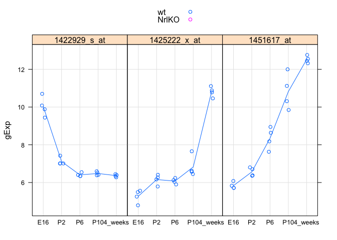
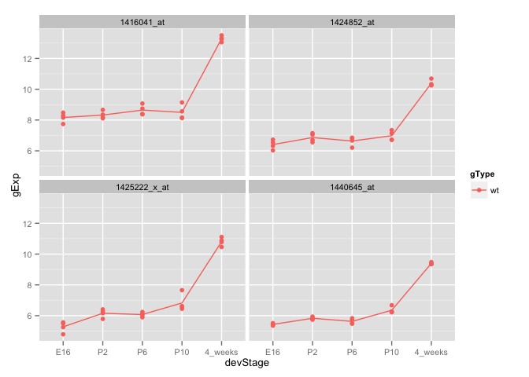
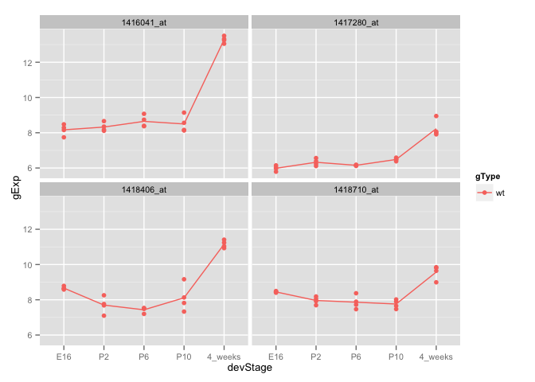
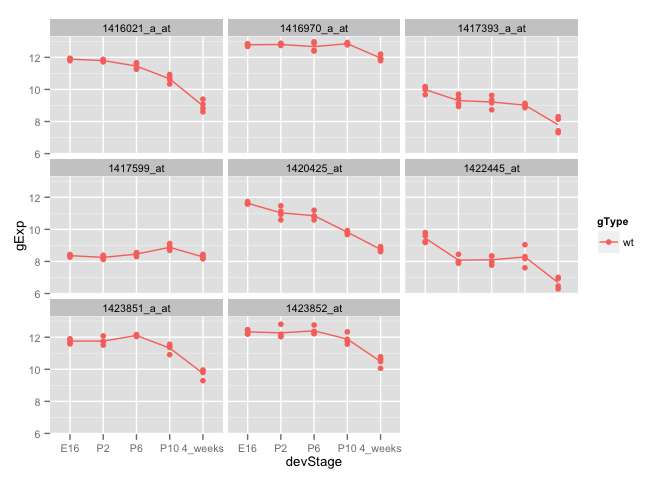
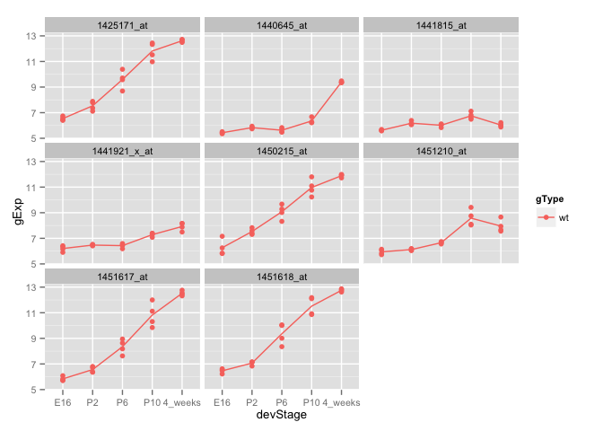
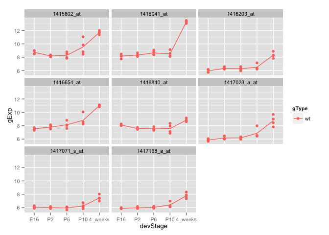
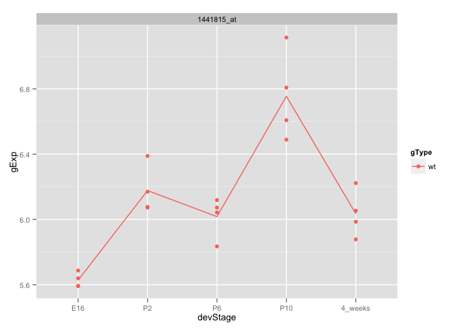

# sm06
Eva Y  
February 14, 2015  

#### Practice exercises
##### Fit a linear model: explain gene expression in the wild type mice as a function of developmental stage (one-way ANOVA)

```r
library(limma)
library(lattice)
library(ggplot2)
library(hexbin)
library(reshape2)
library(GGally)

prDat <- read.table("~/Documents/stat540_seminar_git/seminar/sm03/GSE4051_data.tsv")
str(prDat, max.level = 0)
```

```
## 'data.frame':	29949 obs. of  39 variables:
```

```r
prDes <- readRDS("~/Documents/stat540_seminar_git/seminar/sm03/GSE4051_design.rds")
str(prDes)
```

```
## 'data.frame':	39 obs. of  4 variables:
##  $ sidChar : chr  "Sample_20" "Sample_21" "Sample_22" "Sample_23" ...
##  $ sidNum  : num  20 21 22 23 16 17 6 24 25 26 ...
##  $ devStage: Factor w/ 5 levels "E16","P2","P6",..: 1 1 1 1 1 1 1 2 2 2 ...
##  $ gType   : Factor w/ 2 levels "wt","NrlKO": 1 1 1 1 2 2 2 1 1 1 ...
```

```r
# extract data for wild-type mice
wtDes <- subset(prDes, gType == "wt")
str(wtDes)
```

```
## 'data.frame':	20 obs. of  4 variables:
##  $ sidChar : chr  "Sample_20" "Sample_21" "Sample_22" "Sample_23" ...
##  $ sidNum  : num  20 21 22 23 24 25 26 27 28 29 ...
##  $ devStage: Factor w/ 5 levels "E16","P2","P6",..: 1 1 1 1 2 2 2 2 3 3 ...
##  $ gType   : Factor w/ 2 levels "wt","NrlKO": 1 1 1 1 1 1 1 1 1 1 ...
```

```r
wtDat <- subset(prDat, select = prDes$gType == "wt")
str(wtDat, max.level = 0)
```

```
## 'data.frame':	29949 obs. of  20 variables:
```

```r
# make design matrix, accept default "ref + treatment"
wtDesMat <- model.matrix(~ devStage, wtDes)
str(wtDesMat)
```

```
##  num [1:20, 1:5] 1 1 1 1 1 1 1 1 1 1 ...
##  - attr(*, "dimnames")=List of 2
##   ..$ : chr [1:20] "12" "13" "14" "15" ...
##   ..$ : chr [1:5] "(Intercept)" "devStageP2" "devStageP6" "devStageP10" ...
##  - attr(*, "assign")= int [1:5] 0 1 1 1 1
##  - attr(*, "contrasts")=List of 1
##   ..$ devStage: chr "contr.treatment"
```

```r
# fit the model for all probes at once
# use eBayes() to moderate the estimated error variances
wtFit <- lmFit(wtDat, wtDesMat)
wtEbFit <- eBayes(wtFit)

# F test by topTable() and select hits
# i.e. which genes show differential expression over the course of development?
dsHits <- topTable(wtEbFit)
```

```
## Removing intercept from test coefficients
```

```r
# Use the hit list you stored above and your functions for extracting and plotting data to produce this plot for hits 3, 6, and 9 on the list.
select_hits <- row.names(dsHits[c(3, 6, 9), ])
  
# source script from previous exercise
source('~/Documents/stat540_seminar_git/source_scripts/make_df_stripplots.R', echo=TRUE)
```

```
## 
## > prepareData <- function(x) {
## +     selected_genes <- t(prDat[x, ])
## +     pDat <- cbind(selected_genes, prDes)
## +     pDat <- with(pDat, data.frame(si .... [TRUNCATED] 
## 
## > makeStripplot <- function(x, ...) {
## +     stripplot(gExp ~ devStage | gene, x, group = gType, jitter.data = TRUE, 
## +         auto.key = TRUE, type = .... [TRUNCATED] 
## 
## > makeStripplotGg <- function(x) {
## +     ggplot(x, aes(x = devStage, y = gExp, color = gType, group = gType)) + 
## +         geom_point() + stat_smooth( .... [TRUNCATED]
```

```r
# prepare data frame
hits_Dat <- prepareData(select_hits)

# we only want the wt data
hits_Dat <- subset(hits_Dat, gType == "wt")

# plot with lattice
makeStripplot(hits_Dat)
```

 

```r
# plot with ggplots
p <- makeStripplotGg(hits_Dat) + theme(text = element_text(size=10))
suppressMessages(print(p))
```

 

**Yay, I learned how to use source()!**

##### Be the boss of topTable(). 

```r
# How many probes have Benjamini-Hochberg (“BH”) adjusted p-values for the F test conducted above that are less than 1e-05?
tt_all_genes <- topTable(wtEbFit, number = 29949)
```

```
## Removing intercept from test coefficients
```

```r
bh_less <- subset(tt_all_genes, adj.P.Val < 1e-05)
nrow(bh_less) # 350
```

```
## [1] 350
```

```r
# What is the 63rd hit on this list? Provide it’s Affy ID, F statistic, BH adjusted p-value, and the estimated effect for developmental stage “P6” in that order. 
pick_63 <- tt_all_genes[63, ]
subset(pick_63, select = c(F, adj.P.Val, devStageP6))
```

```
##                    F    adj.P.Val devStageP6
## 1451633_a_at 64.0104 1.048908e-07      2.069
```

##### Consider the effects associated with developmental stages P2 and P10. Scatterplot the t statistics for the test that the P2 effect is zero against that for P10. Ideally this plot would be a high-volume scatterplot, include an x = y line, and have an aspect ratio of 1 and common axes. 

```r
# extract t-statistics for stages P2 and P10
tt_p2p10 <- subset(wtEbFit$t, select = c(devStageP2, devStageP10))

# create data frame
tt_p2p10_df <- data.frame(tt_p2p10)

# plot scatterplot
ggplot(tt_p2p10_df, aes(devStageP10, devStageP2)) + geom_point() + stat_binhex() + theme_bw() + coord_cartesian(ylim = c(-25, 25), xlim = c(-25, 25)) + scale_x_continuous(breaks=seq(-30, 30, 10)) + scale_y_continuous(breaks=seq(-30, 30, 10)) + geom_abline(slope = 1) + xlab("t-statistics devStageP10") + ylab("t-statistics devStageP2")
```

 

##### Create a densityplot of the associated adjusted p-values, so you can get a sense of which developmental stage, P2 or P10, is more clearly distinguished from baseline E16.

```r
# extract adjusted p-values for p2 and p10 devStage
bh_p2 <- topTable(wtEbFit, coef = "devStageP2", n = Inf, sort = "none")$adj.P.Val
bh_p10 <- topTable(wtEbFit, coef = "devStageP10", n = Inf, sort = "none")$adj.P.Val

# create tall data frame
bh_p2p10 <- data.frame(bh_p2 = bh_p2, bh_p10 = bh_p10)
bh_p2p10_tall <- melt(bh_p2p10)
```

```
## No id variables; using all as measure variables
```

```r
colnames(bh_p2p10_tall) <- c("devStage", "adj.P.Val")

# plot density plot
ggplot(bh_p2p10_tall, aes(adj.P.Val, color = devStage)) + 
   stat_density(geom = "line", position = "identity")
```

 

##### If you require a BH adjusted p-value less than 1e-03, how many hits do you get for P2? How many for P10? How much overlap is there?

```r
bh_p2p10_less <- with(bh_p2p10_tall, data.frame(bh_p2 < 1e-03, bh_p10 < 1e-03))
colnames(bh_p2p10_less) <- c("p2", "p10")
addmargins(with(bh_p2p10_less, table(p2, p10)))
```

```
##        p10
## p2      FALSE  TRUE   Sum
##   FALSE 29201   695 29896
##   TRUE      1    52    53
##   Sum   29202   747 29949
```

##### Now just focus on the P10 effect. Create a scatterplot matrix of raw p-values, BH adjusted p-values, and BY p-values.

```r
p10_pval <- topTable(wtEbFit, coef = "devStageP10", n = Inf, sort = "none")$P.Value
p10_by <- p.adjust(p10_pval, method = "BY")
p10_pvals <- data.frame(pval = p10_pval, BH_adj = bh_p10, BY_adj = p10_by)

# using GGally version
(pg <- ggpairs(p10_pvals))
```

 

##### Let’s try to distinguish genes that have stable expression at the last three developmental stages (P6, P10, and 4_weeks) from those that do not. If expression doesn’t change from P6 to P10 to 4_weeks, then the effects for all 3 of those developmental stages should be the same. That means that the difference between the P10 and P6 effects is zero and ditto for the difference between 4_weeks effect and P10 (or P6, for that matter). Let’s form these contrasts.


```r
colnames(wtDesMat)
```

```
## [1] "(Intercept)"     "devStageP2"      "devStageP6"      "devStageP10"    
## [5] "devStage4_weeks"
```

```r
(cont.matrix <- makeContrasts(P10VsP6 = devStageP10 - devStageP6, fourweeksVsP10 = devStage4_weeks - devStageP10, levels = wtDesMat))
```

```
## Warning in makeContrasts(P10VsP6 = devStageP10 - devStageP6,
## fourweeksVsP10 = devStage4_weeks - : Renaming (Intercept) to Intercept
```

```
##                  Contrasts
## Levels            P10VsP6 fourweeksVsP10
##   Intercept             0              0
##   devStageP2            0              0
##   devStageP6           -1              0
##   devStageP10           1             -1
##   devStage4_weeks       0              1
```

```r
wtFitCont <- contrasts.fit(wtFit, cont.matrix)
```

```
## Warning in contrasts.fit(wtFit, cont.matrix): row names of contrasts don't
## match col names of coefficients
```

```r
wtEbFitCont <- eBayes(wtFitCont)

tt_cont <- topTable(wtEbFitCont)

# select top four hits
top_four <- rownames(tt_cont)[1:4]

# subset for only wildtype data 
top_four_wt <- subset(prepareData(top_four), gType == "wt")

# plot using ggplot2
p <- makeStripplotGg(top_four_wt) + theme(text = element_text(size=10))
suppressMessages(print(p))
```

 

##### These 4 probes show little expression change from P6 to P10 and a strong increase from P10 to 4_weeks. Now, we want to find some where there’s a change in each case but perhaps in opposite direction.

```r
cutoff <- 1e-04
wtResCont <- decideTests(wtEbFitCont, p.value = cutoff, method = "global")
summary(wtResCont)
```

```
##    P10VsP6 fourweeksVsP10
## -1       4              8
## 0    29945          29895
## 1        0             46
```

```r
# select 4 hits that decline from P6 to P10
hits1 <- rownames(prDat)[which(wtResCont[, "P10VsP6"] < 0)]

# subset for only wildtype data 
hits1_wt <- subset(prepareData(hits1), gType == "wt")

# plot using ggplot2
p <- makeStripplotGg(hits1_wt) + theme(text = element_text(size=10))
suppressMessages(print(p))
```

 

##### Here are 4 of the 8 that decline from P10 to 4_weeks.

```r
hits2 <- rownames(prDat)[which(wtResCont[, "fourweeksVsP10"] < 0)]

# subset for only wildtype data 
hits2_wt <- subset(prepareData(hits2[1:4]), gType == "wt")

# plot using ggplot2
p <- makeStripplotGg(hits2_wt) + theme(text = element_text(size=10))
suppressMessages(print(p))
```

 

##### Is there any overlap between these probes?

```r
intersect(hits1, hits2) # nope
```

```
## character(0)
```

##### Here are 4 of the 46 that increase from P10 to 4_weeks.

```r
hits3 <- rownames(prDat)[which(wtResCont[, "fourweeksVsP10"] > 0)]

# subset for only wildtype data 
hits3_wt <- subset(prepareData(hits3[1:4]), gType == "wt")

# plot using ggplot2
p <- makeStripplotGg(hits3_wt) + theme(text = element_text(size=10))
suppressMessages(print(p))
```

 

##### Is there any overlap between these probes and the previous “down” hits?

```r
intersect(hits1, hits3) # nope
```

```
## character(0)
```

```r
intersect(hits2, hits3) # nope 
```

```
## character(0)
```

##### Time to revisit this workflow but make the p-value cutoff less stringent, maybe we can find the gene expression profile we're looking for.

```r
cutoff <- 1e-02
nHits <- 8
wtResCont <- decideTests(wtEbFitCont,p.value = cutoff, method = "global")
summary(wtResCont)
```

```
##    P10VsP6 fourweeksVsP10
## -1      40             49
## 0    29897          29636
## 1       12            264
```

```r
# pick the genes that decrease in expression from p10 to p6
hits1 <- rownames(prDat)[which(wtResCont[, "P10VsP6"] < 0)]

# subset for only wildtype data 
hits1_wt <- subset(prepareData(hits1[1:nHits]), gType == "wt")

# plot
p <- makeStripplotGg(hits1_wt) + theme(text = element_text(size=10))
suppressMessages(print(p))
```

 

```r
# pick the genes that decrease in expression from p10 to 4 weeks
hits2 <- rownames(prDat)[which(wtResCont[, "fourweeksVsP10"] < 0)]
hits2_wt <- subset(prepareData(hits2[1:nHits]), gType == "wt")
p <- makeStripplotGg(hits2_wt) + theme(text = element_text(size=10))
suppressMessages(print(p))
```

 

```r
# pick the genes that increase in expression from p6 to p10
hits3 <- rownames(prDat)[which(wtResCont[, "P10VsP6"] > 0)]
hits3_wt <- subset(prepareData(hits3[1:nHits]), gType == "wt")
p <- makeStripplotGg(hits3_wt) + theme(text = element_text(size=10))
suppressMessages(print(p))
```

 

```r
# pick the genes that increase in expression from p10 to 4 weeks
hits4 <- rownames(prDat)[which(wtResCont[, "fourweeksVsP10"] > 0)]
hits4_wt <- subset(prepareData(hits4[1:nHits]), gType == "wt")
p <- makeStripplotGg(hits4_wt) + theme(text = element_text(size=10))
suppressMessages(print(p))
```

 

```r
# plot venn diagram
vennDiagram(wtResCont)
```

 

##### From the Venn diagram, we can tell that there are 10 genes that are differentially expressed between P6-P10 *AND* P10-4weeks. But what are they? 

```r
hits5 <- rownames(prDat)[which(wtResCont[, "P10VsP6"] != 0 & wtResCont[, "fourweeksVsP10"] != 0)] # P6-P10(1, -1) and P10-4weeks (1, -1)

hits5_wt <- subset(prepareData(hits5), gType == "wt")
p <- makeStripplotGg(hits5_wt) + theme(text = element_text(size=10))
suppressMessages(print(p))
```

 

##### Lastly, let's find genes that are increased in expression from P6-P10 and decreased in expressed from P10-4weeks. 

```r
hits6 <- rownames(prDat)[which(wtResCont[, "P10VsP6"] > 0 & wtResCont[, "fourweeksVsP10"] < 0)]

hits6_wt <- subset(prepareData(hits6), gType == "wt")
p <- makeStripplotGg(hits6_wt) + theme(text = element_text(size=10))
suppressMessages(print(p))
```

 

**We found the gene, 1441815_at. Yay!**

