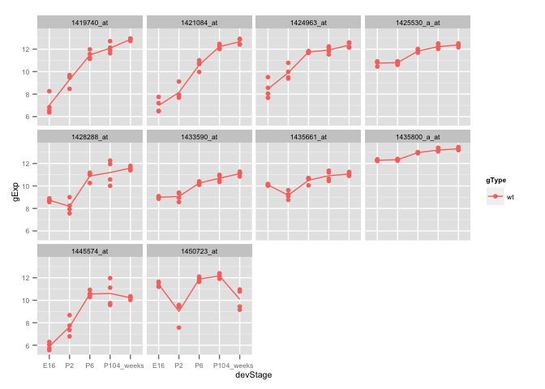
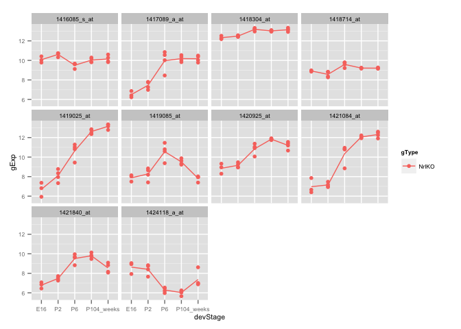
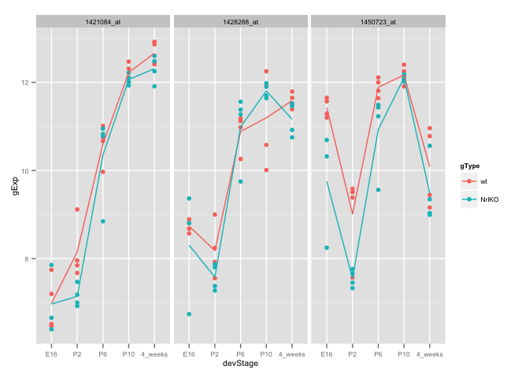

# sm06_takehome
Eva Y  
February 22, 2015  

#### Take-home problem: 

##### First, let's load R packages and data for the analysis. 

```r
library(limma)
library(ggplot2)

prDat <- read.table("~/Documents/stat540_seminar_git/seminar/sm03/GSE4051_data.tsv")
str(prDat, max.level = 0)
```

```
## 'data.frame':	29949 obs. of  39 variables:
```

```r
prDes <- readRDS("~/Documents/stat540_seminar_git/seminar/sm03/GSE4051_design.rds")
str(prDes)
```

```
## 'data.frame':	39 obs. of  4 variables:
##  $ sidChar : chr  "Sample_20" "Sample_21" "Sample_22" "Sample_23" ...
##  $ sidNum  : num  20 21 22 23 16 17 6 24 25 26 ...
##  $ devStage: Factor w/ 5 levels "E16","P2","P6",..: 1 1 1 1 1 1 1 2 2 2 ...
##  $ gType   : Factor w/ 2 levels "wt","NrlKO": 1 1 1 1 2 2 2 1 1 1 ...
```

```r
# extract data for wild-type mice
wtDes <- subset(prDes, gType == "wt")
str(wtDes)
```

```
## 'data.frame':	20 obs. of  4 variables:
##  $ sidChar : chr  "Sample_20" "Sample_21" "Sample_22" "Sample_23" ...
##  $ sidNum  : num  20 21 22 23 24 25 26 27 28 29 ...
##  $ devStage: Factor w/ 5 levels "E16","P2","P6",..: 1 1 1 1 2 2 2 2 3 3 ...
##  $ gType   : Factor w/ 2 levels "wt","NrlKO": 1 1 1 1 1 1 1 1 1 1 ...
```

```r
wtDat <- subset(prDat, select = prDes$gType == "wt")
str(wtDat, max.level = 0)
```

```
## 'data.frame':	29949 obs. of  20 variables:
```

```r
# make design matrix, accept default "ref + treatment"
wtDesMat <- model.matrix(~ devStage, wtDes)
str(wtDesMat)
```

```
##  num [1:20, 1:5] 1 1 1 1 1 1 1 1 1 1 ...
##  - attr(*, "dimnames")=List of 2
##   ..$ : chr [1:20] "12" "13" "14" "15" ...
##   ..$ : chr [1:5] "(Intercept)" "devStageP2" "devStageP6" "devStageP10" ...
##  - attr(*, "assign")= int [1:5] 0 1 1 1 1
##  - attr(*, "contrasts")=List of 1
##   ..$ devStage: chr "contr.treatment"
```

```r
# fit the model for all probes at once
# use eBayes() to moderate the estimated error variances
wtFit <- lmFit(wtDat, wtDesMat)
wtEbFit <- eBayes(wtFit)
```

##### (1) See if you can find one or more probes that have some expression changes up to P6 and then hold steady all the way to 4_weeks. Plot the probes in your finding. Here’s some I found.

```r
# edit the contrast matrix 
(cont.matrix_2 <- makeContrasts(P2VsE16 = devStageP2 - Intercept, P6VsP2 = devStageP6 - devStageP2, P10VsP6 = devStageP10 - devStageP6, fourweeksVsP10 = devStage4_weeks - devStageP10, levels = wtDesMat))
```

```
## Warning in makeContrasts(P2VsE16 = devStageP2 - Intercept, P6VsP2 =
## devStageP6 - : Renaming (Intercept) to Intercept
```

```
##                  Contrasts
## Levels            P2VsE16 P6VsP2 P10VsP6 fourweeksVsP10
##   Intercept            -1      0       0              0
##   devStageP2            1     -1       0              0
##   devStageP6            0      1      -1              0
##   devStageP10           0      0       1             -1
##   devStage4_weeks       0      0       0              1
```

```r
wtFitCont_2 <- contrasts.fit(wtFit, cont.matrix_2)
```

```
## Warning in contrasts.fit(wtFit, cont.matrix_2): row names of contrasts
## don't match col names of coefficients
```

```r
wtEbFitCont_2 <- eBayes(wtFitCont_2)

# pick a cut off, more stringent one
cutoff <- 1e-04
wtResCont_2 <- decideTests(wtEbFitCont_2, p.value = cutoff, method = "global")
summary(wtResCont_2) 
```

```
##    P2VsE16 P6VsP2 P10VsP6 fourweeksVsP10
## -1   29903      0      32             37
## 0       46  29937   29907          29712
## 1        0     12      10            200
```

```r
# pick the genes with changes from E16-P6 and no changes from P6-4weeks based on the 'more' stringent cut off
hits7 <- rownames(prDat)[which(wtResCont_2[, "P2VsE16"] != 0 & wtResCont_2[, "P6VsP2"] != 0 & wtResCont_2[, "P10VsP6"] == 0 & wtResCont_2[, "fourweeksVsP10"] == 0)]

# source script from previous exercise
source('~/Documents/stat540_seminar_git/source_scripts/make_df_stripplots.R', echo=TRUE)
```

```
## 
## > prepareData <- function(x) {
## +     selected_genes <- t(prDat[x, ])
## +     pDat <- cbind(selected_genes, prDes)
## +     pDat <- with(pDat, data.frame(si .... [TRUNCATED] 
## 
## > makeStripplot <- function(x, ...) {
## +     stripplot(gExp ~ devStage | gene, x, group = gType, jitter.data = TRUE, 
## +         auto.key = TRUE, type = .... [TRUNCATED] 
## 
## > makeStripplotGg <- function(x) {
## +     ggplot(x, aes(x = devStage, y = gExp, color = gType, group = gType)) + 
## +         geom_point() + stat_smooth( .... [TRUNCATED]
```

```r
# make data frame, select only wildtype data, and plot 
hits7_wt <- subset(prepareData(hits7), gType == "wt")
p <- makeStripplotGg(hits7_wt) + theme(text = element_text(size=8))
suppressMessages(print(p))
```

 

**Using a more stringent cut off for p-value, I got 10 hits.**

##### (2) Repeat (1) for the genotype NrlKO. Compare the hits between the wt and NrlKO. Are there any common genes shared by these 2 groups of hits, what does the result suggest in terms of the effect of genotype?

```r
# extract data for KO mice
koDes <- subset(prDes, gType == "NrlKO")
str(koDes)
```

```
## 'data.frame':	19 obs. of  4 variables:
##  $ sidChar : chr  "Sample_16" "Sample_17" "Sample_6" "Sample_14" ...
##  $ sidNum  : num  16 17 6 14 3 5 8 1 10 4 ...
##  $ devStage: Factor w/ 5 levels "E16","P2","P6",..: 1 1 1 2 2 2 2 3 3 3 ...
##  $ gType   : Factor w/ 2 levels "wt","NrlKO": 2 2 2 2 2 2 2 2 2 2 ...
```

```r
koDat <- subset(prDat, select = prDes$gType == "NrlKO")
str(koDat, max.level = 0)
```

```
## 'data.frame':	29949 obs. of  19 variables:
```

```r
# make design matrix, accept default "ref + treatment"
koDesMat <- model.matrix(~ devStage, koDes)
str(koDesMat)
```

```
##  num [1:19, 1:5] 1 1 1 1 1 1 1 1 1 1 ...
##  - attr(*, "dimnames")=List of 2
##   ..$ : chr [1:19] "9" "10" "11" "24" ...
##   ..$ : chr [1:5] "(Intercept)" "devStageP2" "devStageP6" "devStageP10" ...
##  - attr(*, "assign")= int [1:5] 0 1 1 1 1
##  - attr(*, "contrasts")=List of 1
##   ..$ devStage: chr "contr.treatment"
```

```r
# fit the model for all probes at once
# use eBayes() to moderate the estimated error variances
koFit <- lmFit(koDat, koDesMat)
koEbFit <- eBayes(koFit)

# edit the contrast matrix 
(cont.matrix_3 <- makeContrasts(P2VsE16 = devStageP2 - Intercept, P6VsP2 = devStageP6 - devStageP2, P10VsP6 = devStageP10 - devStageP6, fourweeksVsP10 = devStage4_weeks - devStageP10, levels = koDesMat))
```

```
## Warning in makeContrasts(P2VsE16 = devStageP2 - Intercept, P6VsP2 =
## devStageP6 - : Renaming (Intercept) to Intercept
```

```
##                  Contrasts
## Levels            P2VsE16 P6VsP2 P10VsP6 fourweeksVsP10
##   Intercept            -1      0       0              0
##   devStageP2            1     -1       0              0
##   devStageP6            0      1      -1              0
##   devStageP10           0      0       1             -1
##   devStage4_weeks       0      0       0              1
```

```r
koFitCont <- contrasts.fit(koFit, cont.matrix_3)
```

```
## Warning in contrasts.fit(koFit, cont.matrix_3): row names of contrasts
## don't match col names of coefficients
```

```r
koEbFitCont <- eBayes(koFitCont)

# pick a cut off, more stringent one
cutoff <- 1e-04
koResCont <- decideTests(koEbFitCont, p.value = cutoff, method = "global")
summary(koResCont) 
```

```
##    P2VsE16 P6VsP2 P10VsP6 fourweeksVsP10
## -1   29939      6      53             26
## 0       10  29888   29809          29830
## 1        0     55      87             93
```

```r
# pick the genes with changes from E16-P6 and no changes from P6-4weeks based on the 'more' stringent cut off
hits8 <- rownames(prDat)[which(koResCont[, "P2VsE16"] != 0 & koResCont[, "P6VsP2"] != 0 & koResCont[, "P10VsP6"] == 0 & koResCont[, "fourweeksVsP10"] == 0)]

# make data frame, select only KO data, and plot 
# select only 10 hits from hits8
hits8_ko <- subset(prepareData(hits8[1:10]), gType == "NrlKO")
p <- makeStripplotGg(hits8_ko) + theme(text = element_text(size=8))
suppressMessages(print(p))
```

 

```r
# check if there are any genes shared between wt and ko mice 
common_hits <- intersect(hits7, hits8)
```

##### There are three probes that are commom in between wild-type and knock-out mice that are differentially expressed from E16-P6 and stablizes from E6-4weeks.

```r
# make data frame and plot 
hits9 <- prepareData(common_hits)
p <- makeStripplotGg(hits9) + theme(text = element_text(size=8))
suppressMessages(print(p))
```

 

