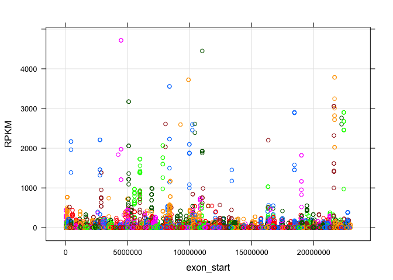

# sm07
Eva Y  
March 10, 2015  

### Take-home problem: Create a similar count table for all the exons located on chr2L.

#### First, load and filter the bam files as per instructions in the seminar. 

```r
suppressPackageStartupMessages(library(ShortRead))
library(Rsamtools)
library(easyRNASeq)
library(lattice)

bamDat <- readAligned("../../data/drosophilaMelanogasterSubset.bam", type="BAM")

#bamDat is an AlignedRead object from the ShortRead package. It stores reads and their genomic alignment information.

str(bamDat)
```

```
## Formal class 'AlignedRead' [package "ShortRead"] with 8 slots
##   ..@ chromosome  : Factor w/ 15 levels "chrYHet","chrM",..: 2 2 2 2 2 2 2 2 2 2 ...
##   ..@ position    : int [1:64206] 548 1497 1506 1528 1540 1552 1552 1555 1559 1566 ...
##   ..@ strand      : Factor w/ 3 levels "+","-","*": 2 1 1 1 1 1 1 1 2 2 ...
##   ..@ alignQuality:Formal class 'NumericQuality' [package "ShortRead"] with 1 slot
##   .. .. ..@ quality: int [1:64206] 132 132 127 130 130 122 132 132 132 132 ...
##   ..@ alignData   :Formal class 'AlignedDataFrame' [package "ShortRead"] with 4 slots
##   .. .. ..@ varMetadata      :'data.frame':	1 obs. of  1 variable:
##   .. .. .. ..$ labelDescription: chr "Type of read; see ?scanBam"
##   .. .. ..@ data             :'data.frame':	64206 obs. of  1 variable:
##   .. .. .. ..$ flag: int [1:64206] 16 0 0 0 0 0 0 0 16 16 ...
##   .. .. ..@ dimLabels        : chr [1:2] "readName" "alignColumn"
##   .. .. ..@ .__classVersion__:Formal class 'Versions' [package "Biobase"] with 1 slot
##   .. .. .. .. ..@ .Data:List of 1
##   .. .. .. .. .. ..$ : int [1:3] 1 1 0
##   ..@ quality     :Formal class 'FastqQuality' [package "ShortRead"] with 1 slot
##   .. .. ..@ quality:Formal class 'BStringSet' [package "Biostrings"] with 5 slots
##   .. .. .. .. ..@ pool           :Formal class 'SharedRaw_Pool' [package "XVector"] with 2 slots
##   .. .. .. .. .. .. ..@ xp_list                    :List of 1
##   .. .. .. .. .. .. .. ..$ :<externalptr> 
##   .. .. .. .. .. .. ..@ .link_to_cached_object_list:List of 1
##   .. .. .. .. .. .. .. ..$ :<environment: 0x7ffb308ccdf8> 
##   .. .. .. .. ..@ ranges         :Formal class 'GroupedIRanges' [package "XVector"] with 7 slots
##   .. .. .. .. .. .. ..@ group          : int [1:64206] 1 1 1 1 1 1 1 1 1 1 ...
##   .. .. .. .. .. .. ..@ start          : int [1:64206] 1 37 73 109 145 181 217 253 289 325 ...
##   .. .. .. .. .. .. ..@ width          : int [1:64206] 36 36 36 36 36 36 36 36 36 36 ...
##   .. .. .. .. .. .. ..@ NAMES          : NULL
##   .. .. .. .. .. .. ..@ elementType    : chr "integer"
##   .. .. .. .. .. .. ..@ elementMetadata: NULL
##   .. .. .. .. .. .. ..@ metadata       : list()
##   .. .. .. .. ..@ elementType    : chr "BString"
##   .. .. .. .. ..@ elementMetadata: NULL
##   .. .. .. .. ..@ metadata       : list()
##   ..@ sread       :Formal class 'DNAStringSet' [package "Biostrings"] with 5 slots
##   .. .. ..@ pool           :Formal class 'SharedRaw_Pool' [package "XVector"] with 2 slots
##   .. .. .. .. ..@ xp_list                    :List of 1
##   .. .. .. .. .. ..$ :<externalptr> 
##   .. .. .. .. ..@ .link_to_cached_object_list:List of 1
##   .. .. .. .. .. ..$ :<environment: 0x7ffb308ccdf8> 
##   .. .. ..@ ranges         :Formal class 'GroupedIRanges' [package "XVector"] with 7 slots
##   .. .. .. .. ..@ group          : int [1:64206] 1 1 1 1 1 1 1 1 1 1 ...
##   .. .. .. .. ..@ start          : int [1:64206] 1 37 73 109 145 181 217 253 289 325 ...
##   .. .. .. .. ..@ width          : int [1:64206] 36 36 36 36 36 36 36 36 36 36 ...
##   .. .. .. .. ..@ NAMES          : NULL
##   .. .. .. .. ..@ elementType    : chr "integer"
##   .. .. .. .. ..@ elementMetadata: NULL
##   .. .. .. .. ..@ metadata       : list()
##   .. .. ..@ elementType    : chr "DNAString"
##   .. .. ..@ elementMetadata: NULL
##   .. .. ..@ metadata       : list()
##   ..@ id          :Formal class 'BStringSet' [package "Biostrings"] with 5 slots
##   .. .. ..@ pool           :Formal class 'SharedRaw_Pool' [package "XVector"] with 2 slots
##   .. .. .. .. ..@ xp_list                    :List of 1
##   .. .. .. .. .. ..$ :<externalptr> 
##   .. .. .. .. ..@ .link_to_cached_object_list:List of 1
##   .. .. .. .. .. ..$ :<environment: 0x7ffb308ccdf8> 
##   .. .. ..@ ranges         :Formal class 'GroupedIRanges' [package "XVector"] with 7 slots
##   .. .. .. .. ..@ group          : int [1:64206] 1 1 1 1 1 1 1 1 1 1 ...
##   .. .. .. .. ..@ start          : int [1:64206] 1 29 57 85 114 144 173 202 230 260 ...
##   .. .. .. .. ..@ width          : int [1:64206] 28 28 28 29 30 29 29 28 30 30 ...
##   .. .. .. .. ..@ NAMES          : NULL
##   .. .. .. .. ..@ elementType    : chr "integer"
##   .. .. .. .. ..@ elementMetadata: NULL
##   .. .. .. .. ..@ metadata       : list()
##   .. .. ..@ elementType    : chr "BString"
##   .. .. ..@ elementMetadata: NULL
##   .. .. ..@ metadata       : list()
```

```r
# filter bamDat, remove reads with >2 'N' and filter for reads aligning to chromosomes
nFilt <- nFilter(2)
chrFilt <- chromosomeFilter(regex="chr")
filt <- compose(nFilt, chrFilt)
bamDatFiltered <- bamDat[filt(bamDat)]
str(bamDatFiltered)
```

```
## Formal class 'AlignedRead' [package "ShortRead"] with 8 slots
##   ..@ chromosome  : Factor w/ 7 levels "chrM","chr2L",..: 1 1 1 1 1 1 1 1 1 1 ...
##   ..@ position    : int [1:56883] 548 1497 1506 1528 1540 1552 1552 1555 1559 1566 ...
##   ..@ strand      : Factor w/ 3 levels "+","-","*": 2 1 1 1 1 1 1 1 2 2 ...
##   ..@ alignQuality:Formal class 'NumericQuality' [package "ShortRead"] with 1 slot
##   .. .. ..@ quality: int [1:56883] 132 132 127 130 130 122 132 132 132 132 ...
##   ..@ alignData   :Formal class 'AlignedDataFrame' [package "ShortRead"] with 4 slots
##   .. .. ..@ varMetadata      :'data.frame':	1 obs. of  1 variable:
##   .. .. .. ..$ labelDescription: chr "Type of read; see ?scanBam"
##   .. .. ..@ data             :'data.frame':	56883 obs. of  1 variable:
##   .. .. .. ..$ flag: int [1:56883] 16 0 0 0 0 0 0 0 16 16 ...
##   .. .. ..@ dimLabels        : chr [1:2] "readName" "alignColumn"
##   .. .. ..@ .__classVersion__:Formal class 'Versions' [package "Biobase"] with 1 slot
##   .. .. .. .. ..@ .Data:List of 1
##   .. .. .. .. .. ..$ : int [1:3] 1 1 0
##   ..@ quality     :Formal class 'FastqQuality' [package "ShortRead"] with 1 slot
##   .. .. ..@ quality:Formal class 'BStringSet' [package "Biostrings"] with 5 slots
##   .. .. .. .. ..@ pool           :Formal class 'SharedRaw_Pool' [package "XVector"] with 2 slots
##   .. .. .. .. .. .. ..@ xp_list                    :List of 1
##   .. .. .. .. .. .. .. ..$ :<externalptr> 
##   .. .. .. .. .. .. ..@ .link_to_cached_object_list:List of 1
##   .. .. .. .. .. .. .. ..$ :<environment: 0x7ffb308ccdf8> 
##   .. .. .. .. ..@ ranges         :Formal class 'GroupedIRanges' [package "XVector"] with 7 slots
##   .. .. .. .. .. .. ..@ group          : int [1:56883] 1 1 1 1 1 1 1 1 1 1 ...
##   .. .. .. .. .. .. ..@ start          : int [1:56883] 1 37 73 109 145 181 217 253 289 325 ...
##   .. .. .. .. .. .. ..@ width          : int [1:56883] 36 36 36 36 36 36 36 36 36 36 ...
##   .. .. .. .. .. .. ..@ NAMES          : NULL
##   .. .. .. .. .. .. ..@ elementType    : chr "integer"
##   .. .. .. .. .. .. ..@ elementMetadata: NULL
##   .. .. .. .. .. .. ..@ metadata       : list()
##   .. .. .. .. ..@ elementType    : chr "BString"
##   .. .. .. .. ..@ elementMetadata: NULL
##   .. .. .. .. ..@ metadata       : list()
##   ..@ sread       :Formal class 'DNAStringSet' [package "Biostrings"] with 5 slots
##   .. .. ..@ pool           :Formal class 'SharedRaw_Pool' [package "XVector"] with 2 slots
##   .. .. .. .. ..@ xp_list                    :List of 1
##   .. .. .. .. .. ..$ :<externalptr> 
##   .. .. .. .. ..@ .link_to_cached_object_list:List of 1
##   .. .. .. .. .. ..$ :<environment: 0x7ffb308ccdf8> 
##   .. .. ..@ ranges         :Formal class 'GroupedIRanges' [package "XVector"] with 7 slots
##   .. .. .. .. ..@ group          : int [1:56883] 1 1 1 1 1 1 1 1 1 1 ...
##   .. .. .. .. ..@ start          : int [1:56883] 1 37 73 109 145 181 217 253 289 325 ...
##   .. .. .. .. ..@ width          : int [1:56883] 36 36 36 36 36 36 36 36 36 36 ...
##   .. .. .. .. ..@ NAMES          : NULL
##   .. .. .. .. ..@ elementType    : chr "integer"
##   .. .. .. .. ..@ elementMetadata: NULL
##   .. .. .. .. ..@ metadata       : list()
##   .. .. ..@ elementType    : chr "DNAString"
##   .. .. ..@ elementMetadata: NULL
##   .. .. ..@ metadata       : list()
##   ..@ id          :Formal class 'BStringSet' [package "Biostrings"] with 5 slots
##   .. .. ..@ pool           :Formal class 'SharedRaw_Pool' [package "XVector"] with 2 slots
##   .. .. .. .. ..@ xp_list                    :List of 1
##   .. .. .. .. .. ..$ :<externalptr> 
##   .. .. .. .. ..@ .link_to_cached_object_list:List of 1
##   .. .. .. .. .. ..$ :<environment: 0x7ffb308ccdf8> 
##   .. .. ..@ ranges         :Formal class 'GroupedIRanges' [package "XVector"] with 7 slots
##   .. .. .. .. ..@ group          : int [1:56883] 1 1 1 1 1 1 1 1 1 1 ...
##   .. .. .. .. ..@ start          : int [1:56883] 1 29 57 85 114 144 173 202 230 260 ...
##   .. .. .. .. ..@ width          : int [1:56883] 28 28 28 29 30 29 29 28 30 30 ...
##   .. .. .. .. ..@ NAMES          : NULL
##   .. .. .. .. ..@ elementType    : chr "integer"
##   .. .. .. .. ..@ elementMetadata: NULL
##   .. .. .. .. ..@ metadata       : list()
##   .. .. ..@ elementType    : chr "BString"
##   .. .. ..@ elementMetadata: NULL
##   .. .. ..@ metadata       : list()
```

#### This is followed by accessing the genome annotations to extract for all exons.

```r
# use the BioMart functionality of the Ensembl database to retrieve the annotations of Drosophila melagoaster chromosome 2L
library(biomaRt)
ensembl <- useMart("ensembl", dataset="dmelanogaster_gene_ensembl")

# query for the information we need
annotation.fields <- c("ensembl_gene_id", "strand", "ensembl_transcript_id", 
                       "chromosome_name", "ensembl_exon_id", 
                       "exon_chrom_start","exon_chrom_end")

# download the actual annotation data and restrict to chr2L
exon.annotation <- getBM(annotation.fields, mart=ensembl,
                         filters="chromosome_name", values=c("2L"))

# chromosome name lacks the “chr” prefix, add "chr" to annotation data
exon.annotation$chromosome <- paste("chr", 
                                    exon.annotation$chromosome_name, sep='')

# double check
levels(as.factor(exon.annotation$chromosome))
```

```
## [1] "chr2L"
```

#### Next, we need to store the location of the exons. 

```r
exon.range <- RangedData(IRanges(start=exon.annotation$exon_chrom_start,
                                 end=exon.annotation$exon_chrom_end),
                         space=exon.annotation$chromosome,
                         strand=exon.annotation$strand,
                         transcript=exon.annotation$ensembl_transcript_id,
                         gene=exon.annotation$ensembl_gene_id,
                         exon=exon.annotation$ensembl_exon_id,
                         universe="Dm3")
show(exon.range)
```

```
## RangedData with 28662 rows and 4 value columns across 1 space
##          space               ranges   |    strand  transcript        gene
##       <factor>            <IRanges>   | <integer> <character> <character>
## 1        chr2L       [ 7529,  8116]   |         1 FBtr0300689 FBgn0031208
## 2        chr2L       [ 8193,  9484]   |         1 FBtr0300689 FBgn0031208
## 3        chr2L       [ 7529,  8116]   |         1 FBtr0300690 FBgn0031208
## 4        chr2L       [ 8193,  8589]   |         1 FBtr0300690 FBgn0031208
## 5        chr2L       [ 8668,  9484]   |         1 FBtr0300690 FBgn0031208
## 6        chr2L       [ 7529,  8116]   |         1 FBtr0330654 FBgn0031208
## 7        chr2L       [ 8229,  9484]   |         1 FBtr0330654 FBgn0031208
## 8        chr2L       [21136, 21376]   |        -1 FBtr0078166 FBgn0002121
## 9        chr2L       [19885, 20020]   |        -1 FBtr0078166 FBgn0002121
## ...        ...                  ... ...       ...         ...         ...
## 28654    chr2L [22959877, 22960876]   |        -1 FBtr0111239 FBgn0086683
## 28655    chr2L [22959606, 22959815]   |        -1 FBtr0111239 FBgn0086683
## 28656    chr2L [22959606, 22959815]   |        -1 FBtr0111240 FBgn0086683
## 28657    chr2L [22960932, 22961179]   |        -1 FBtr0111240 FBgn0086683
## 28658    chr2L [22959877, 22960833]   |        -1 FBtr0111240 FBgn0086683
## 28659    chr2L [22959606, 22959815]   |        -1 FBtr0111241 FBgn0086683
## 28660    chr2L [22959877, 22960915]   |        -1 FBtr0111241 FBgn0086683
## 28661    chr2L [22961737, 22961993]   |         1 FBtr0306299 FBgn0262887
## 28662    chr2L [22962624, 22963456]   |         1 FBtr0306299 FBgn0262887
##                    exon
##             <character>
## 1         FBgn0031208:1
## 2         FBgn0031208:3
## 3         FBgn0031208:1
## 4         FBgn0031208:2
## 5         FBgn0031208:5
## 6         FBgn0031208:1
## 7         FBgn0031208:4
## 8        FBgn0002121:17
## 9        FBgn0002121:13
## ...                 ...
## 28654     FBgn0086683:3
## 28655     FBgn0086683:1
## 28656     FBgn0086683:1
## 28657 FBgn0086683:52985
## 28658     FBgn0086683:2
## 28659     FBgn0086683:1
## 28660     FBgn0086683:4
## 28661     FBgn0262887:1
## 28662     FBgn0262887:2
```

#### We need to determine differential expression analysis on a per exon basis as stated by the question of the problem. 

```r
# first let's get the load genome database
library(BSgenome.Dmelanogaster.UCSC.dm3)
```

```
## Loading required package: BSgenome
## Loading required package: rtracklayer
```

```r
# get length of the chromosome
(chrSizes <- seqlengths(Dmelanogaster))
```

```
##     chr2L     chr2R     chr3L     chr3R      chr4      chrX      chrU 
##  23011544  21146708  24543557  27905053   1351857  22422827  10049037 
##      chrM  chr2LHet  chr2RHet  chr3LHet  chr3RHet   chrXHet   chrYHet 
##     19517    368872   3288761   2555491   2517507    204112    347038 
## chrUextra 
##  29004656
```

```r
# find out how many bases cover each interval for all chromosomes
(cover <- coverage(bamDatFiltered, width=chrSizes))
```

```
## RleList of length 7
## $chrM
## integer-Rle of length 19517 with 953 runs
##   Lengths:  547   36  913    9   22    5 ...    3    5   13  258   36 5793
##   Values :    0    1    0    1    2    3 ...    4    3    2    0    1    0
## 
## $chr2L
## integer-Rle of length 23011544 with 17850 runs
##   Lengths:  6777    36  2316    36  1621 ...   107    36   499    36 50474
##   Values :     0     1     0     1     0 ...     0     1     0     1     0
## 
## $chrX
## integer-Rle of length 22422827 with 16522 runs
##   Lengths:  18996     36  12225     36 ...     36    130     36   6180
##   Values :      0      1      0      1 ...      1      0      1      0
## 
## $chr3L
## integer-Rle of length 24543557 with 17396 runs
##   Lengths: 135455     36   6783     23 ...     36  82251     36  12469
##   Values :      0      1      0      1 ...      1      0      1      0
## 
## $chr4
## integer-Rle of length 1351857 with 1255 runs
##   Lengths:  59510     36   2019     36 ...     36    267     36 118808
##   Values :      0      1      0      1 ...      1      0      1      0
## 
## ...
## <2 more elements>
```

```r
# get the average coverage for all bp covered by a given exon
exon.coverage <- aggregate(cover[match(names(exon.range),names(cover))],
                         ranges(exon.range), sum)

exon.coverage <- ceiling(exon.coverage/unique(width(bamDatFiltered)))
show(exon.coverage)
```

```
## NumericList of length 1
## [["chr2L"]] 0 1 0 0 1 0 1 0 0 13 9 2 11 4 ... 0 0 0 0 1 4 1 1 1 4 1 4 0 0
```

```r
# sanity check to make sure that there are 28662 exons
length(exon.coverage[["chr2L"]])
```

```
## [1] 28662
```

```r
length(ranges(exon.range)$chr2L)
```

```
## [1] 28662
```

#### Generate the count table and store exon coverage as a data frame. 

```r
countTable <- data.frame(chromosome=exon.range$space,
                         exon_start=start(exon.range$ranges),
                         exon_end=end(exon.range$ranges),
                         strand=exon.range$strand,
                         transcript=exon.range$transcript,
                         gene=exon.range$gene,
                         exon=exon.range$exon,
                         count=as.vector(exon.coverage[["chr2L"]]))

dim(countTable)
```

```
## [1] 28662     8
```

```r
head(countTable)
```

```
##   chromosome exon_start exon_end strand  transcript        gene
## 1      chr2L       7529     8116      1 FBtr0300689 FBgn0031208
## 2      chr2L       8193     9484      1 FBtr0300689 FBgn0031208
## 3      chr2L       7529     8116      1 FBtr0300690 FBgn0031208
## 4      chr2L       8193     8589      1 FBtr0300690 FBgn0031208
## 5      chr2L       8668     9484      1 FBtr0300690 FBgn0031208
## 6      chr2L       7529     8116      1 FBtr0330654 FBgn0031208
##            exon count
## 1 FBgn0031208:1     0
## 2 FBgn0031208:3     1
## 3 FBgn0031208:1     0
## 4 FBgn0031208:2     0
## 5 FBgn0031208:5     1
## 6 FBgn0031208:1     0
```

#### Add normalization value = RPKM.

```r
RPKM <- (as.vector(exon.coverage[["chr2L"]])/(end(exon.range$ranges) - start(exon.range$ranges)))*(1000000000/length(bamDat))

countTable <- data.frame(countTable, RPKM=RPKM)
```

#### Let's try order the exons and make a coverage plot to access differential expression. 

```r
# order the by exon_start so the coverage plotted will be along chr2L
countTable <- countTable[order(countTable$exon_start), ]

# plot 
xyplot(RPKM ~ exon_start, countTable, grid = TRUE, group = gene)
```

 

#### Interpret the plot: 
I plotted exon_start vs. RPKM and group the genes based on color. Based on the plot, it can be observed that there are some exons that are differentially expressed in chr2L. As each color represents a gene, it can be observed that exons of certain genes seem to be differentially expressed. *Am I making sense?*
