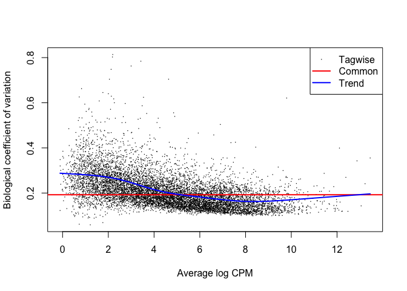
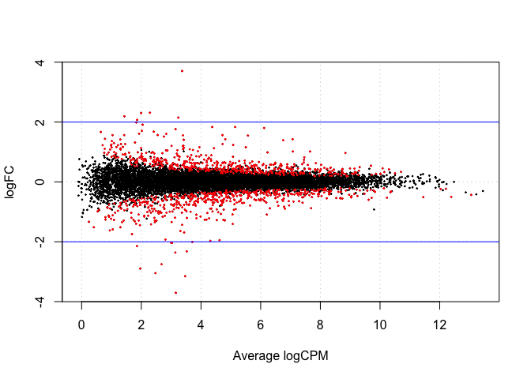
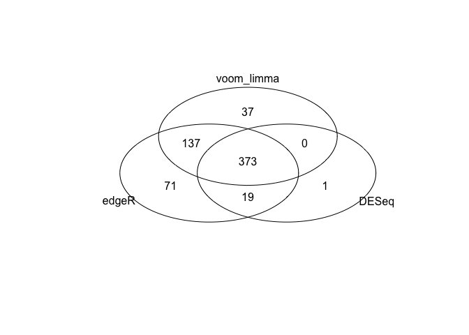

# sm07b
Eva Y  
March 11, 2015  

### Mini exercise: Redo the above analysis but first filter the data and remove any gene that has: 1. count equal to zero across all samples 2. count equal to zero in at least one sample in each genotype group

#### Load packages and data

```r
library(edgeR)
library(DESeq)
library(dplyr)
library(ggplot2)
library(gplots)

dat <- read.table("../../data/bottomly_count_table.tsv",
                  header = TRUE, row.names = 1)

des <- read.table("../../data/bottomly_phenodata.tsv",
                  header = TRUE, row.names = 1)
```

#### Filter the data as mentioned in the question. 

```r
# remove any gene that has: 
# 1. count equal to zero across all samples 
sum_counts <- data.frame(apply(dat, 1, sum))
colnames(sum_counts) <- "sum_counts"
sdat <- cbind(gene=row.names(dat), dat, sum_counts)
filter_dat <- sdat %>% filter(sum_counts != 0)

# check if all sum_counts are not 0
which(filter_dat$sum_counts == 0)
```

```
## integer(0)
```

```r
# 2. count equal to zero in at least one sample in each genotype group
unique(des$strain)
```

```
## [1] C57BL/6J DBA/2J  
## Levels: C57BL/6J DBA/2J
```

```r
gtype1 <- which(des$strain == "C57BL/6J")
gtype2 <- which(des$strain == "DBA/2J")

filter_gtype1 <- apply(filter_dat[ ,gtype1+1], 1, function(row) !0 %in% row)
filter_gtype2 <- apply(filter_dat[ ,gtype2+1], 1, function(row) !0 %in% row)
filter_dat <- filter_dat %>% filter(filter_gtype1 == TRUE & filter_gtype2 == TRUE)

# I guess I could also remove rows with >1 0...haha, but I already did this. 
```

### Redo the analysis as in the seminar. 

```r
# make changes to filtered data frame
row.names(filter_dat) <- filter_dat$gene
filter_dat <- filter_dat[ ,2:22]

# sanity check
all(rownames(des) == colnames(filter_dat))
```

```
## [1] TRUE
```

### GLM edgeR

```r
# first step is to create a ‘group’ object describing which group each sample belongs to
with(des,table(strain))
```

```
## strain
## C57BL/6J   DBA/2J 
##       10       11
```

```r
group <- factor(c(rep("1",10),rep("2",11)))

#this produces an object of type DGEList with can be manipulated in a similar way to any other list object in R
dge.glm <- DGEList(counts=filter_dat, group=group)
str(dge.glm)
```

```
## Formal class 'DGEList' [package "edgeR"] with 1 slot
##   ..@ .Data:List of 2
##   .. ..$ : int [1:9196, 1:21] 369 21 15 517 273 11 19 19 97 108 ...
##   .. .. ..- attr(*, "dimnames")=List of 2
##   .. .. .. ..$ : chr [1:9196] "ENSMUSG00000000001" "ENSMUSG00000000056" "ENSMUSG00000000058" "ENSMUSG00000000078" ...
##   .. .. .. ..$ : chr [1:21] "SRX033480" "SRX033488" "SRX033481" "SRX033489" ...
##   .. ..$ :'data.frame':	21 obs. of  3 variables:
##   .. .. ..$ group       : Factor w/ 2 levels "1","2": 1 1 1 1 1 1 1 1 1 1 ...
##   .. .. ..$ lib.size    : num [1:21] 3036010 6288375 2713100 6534075 3011677 ...
##   .. .. ..$ norm.factors: num [1:21] 1 1 1 1 1 1 1 1 1 1 ...
```

```r
names(dge.glm)
```

```
## [1] "counts"  "samples"
```

```r
dge.glm[["samples"]]
```

```
##           group lib.size norm.factors
## SRX033480     1  3036010            1
## SRX033488     1  6288375            1
## SRX033481     1  2713100            1
## SRX033489     1  6534075            1
## SRX033482     1  3011677            1
## SRX033490     1  7083799            1
## SRX033483     1  3702665            1
## SRX033476     1  5154553            1
## SRX033478     1  4934324            1
## SRX033479     1  4186153            1
## SRX033472     2  3964343            1
## SRX033473     2  4725998            1
## SRX033474     2  3696478            1
## SRX033475     2  3564296            1
## SRX033491     2  7265111            1
## SRX033484     2  4414207            1
## SRX033492     2  7105298            1
## SRX033485     2  3461850            1
## SRX033493     2  7325666            1
## SRX033486     2  3873361            1
## SRX033494     2  6757161            1
```

```r
nrow(dge.glm[[1]])
```

```
## [1] 9196
```

```r
ncol(dge.glm[[1]])
```

```
## [1] 21
```

### Make design matrix and perform analysis.

```r
design <- model.matrix(~group)

# determine dispersion values
dge.glm.com.disp <- estimateGLMCommonDisp(dge.glm, design, verbose=TRUE)
```

```
## Disp = 0.03704 , BCV = 0.1925
```

```r
dge.glm.trend.disp <- estimateGLMTrendedDisp(dge.glm.com.disp, design)
```

```
## Loading required package: splines
```

```r
dge.glm.tag.disp <- estimateGLMTagwiseDisp(dge.glm.trend.disp, design)

#plot the tagwise dispersion against log2-CPM (counts per million)
plotBCV(dge.glm.tag.disp)
```

 

```r
fit <- glmFit(dge.glm.tag.disp, design)
colnames(coef(fit))
```

```
## [1] "(Intercept)" "group2"
```

```r
lrt <- glmLRT(fit, coef=2)
topTags(lrt)
```

```
## Coefficient:  group2 
##                        logFC   logCPM       LR       PValue          FDR
## ENSMUSG00000015484 -1.968453 4.309346 288.3027 1.165177e-64 1.071497e-60
## ENSMUSG00000024248 -3.152731 3.466157 280.1113 7.101389e-63 3.265219e-59
## ENSMUSG00000030532  1.546320 5.574337 261.5859 7.741542e-59 2.373041e-55
## ENSMUSG00000023236  1.425651 7.069439 255.5410 1.608841e-57 3.698725e-54
## ENSMUSG00000050824  3.704176 3.367040 233.3497 1.108802e-52 2.039309e-49
## ENSMUSG00000015852 -2.361914 3.140922 217.7077 2.860193e-49 4.383723e-46
## ENSMUSG00000028393  1.802042 6.112981 212.0977 4.788726e-48 6.291017e-45
## ENSMUSG00000072572 -2.010160 3.708574 188.1271 8.149942e-43 9.368358e-40
## ENSMUSG00000066800 -2.321115 3.520125 182.8659 1.147388e-41 1.172375e-38
## ENSMUSG00000074064  1.391909 6.754600 175.6185 4.386743e-40 4.034049e-37
```

```r
tt.glm <- topTags(lrt, n=Inf)
class(tt.glm)
```

```
## [1] "TopTags"
## attr(,"package")
## [1] "edgeR"
```

```r
nrow(tt.glm$table[tt.glm$table$FDR < 0.01,])
```

```
## [1] 587
```

```r
interestingSamples <- rownames(tt.glm$table[tt.glm$table$FDR < 1e-50,])
cpm(dge.glm.tag.disp)[interestingSamples,]
```

```
##                    SRX033480 SRX033488 SRX033481 SRX033489 SRX033482
## ENSMUSG00000015484  27.00913  34.03105  32.80380  36.27139  31.54389
## ENSMUSG00000024248  14.82209  26.07987  17.32336  23.56875  18.59429
## ENSMUSG00000030532  27.99727  24.96670  21.37776  25.40528  18.59429
## ENSMUSG00000023236  65.54656  78.87570  72.61067  72.54279  76.70145
##                    SRX033490 SRX033483 SRX033476 SRX033478 SRX033479
## ENSMUSG00000015484  33.45662  30.78863  34.72658  26.95405  31.53253
## ENSMUSG00000024248  25.83360  18.90530  24.83242  14.38900  14.33297
## ENSMUSG00000030532  26.82177  26.46742  19.20632  23.30613  20.06616
## ENSMUSG00000023236  81.02997  83.45340  55.29092  57.96133  66.40942
##                     SRX033472  SRX033473  SRX033474  SRX033475  SRX033491
## ENSMUSG00000015484   7.062961   4.866697   9.197945   7.855689   8.533937
## ENSMUSG00000024248   2.270237   1.269573   1.893694   3.366724   3.165815
## ENSMUSG00000030532  69.872864  70.672903  63.303501  63.126070  73.914906
## ENSMUSG00000023236 195.744919 183.876506 176.384115 156.552654 207.292084
##                     SRX033484  SRX033492  SRX033485  SRX033493  SRX033486
## ENSMUSG00000015484   9.514733   8.444403   8.954750   6.688812  10.326949
## ENSMUSG00000024248   1.585789   1.688881   1.733177   1.774583   2.581737
## ENSMUSG00000030532  70.227789  70.792245  62.683247  78.764170  59.379955
## ENSMUSG00000023236 178.287969 193.095349 207.403556 202.029413 204.989930
##                     SRX033494
## ENSMUSG00000015484   8.879469
## ENSMUSG00000024248   3.107814
## ENSMUSG00000030532  71.479724
## ENSMUSG00000023236 193.128446
```

```r
summary(de.glm <- decideTestsDGE(lrt, p=0.05, adjust="BH"))
```

```
##    [,1]
## -1  503
## 0  8183
## 1   510
```

With the filtering applied, 503 genes are under-expressed in group 2 (DBA/2J) compared with group 1 (C57BL/6J), 8183 show no differences in expression while 510 genes are over-expressed.


```r
#plotting the tagwise log fold changes against log-cpm
tags.glm <- rownames(dge.glm.tag.disp)[as.logical(de.glm)]
plotSmear(lrt, de.tags=tags.glm)
abline(h=c(-2,2),col="blue")
```

 

Good ticket that explains edgeR [parameters and concepts](http://seqanswers.com/forums/showthread.php?t=5591).


### Take-home problem: Choose a specific threshold for the adjusted p value, find the genes identified as differentially expressed using each of edgeR, DESeq and voom+limma. Compare the number of genes in these 3 lists, and draw a venn digram demonstrating the overlap (if any!).

#### Using edgeR: 

```r
# reading count table data and grouping information
dge.glm <- DGEList(counts=dat, group=group)

# use the same design matrix and perform common, trend, and tagwise analysis
dge.glm.com.disp <- estimateGLMCommonDisp(dge.glm, design, verbose=TRUE)
```

```
## Disp = 0.03893 , BCV = 0.1973
```

```r
dge.glm.trend.disp <- estimateGLMTrendedDisp(dge.glm.com.disp, design)

dge.glm.tag.disp <- estimateGLMTagwiseDisp(dge.glm.trend.disp, design)

# fit the model 
fit <- glmFit(dge.glm.tag.disp, design)
lrt <- glmLRT(fit, coef=2)

# pick genes with adjusted p value < 0.01
tt.glm <- topTags(lrt, n=Inf)
edgeR <- row.names(subset(tt.glm$table, FDR < 0.01))
```

#### Using DESeq:

```r
# reading in the same count table data and grouping information
deSeqDat <- newCountDataSet(dat, group)

# estimate the size factors to account for differences in library coverage and estimate the variance
deSeqDat <- estimateSizeFactors(deSeqDat)
deSeqDat <- estimateDispersions(deSeqDat)

# fit model and examine the results
results <- nbinomTest(deSeqDat, levels(group)[1], levels(group)[2])

# pick genes with adjusted p value < 0.01
DESeq <- results %>%
  filter(padj < 0.01) %>%
  select(id)
```

#### Using voom & limma

```r
# reading in the same count table data and grouping information
norm.factor <- calcNormFactors(dat)

# estimate the size factors to account for differences in library coverage and estimate the variance
dat.voomed <- voom(dat, design, lib.size=colSums(dat)*norm.factor)

# fit model and examine the results
fit <- lmFit(dat.voomed, design)
fit <- eBayes(fit)

# pick genes with adjusted p value < 0.01
tt.voom <- topTable(fit, coef=2, n=Inf)
voom_limma <- row.names(subset(tt.voom, adj.P.Val < 0.01))
```

#### Generate venn diagram to inspect overlaps between these three methods. 

```r
suppressWarnings(venn(list(edgeR=edgeR, DESeq=DESeq, voom_limma=voom_limma)))
```

 
