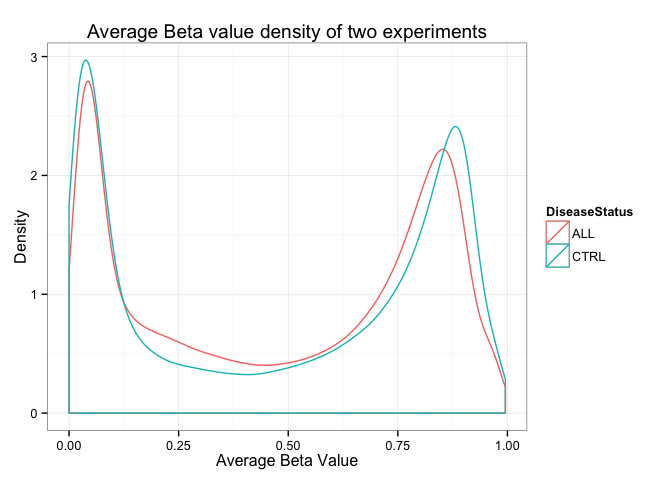
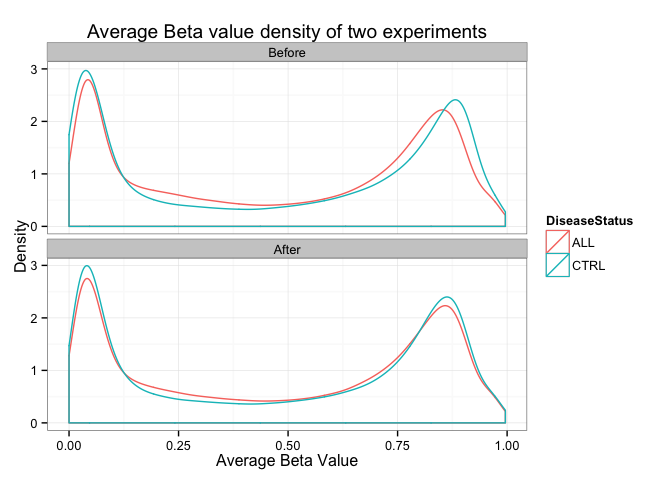
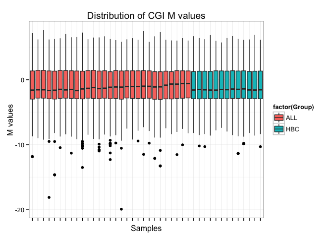
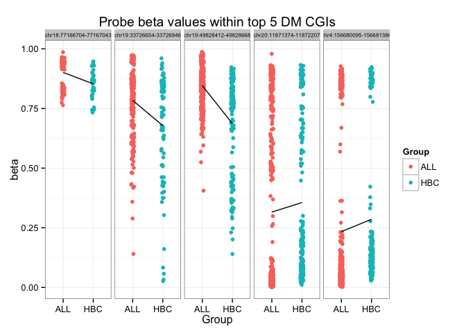
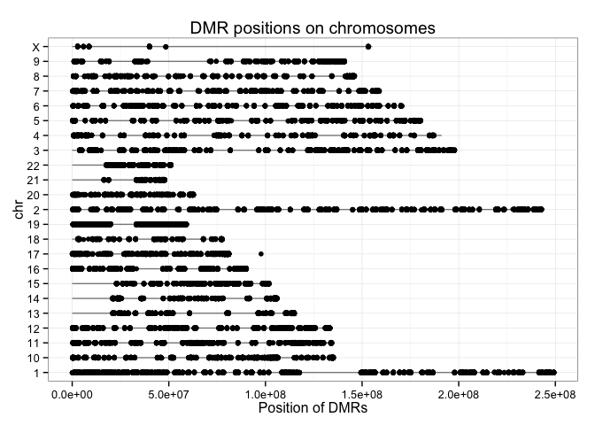

# sm08
Eva Y  
March 14, 2015  

### Practice exercises:

#### Load packages:

```r
library(GEOquery)
library(wateRmelon)
```

```
## Warning: package 'limma' was built under R version 3.1.3
```

```r
library(IlluminaHumanMethylation450k.db)
```

```
## Warning: 'IlluminaHumanMethylation450k.db' is deprecated.
## Use 'FDb.InfiniumMethylation.hg19' instead.
## Use 'FDb.InfiniumMethylation.hg18' instead.
## Use 'mapToGenome() function in minfi or methylumi' instead.
## See help("Deprecated")
```

```r
library(ggplot2)
library(limma)
library(gplots)
```

#### Load the data: 

```r
if(file.exists("methyl_ALL.Rdata")){ # if previously downloaded
  load("methyl_ALL.Rdata")
} else { # if downloading for the first time
  GSE39141 <- getGEO('GSE39141')
  show(GSE39141) ## 33 samples (29 ALL and 4 healthy B cells)
  GSE42865 <- getGEO('GSE42865') # took ~2 mins for JB
  show(GSE42865) ## 16 samples (9 healthy cells B cells and 7 other cells)
  
  # Extract expression matrices (turn into data frames at once) 
  ALL.dat <- as.data.frame(exprs(GSE39141[[1]]))
  CTRL.dat <- as.data.frame(exprs(GSE42865[[1]]))
  
  # Obtain the meta-data for the samples and rename them perhaps?
  ALL.meta <- pData(phenoData(GSE39141[[1]]))
  CTRL.meta <- pData(phenoData(GSE42865[[1]]))
  
  # create some labels
  ALL.meta$Group<- c(rep('ALL', 29), rep('HBC', 4)) 
  ## ALL: Case; HBC: Healthy B Cells
  
  # Subset both meta-data and data for control (healthy) donors
  CTRL.meta <- droplevels(subset(CTRL.meta,
                                 grepl("Healthy donor", characteristics_ch1.1)))
  CTRL.dat <- subset(CTRL.dat, select = as.character(CTRL.meta$geo_accession)) 
  
  # Rename variables
  names(ALL.dat) <- paste(ALL.meta$Group,
                          gsub("GSM", "", names(ALL.dat)), sep = '_')
  names(CTRL.dat) <- paste('HBC', gsub("GSM", "", names(CTRL.dat)), sep = '_')
  
  # save the data to avoid future re-downloading
  save(ALL.dat, CTRL.dat, ALL.meta, CTRL.meta, file = "methyl_ALL.Rdata")
}
```

#### Ready for exploratory analysis...
##### Let's start by plotting the density plot oof average beta values for probes in the two datasets.

```r
# calculate mean for each probe
ALL.avg <- rowMeans(ALL.dat, na.rm = T)
CTRL.avg <- rowMeans(CTRL.dat, na.rm = T)

# generate data frame for plotting
avg.beta <- data.frame(ALL=ALL.avg, CTRL=CTRL.avg)
avg.beta <- melt(avg.beta, variable.name="DiseaseStatus", value.name="AverageBetaValue")

# plot density plot
ggplot(avg.beta, aes(AverageBetaValue, colour=DiseaseStatus)) + 
  geom_density() + theme_bw() + 
  xlab("Average Beta Value") + ylab("Density") + 
  ggtitle("Average Beta value density of two experiments")
```

 

##### As observed in the seminar, we can see that the distribution of beta values are different between the two experiments. This is why we need to normalize the data. 

```r
# combine data from two experiments into one matrix, each column represents beta
# values of one sample
beta.matrix <- as.matrix(cbind(ALL.dat, CTRL.dat))
str(beta.matrix, max.level = 0)
```

```
##  num [1:485577, 1:42] 0.512 0.911 0.857 0.149 0.729 ...
##  - attr(*, "dimnames")=List of 2
```

```r
# quantile normalization
system.time(beta.norm <- betaqn(beta.matrix))
```

```
##    user  system elapsed 
##  55.277   6.156  64.954
```

```r
# generate ALL and CTRL data frame again so we can compare before and after normalization results
ALL.norm <- beta.norm[ ,1:33]
CTRL.norm <- beta.norm[ ,34:ncol(beta.norm)]

# get mean for each probe
ALL.norm <- rowMeans(ALL.norm, na.rm = T)
CTRL.norm <- rowMeans(CTRL.norm, na.rm = T)

# make a tall and skinny data frame
avg.beta.norm <- data.frame(ALL=ALL.norm, CTRL=CTRL.norm)
avg.beta.norm <- melt(avg.beta.norm, variable.name="DiseaseStatus", value.name="AverageBetaValue")
avg.beta.norm <- cbind(avg.beta.norm, Norm = rep("After", nrow(avg.beta.norm)))

# add "Before" to dataset that is not normalized
avg.beta <-cbind(avg.beta, Norm = rep("Before", nrow(avg.beta)))

# make one big data frame for plotting
all.avg.beta <- rbind(avg.beta, avg.beta.norm)

# now we can plot it using ggplot2
ggplot(all.avg.beta, aes(AverageBetaValue, color=DiseaseStatus)) +
  facet_wrap(~Norm, ncol=1) + geom_density() + theme_bw() +
  xlab("Average Beta Value") + ylab("Density") + 
  ggtitle("Average Beta value density of two experiments")
```

 

##### Beta values are converted to M values so that it is more compatible with the typical assumptions of linear models. 

```r
M.norm <- beta2m(beta.norm)
```

##### CpG Islands:

```r
# Extracting probe ID to CpG islands association
cginame <- as.data.frame(IlluminaHumanMethylation450kCPGINAME)
names(cginame) <- c('Probe_ID', 'cginame')
rownames(cginame) <- cginame$Probe_ID
length(levels(factor(cginame$cginame)))   # No. of CGIs
```

```
## [1] 27176
```

```r
# restrict probes to those within CGIs
beta.inCGI <- beta.norm[cginame$Probe_ID, ]
M.inCGI <- M.norm[cginame$Probe_ID, ]
nrow(M.inCGI)  # No. of probes within CGIs
```

```
## [1] 309465
```

```r
# aggregate probes to CGIs
beta.CGI <- aggregate(beta.inCGI, by = list(cginame$cginame), mean, na.rm = T)
rownames(beta.CGI) <- beta.CGI[, "Group.1"]
beta.CGI <- subset(beta.CGI, select = - Group.1)
str(beta.CGI, max.level = 0)
```

```
## 'data.frame':	27176 obs. of  42 variables:
```

```r
M.CGI <- aggregate(M.inCGI, by = list(cginame$cginame), mean, na.rm = T)
rownames(M.CGI) <- M.CGI[, "Group.1"]
M.CGI <- subset(M.CGI, select = - Group.1)
str(M.CGI, max.level = 0)
```

```
## 'data.frame':	27176 obs. of  42 variables:
```

```r
# make data frame tall and skinny
m.cgi.tall <- melt(M.CGI, variable.name="Samples", value.name="MValues")
m.cgi.tall <- data.frame(m.cgi.tall, Group=rep(c("ALL", "HBC"), c(29*nrow(M.CGI), 13*nrow(M.CGI))))

# plot distribution of CGI M values
ggplot(m.cgi.tall, aes(x=Samples, y=MValues)) +
         geom_boxplot(aes(fill=factor(Group))) + theme_bw() +
         theme(axis.text.x = element_blank()) + 
         xlab("Samples") + ylab("M values") + 
         ggtitle("Distribution of CGI M values")
```

```
## Warning: Removed 15924 rows containing non-finite values (stat_boxplot).
```

 

##### Differential methylation analysis with limma:

```r
design <- data.frame(Group = relevel(factor(gsub("_[0-9]+", "", colnames(M.CGI))), ref = "HBC"), row.names = colnames(M.CGI))
str(design)
```

```
## 'data.frame':	42 obs. of  1 variable:
##  $ Group: Factor w/ 2 levels "HBC","ALL": 2 2 2 2 2 2 2 2 2 2 ...
```

```r
DesMat <- model.matrix(~ Group, design)

DMRfit <- lmFit(M.CGI, DesMat)
DMRfitEb <- eBayes(DMRfit)
cutoff <- 0.01
DMR <- topTable(DMRfitEb, coef = 'GroupALL', number = Inf, p.value = cutoff)

# number of CGIs that are differentially methylated between ALL and control group using FDR < 0.01
nrow(DMR)
```

```
## [1] 4115
```

##### Plot the top 5 CGI hits.

```r
# select top 5 hits
DMR5 <- topTable(DMRfitEb, coef = 'GroupALL', number = 5)

# extract from the data frame with raw beta values
beta.DMR5probe <- beta.inCGI[cginame[rownames(beta.inCGI),]$cginame %in% rownames(DMR5),]

# make data frame tall and skinny, and add relevant IDs
beta.DMR5probe.tall <-
  melt(beta.DMR5probe, value.name = 'M', varnames = c('Probe_ID', 'Sample'))

beta.DMR5probe.tall$Group <-
  factor(gsub("_[0-9]+", "", beta.DMR5probe.tall$Sample))

beta.DMR5probe.tall$CGI <-
  factor(cginame[as.character(beta.DMR5probe.tall$Probe_ID),]$cginame)

# plot
(beta.DMR5.stripplot <-
   ggplot(data = beta.DMR5probe.tall, aes(x = Group, y = M, color = Group)) + 
   geom_point(position = position_jitter(width = 0.05), na.rm = T) + 
   stat_summary(fun.y = mean, aes(group = 1), geom = "line", color = "black") + 
   facet_grid(. ~ CGI) + 
   ggtitle("Probe beta values within top 5 DM CGIs") + 
   xlab("Group") + 
   ylab("beta") + 
   theme_bw() + 
   theme(strip.text.x = element_text(size = 6)))
```

```
## Warning: Removed 3 rows containing missing values (stat_summary).
```

```
## Warning: Removed 1 rows containing missing values (stat_summary).
```

```
## Warning: Removed 2 rows containing missing values (stat_summary).
```

```
## Warning: Removed 3 rows containing missing values (stat_summary).
```

 

##### Plot location of differential methylated probes along each chromosome.

```r
chrlen <- unlist(as.list(IlluminaHumanMethylation450kCHRLENGTHS)[c(as.character(1:22), "X")])   
chrlen <- data.frame(chr = factor(names(chrlen)), length = chrlen)

# get the chromosome of each probe
chr <- IlluminaHumanMethylation450kCHR 

# get the probe identifiers that are mapped to chromosome
chr <- unlist(as.list(chr[mappedkeys(chr)]))

# get chromosome coordinate of each probe
coord <- IlluminaHumanMethylation450kCPGCOORDINATE

# get the probe identifiers that are mapped to coordinate
coord <- unlist(as.list(coord[mappedkeys(coord)]))      
coord <- data.frame(chr = chr[intersect(names(chr), names(coord))], coord = coord[intersect(names(chr), names(coord))])

# coordinates of probes in DM CGIs
coordDMRprobe <- droplevels(na.omit(coord[cginame[cginame$cginame %in% rownames(DMR),]$Probe_ID,])) 

(coord.plot <- ggplot(data = coordDMRprobe) + 
   geom_linerange(aes(factor(chr, levels = c("X", as.character(22:1))),
                      ymin = 0, ymax = length), data = chrlen, alpha = 0.5) +
   geom_point(aes(x = factor(chr, 
                             levels = c("X", as.character(22:1))), y = coord),
              position = position_jitter(width = 0.03), na.rm = T) +
   ggtitle("DMR positions on chromosomes") + 
   ylab("Position of DMRs") +
   xlab("chr") +
   coord_flip() + 
   theme_bw())
```

 

### Takehome assignment:
**Using plots generated above (or via) the above analysis, describe how and which linear modelling assumptions are imperfectly satisfied. If assumptions are violated, how does this affect the usage of Limma?**
One of the assumptions of a linear model is equal variance among all samples. Based on the boxplot of the distribution of CGI M values, it can be observed that variance is not constant among the samples (i.e. higher variability in ALL samples vs. CTRL samples).  

**Help from these links:**
[Link 1](http://www.basic.northwestern.edu/statguidefiles/linreg_ass_viol.html#Nonconstant variance of Y)
[Link 2](http://stats.stackexchange.com/questions/52089/what-does-having-constant-variance-in-a-linear-regression-model-mean)
[Link 3](http://www.stat.cmu.edu/~hseltman/309/Book/chapter9.pdf)
