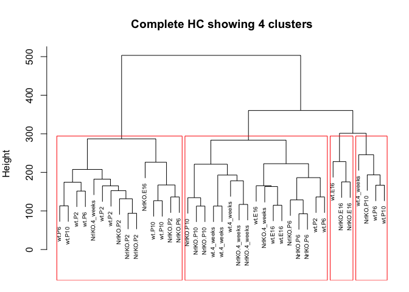

# sm09
Eva Y  
March 12, 2015  

### Take-home problem: 
(1) draw a plot with number of clusters in the x-axis and the average silhouette widths in the y-axis. Use the information obtained to determine if 5 was the best choice for the number of clusters.
(2)For a common choice of k, compare the clustering across different methods, e.g. hierarchical (pruned to specific k, obviously), k-means, PAM. You will re-discover the “label switching problem” for yourself. How does that manifest itself? How concordant are the clusterings for different methods?

#### Load packages and data. Perform some modifications to the dataset. 

```r
library(RColorBrewer)
library(cluster)
library(pvclust)
library(xtable)
library(limma)
library(plyr)
library(lattice)
library(gplots)

prDat <- read.table("../../data/GSE4051_data.tsv", 
                    header = TRUE, row.names = 1)
str(prDat, max.level = 0)
```

```
## 'data.frame':	29949 obs. of  39 variables:
```

```r
prDes <- readRDS("../../data/GSE4051_design.rds")
str(prDes)
```

```
## 'data.frame':	39 obs. of  4 variables:
##  $ sidChar : chr  "Sample_20" "Sample_21" "Sample_22" "Sample_23" ...
##  $ sidNum  : num  20 21 22 23 16 17 6 24 25 26 ...
##  $ devStage: Factor w/ 5 levels "E16","P2","P6",..: 1 1 1 1 1 1 1 2 2 2 ...
##  $ gType   : Factor w/ 2 levels "wt","NrlKO": 1 1 1 1 2 2 2 1 1 1 ...
```

```r
# scale data, minus mean divided by sd
sprDat <- t(scale(t(prDat)))
str(sprDat, max.level = 0, give.attr = FALSE)
```

```
##  num [1:29949, 1:39] 0.0838 0.1758 0.7797 -0.3196 0.8358 ...
```

```r
# compute pairwise distances
pr.dis <- dist(t(sprDat), method = 'euclidean')

# create a new factor representing the interaction of gType and devStage
prDes$grp <- with(prDes, interaction(gType, devStage))
summary(prDes$grp)
```

```
##        wt.E16     NrlKO.E16         wt.P2      NrlKO.P2         wt.P6 
##             4             3             4             4             4 
##      NrlKO.P6        wt.P10     NrlKO.P10    wt.4_weeks NrlKO.4_weeks 
##             4             4             4             4             4
```

#### Q1: 

```r
# PAM algorithm
# number of clusters
k <- 2:30

# make function give average silhouette width
get_avg_swidth <- function(k){
  pr.pam <- pam(pr.dis, k=k)
  pr.pam_sum <- summary(pr.pam)
  avg_swidth <- pr.pam_sum$silinfo$avg.width
  avg_swidth
}

# apply the function to a vector 2:30
avg_swidth_df <- data.frame(clusters=c(2:30), 
                            avg_width=sapply(k, get_avg_swidth))

# plot avg width vs. clusters
xyplot(avg_width ~ clusters, avg_swidth_df, xlab="Number of Clusters", ylab="Average Silhouette Width")
```

 

#### Q2: 

```r
# pick k=4 because after that the average silhouette width drops based on the plot in Q1. 
# this is the elbow/knee curve some discussions are referring to...
k <- 4
```

##### Generate hierarchical clustering:

```r
pr_hc <- hclust(pr.dis, method = 'complete')

# identify 4 clusters
op <- par(mar = c(1,4,4,1))
plot(pr_hc, labels = prDes$grp, cex = 0.6, 
     main = "Complete HC showing 4 clusters")
rect.hclust(pr_hc, k = 4)
```

 

```r
# make data frame
pr_hc <- cutree(pr_hc, k=k)
pr_hc_df <- data.frame(pr_hc)
colnames(pr_hc_df) <- "hc"
```

##### Perform kmeans clustering:

```r
set.seed(1)
pr_km <- kmeans(t(sprDat), centers = k, nstart =  50)

# make data frame
pr_km_df <- data.frame(km=pr_km$cluster)
```

##### Perform PAM:

```r
pr_pam <- pam(pr.dis, k = k)

# make data frame
pr_pam_df <- data.frame(pm=pr_pam$clustering)
```

##### Label switching problem: 
The problem is that clustering of similar samples to a group can be named differently between different methods. For example, if sample 1, 2, and 3 are designated cluster 1 using kmeans, the same cluster consisting of the same samples (1, 2, and 3) can be named cluster 2. That's pretty annoying. How could we tell concordance?

```r
all_clust <- cbind(prDes$grp, pr_hc_df, pr_pam_df, pr_km_df)
all_clust
```

```
##               prDes$grp hc pm km
## Sample_20        wt.E16  1  1  4
## Sample_21        wt.E16  2  1  4
## Sample_22        wt.E16  1  1  4
## Sample_23        wt.E16  1  1  4
## Sample_16     NrlKO.E16  3  2  1
## Sample_17     NrlKO.E16  2  1  4
## Sample_6      NrlKO.E16  2  1  4
## Sample_24         wt.P2  3  3  3
## Sample_25         wt.P2  1  3  3
## Sample_26         wt.P2  3  2  1
## Sample_27         wt.P2  3  2  1
## Sample_14      NrlKO.P2  3  3  3
## Sample_3       NrlKO.P2  3  3  3
## Sample_5       NrlKO.P2  3  2  1
## Sample_8       NrlKO.P2  3  2  1
## Sample_28         wt.P6  3  2  1
## Sample_29         wt.P6  4  1  4
## Sample_30         wt.P6  1  3  3
## Sample_31         wt.P6  3  3  3
## Sample_1       NrlKO.P6  1  3  3
## Sample_10      NrlKO.P6  1  3  3
## Sample_4       NrlKO.P6  1  3  3
## Sample_7       NrlKO.P6  3  2  1
## Sample_32        wt.P10  4  4  2
## Sample_33        wt.P10  3  2  1
## Sample_34        wt.P10  3  2  1
## Sample_35        wt.P10  3  3  3
## Sample_13     NrlKO.P10  1  3  2
## Sample_15     NrlKO.P10  1  3  3
## Sample_18     NrlKO.P10  4  3  2
## Sample_19     NrlKO.P10  1  3  3
## Sample_36    wt.4_weeks  4  4  2
## Sample_37    wt.4_weeks  1  4  2
## Sample_38    wt.4_weeks  1  4  2
## Sample_39    wt.4_weeks  1  4  2
## Sample_11 NrlKO.4_weeks  1  4  2
## Sample_12 NrlKO.4_weeks  3  3  3
## Sample_2  NrlKO.4_weeks  1  4  2
## Sample_9  NrlKO.4_weeks  1  1  4
```

By eyeballing this table, we can sort of tell that cluster results are more concordant between PAM and kmeans (i.e. samples are similarly distributed in clusters).

##### But let's try visualizing this with venn diagrams.

```r
# subset the data for hc
clust_hc1 <- subset(row.names(all_clust), 
                    all_clust$hc == 1)
clust_hc2 <- subset(row.names(all_clust), 
                    all_clust$hc == 2)
clust_hc3 <- subset(row.names(all_clust), 
                    all_clust$hc == 3)
clust_hc4 <- subset(row.names(all_clust), 
                    all_clust$hc == 4)

# subset the data for pam 
clust_pam1 <- subset(row.names(all_clust), 
                    all_clust$pm == 1)
clust_pam2 <- subset(row.names(all_clust), 
                    all_clust$pm == 2)
clust_pam3 <- subset(row.names(all_clust), 
                    all_clust$pm == 3)
clust_pam4 <- subset(row.names(all_clust), 
                    all_clust$pm == 4)

# subset the data for km 
clust_km1 <- subset(row.names(all_clust), 
                    all_clust$km == 1)
clust_km2 <- subset(row.names(all_clust), 
                    all_clust$km == 2)
clust_km3 <- subset(row.names(all_clust), 
                    all_clust$km == 3)
clust_km4 <- subset(row.names(all_clust), 
                    all_clust$km == 4)
```

##### Figure out which cluster is which by generating venn diagrams. 

```r
# clust_km1 vs. all hc
venn(list(km1=clust_km1, hc1=clust_hc1, hc2=clust_hc2, hc3=clust_hc3, hc4=clust_hc4)) # km1 = hc3
```

 

```r
# clust_km2 vs. all hc
venn(list(km2=clust_km2, hc1=clust_hc1, hc2=clust_hc2, hc3=clust_hc3, hc4=clust_hc4)) # km2 = hc1
```

 

```r
# clust_km3 vs. all hc
venn(list(km3=clust_km3, hc1=clust_hc1, hc2=clust_hc2, hc3=clust_hc3, hc4=clust_hc4)) # km3 = hc1 ???
```

 

```r
# clust_km4 vs. all hc
venn(list(km4=clust_km4, hc1=clust_hc1, hc2=clust_hc2, hc3=clust_hc3, hc4=clust_hc4)) # km4 = hc1 ???
```

 

It is quite hard to match clusters between the hc method and km method, which indicates that these two methods are quite disconcordant. 


```r
# clust_pam1 vs. all hc
venn(list(pam1=clust_pam1, hc1=clust_hc1, hc2=clust_hc2, hc3=clust_hc3, hc4=clust_hc4)) # pam1 = hc1 
```

 

```r
# clust_pam2 vs. all hc
venn(list(pam2=clust_pam2, hc1=clust_hc1, hc2=clust_hc2, hc3=clust_hc3, hc4=clust_hc4)) # pam2 = hc3
```

 

```r
# clust_pam3 vs. all hc
venn(list(pam3=clust_pam3, hc1=clust_hc1, hc2=clust_hc2, hc3=clust_hc3, hc4=clust_hc4)) # pam3 = hc1 ???
```

 

```r
# clust_km4 vs. all hc
venn(list(pam4=clust_pam4, hc1=clust_hc1, hc2=clust_hc2, hc3=clust_hc3, hc4=clust_hc4)) # pam4 = hc1 ???
```

 

The same is observed for pam vs. hc. 


```r
# clust_km1 vs. all pam
venn(list(km1=clust_km1, pam1=clust_pam1, pam2=clust_pam2, pam3=clust_pam3, pam4=clust_pam4)) # km1 = pam2
```

 

```r
# clust_km2 vs. all pam
venn(list(km2=clust_km2, pam1=clust_pam1, pam2=clust_pam2, pam3=clust_pam3, pam4=clust_pam4)) # km2 = pam4
```

 

```r
# clust_km3 vs. all pam
venn(list(km3=clust_km3, pam1=clust_pam1, pam2=clust_pam2, pam3=clust_pam3, pam4=clust_pam4)) # km3 = pam3
```

 

```r
# clust_km4 vs. all pam
venn(list(km4=clust_km4, pam1=clust_pam1, pam2=clust_pam2, pam3=clust_pam3, pam4=clust_pam4)) # km4 = pam1
```

 

We can observe that km vs. pam method is easier to define clusters based on sample overlap. Therefore, these two methods are the most concordant.

##### Let's validate these using simpler venn diagrams. 

```r
# km1 = pam2 = hc3
# 100% concordance between km1 and pam2
# whereas 6 samples are clustered differently using the hc method compared to km and pam
venn(list(km1=clust_km1, pam2=clust_pam2, hc3=clust_hc3))
```

 

```r
# km2 = pam4 = hc1
# only 1 sample in a different cluster using km compared to pam
# whereas 11 samples are clustered differently using the hc method compared to km and pam
venn(list(km2=clust_km2, pam4=clust_pam4, hc1=clust_hc1))
```

 

```r
# km3 = pam3 = hc1
# only 1 sample in a different cluster using pam compared to km
# whereas 9 samples are clustered differently using the hc method compared to km and pam
venn(list(km3=clust_km3, pam3=clust_pam3, hc1=clust_hc1))
```

 

```r
# km4 = pam1 = hc1
# 100% concordance between km4 and pam1
# whereas 13 samples are clustered differently using the hc method compared to km and pam
venn(list(km4=clust_km4, pam1=clust_pam1, hc1=clust_hc1))
```

 

